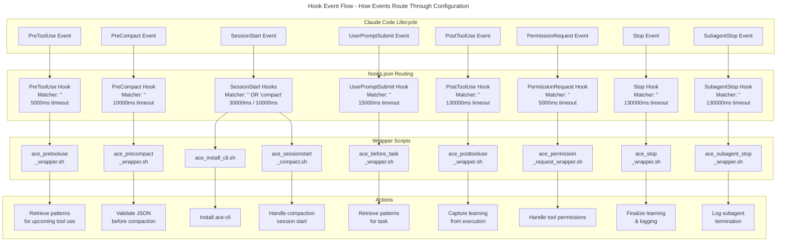
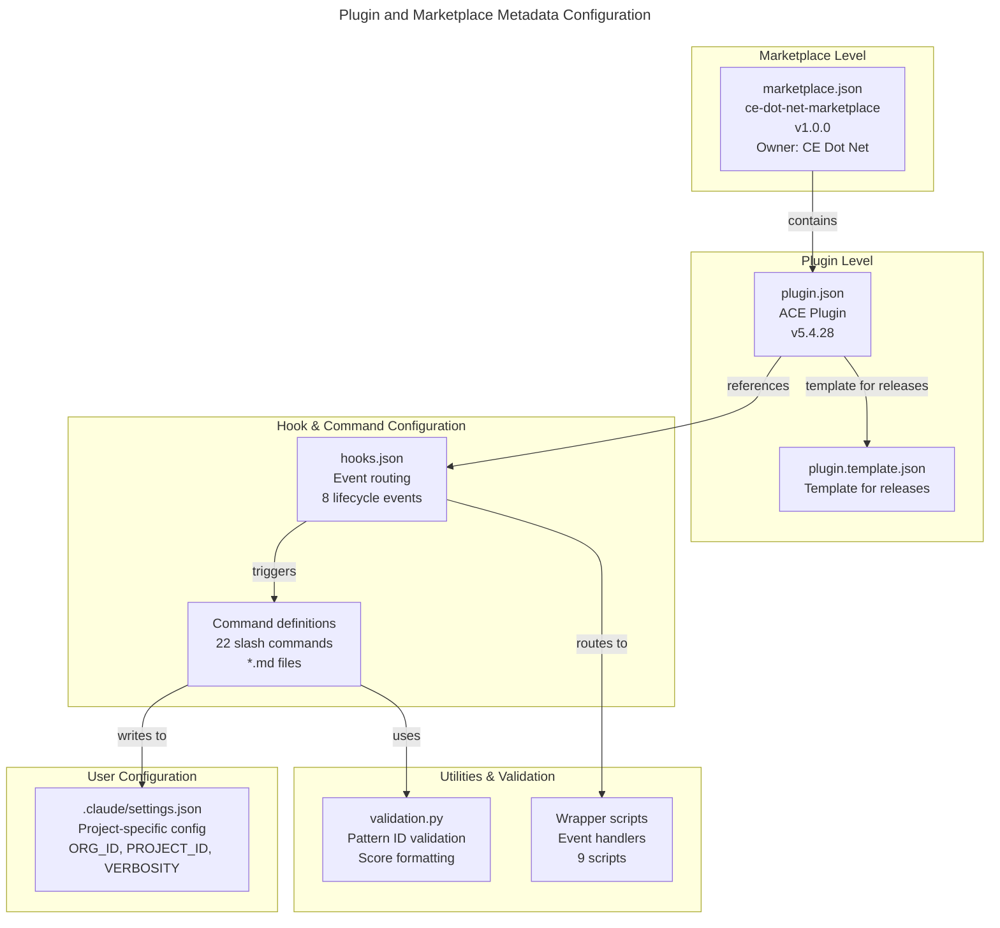

# C4 Code Level: ACE Configuration & Commands

## Overview

- **Name**: ACE Configuration & Commands
- **Description**: Plugin configuration files, hook definitions, and slash command implementations that enable ACE pattern learning, project configuration, playbook management, and command-line interface for the Claude Code ACE plugin
- **Location**: Multiple directories
  - Hook definitions: `/Users/ptsafaridis/repos/github_com/ce-dot-net/ce-claude-marketplace/plugins/ace/hooks/`
  - Commands: `/Users/ptsafaridis/repos/github_com/ce-dot-net/ce-claude-marketplace/plugins/ace/commands/`
  - Plugin metadata: `/Users/ptsafaridis/repos/github_com/ce-dot-net/ce-claude-marketplace/plugins/ace/.claude-plugin/`
  - Marketplace metadata: `/Users/ptsafaridis/repos/github_com/ce-dot-net/ce-claude-marketplace/.claude-plugin/`
  - Validation utilities: `/Users/ptsafaridis/repos/github_com/ce-dot-net/ce-claude-marketplace/plugins/ace/utils/`
- **Language**: JSON (configuration), Markdown (commands), Python (validation utilities)
- **Purpose**: Provides configuration, command definitions, and validation utilities that integrate ACE pattern learning into Claude Code. Hooks route lifecycle events to scripts, commands expose user-facing slash commands for pattern management, and validation ensures data integrity.

## Code Elements

### Hook Configuration (hooks.json)

**File**: `/Users/ptsafaridis/repos/github_com/ce-dot-net/ce-claude-marketplace/plugins/ace/hooks/hooks.json`

Hook entries that route Claude Code lifecycle events to ACE scripts:

#### Hook: PreToolUse
- **Event Type**: `PreToolUse`
- **Matcher**: Empty string (matches all)
- **Command**: `${CLAUDE_PLUGIN_ROOT}/scripts/ace_pretooluse_wrapper.sh`
- **Timeout**: 5000ms
- **Purpose**: Execute before tool/function execution to retrieve relevant ACE patterns

#### Hook: PreCompact
- **Event Type**: `PreCompact`
- **Matcher**: Empty string (matches all)
- **Command**: `${CLAUDE_PLUGIN_ROOT}/scripts/ace_precompact_wrapper.sh`
- **Timeout**: 10000ms
- **Purpose**: Validate JSON before context compaction

#### Hook: SessionStart
- **Event Type**: `SessionStart`
- **Matcher**: Empty string (matches all)
  - **Command**: `${CLAUDE_PLUGIN_ROOT}/scripts/ace_install_cli.sh`
  - **Timeout**: 30000ms
  - **Purpose**: Install ace-cli on session initialization
- **Matcher**: "compact" (matches when context compaction occurs)
  - **Command**: `${CLAUDE_PLUGIN_ROOT}/scripts/ace_sessionstart_compact.sh`
  - **Timeout**: 10000ms
  - **Purpose**: Handle session start during context compaction

#### Hook: UserPromptSubmit
- **Event Type**: `UserPromptSubmit`
- **Matcher**: Empty string (matches all)
- **Command**: `${CLAUDE_PLUGIN_ROOT}/scripts/ace_before_task_wrapper.sh`
- **Timeout**: 15000ms
- **Purpose**: Execute before user prompt to retrieve patterns for upcoming task

#### Hook: PostToolUse
- **Event Type**: `PostToolUse`
- **Matcher**: Empty string (matches all)
- **Command**: `${CLAUDE_PLUGIN_ROOT}/scripts/ace_posttooluse_wrapper.sh --log`
- **Timeout**: 130000ms
- **Purpose**: Execute after tool use to capture learning from task execution

#### Hook: PermissionRequest
- **Event Type**: `PermissionRequest`
- **Matcher**: Empty string (matches all)
- **Command**: `${CLAUDE_PLUGIN_ROOT}/scripts/ace_permission_request_wrapper.sh`
- **Timeout**: 5000ms
- **Purpose**: Handle permission requests during tool execution

#### Hook: Stop
- **Event Type**: `Stop`
- **Matcher**: Empty string (matches all)
- **Command**: `${CLAUDE_PLUGIN_ROOT}/scripts/ace_stop_wrapper.sh --log --chat`
- **Timeout**: 130000ms
- **Purpose**: Finalize learning and logging when user stops conversation

#### Hook: SubagentStop
- **Event Type**: `SubagentStop`
- **Matcher**: Empty string (matches all)
- **Command**: `${CLAUDE_PLUGIN_ROOT}/scripts/ace_subagent_stop_wrapper.sh --log --chat --notify`
- **Timeout**: 130000ms
- **Purpose**: Handle subagent termination and learning capture with notifications

### Slash Commands

**Directory**: `/Users/ptsafaridis/repos/github_com/ce-dot-net/ce-claude-marketplace/plugins/ace/commands/`

Commands are defined as markdown files with YAML frontmatter providing metadata:

#### ace-learn.md
- **Command**: `/ace:learn`
- **Description**: Capture learning from completed work interactively
- **Frontmatter**:
  - `description`: "Capture learning from completed work interactively"
- **Purpose**: Manually capture patterns and lessons learned from recent work using Claude Code's native AskUserQuestion UI
- **Flow**:
  1. Gather task information (implemented feature, fixed bug, refactored code, integrated API)
  2. Ask for success status (success, partial success, failed)
  3. Collect lessons learned (insights, gotchas, solutions)
  4. Gather git context (branch, commit hash, commit message, files changed)
  5. Call ace-cli learn with captured data

#### ace-bootstrap.md
- **Command**: `/ace:bootstrap`
- **Description**: Bootstrap ACE playbook from docs, git history, and/or current code
- **Frontmatter**:
  - `description`: "Bootstrap ACE playbook from docs, git history, and/or current code"
  - `argument-hint`: "[--mode hybrid|both|local-files|git-history|docs-only] [--thoroughness light|medium|deep] [--commits N] [--days N]"
  - `context`: "fork"
- **Parameters**:
  - `--mode`: Analysis mode (hybrid=recommended, both, local-files, git-history, docs-only)
  - `--thoroughness`: Depth (light, medium, deep)
  - `--repo-path`: Repository path
  - `--max-files`: Maximum files to analyze
  - `--commit-limit`: Maximum commits to analyze
  - `--days-back`: Days of history to analyze
  - `--merge`: Merge with existing playbook (default: true)
- **Purpose**: Initialize playbook by analyzing codebase files and/or git commit history

#### ace-status.md
- **Command**: `/ace:status`
- **Description**: Show ACE playbook statistics and learning status
- **Frontmatter**:
  - `description`: "Show ACE playbook statistics and learning status"
  - `argument-hint`: (empty)
- **Purpose**: Display comprehensive statistics about ACE playbook including total patterns, patterns by section, and top helpful/harmful patterns
- **Flow**:
  1. Pre-flight auth check (verify ace-cli availability and authentication)
  2. Handle auth status (show login prompt if needed)
  3. Get status from ace-cli status
  4. Format and display playbook statistics

#### ace-search.md
- **Command**: `/ace:search`
- **Description**: Semantic search for ACE patterns using natural language query
- **Frontmatter**:
  - `description`: "Semantic search for ACE patterns using natural language query"
- **Parameters**:
  - `query` (required): Natural language description
  - `--threshold`: Similarity threshold (0.0-1.0)
  - `--allowed-domains`: Whitelist specific domains
  - `--blocked-domains`: Blacklist specific domains
  - `--json`: Return JSON format
- **Purpose**: Find relevant patterns using semantic similarity instead of full playbook retrieval
- **Benefits**: Reduces context by 50-92% through targeted pattern retrieval

#### ace-configure.md
- **Command**: `/ace:configure`
- **Description**: Configure ACE server connection settings interactively
- **Frontmatter**:
  - `description`: "Configure ACE server connection settings interactively"
  - `argument-hint`: "[--global] [--project]"
- **Purpose**: Interactive configuration wizard for setting up ACE server connection
- **Flow**:
  1. Check prerequisites (jq, ace-cli)
  2. Check authentication status (requires `/ace:login` first)
  3. Fetch organizations from ACE server
  4. User selects organization
  5. Fetch projects for selected organization
  6. User selects project
  7. Set default organization
  8. Select verbosity mode (detailed, compact)
  9. Save to `.claude/settings.json`
  10. Verify configuration
  11. Show summary with next steps
- **Config Format**: `.claude/settings.json` with env vars for ACE_ORG_ID, ACE_PROJECT_ID, ACE_VERBOSITY

#### ace-patterns.md
- **Command**: `/ace:patterns`
- **Description**: View ACE playbook organized by section (strategies, snippets, troubleshooting, APIs)
- **Frontmatter**:
  - `description`: "View ACE playbook organized by section (strategies, snippets, troubleshooting, APIs)"
  - `argument-hint`: "[section] [min-helpful]"
- **Parameters**:
  - `section` (optional): Filter to specific section (strategies_and_hard_rules, useful_code_snippets, troubleshooting_and_pitfalls, apis_to_use)
  - `min_helpful` (optional): Minimum helpful count filter
- **Purpose**: Display the complete ACE playbook organized by 4 sections

#### Additional Commands (Summary)
- **ace-bootstrap.md**: Bootstrap playbook from code/git/docs
- **ace-cleanup.md**: Clean up temporary files and caches
- **ace-clear.md**: Clear playbook and start fresh
- **ace-configure.md**: Configure ACE server connection
- **ace-delta.md**: Show changes in playbook over time
- **ace-doctor.md**: Diagnose ACE configuration issues
- **ace-domains.md**: Manage playbook domains
- **ace-enable-auto-update.md**: Enable automatic ACE updates
- **ace-export-patterns.md**: Export playbook to JSON
- **ace-import-patterns.md**: Import playbook from JSON
- **ace-install-cli.md**: Install or update ace-cli
- **ace-learn.md**: Capture learning from work
- **ace-login.md**: Authenticate with ACE server
- **ace-patterns.md**: View playbook patterns
- **ace-insights.md**: Generate insights report (relevance metrics)
- **ace-search.md**: Semantic search patterns
- **ace-status.md**: Show playbook statistics
- **ace-test.md**: Test ACE configuration
- **ace-top.md**: Show highest-rated patterns
- **ace-tune.md**: Tune ACE behavior and thresholds

### Plugin Metadata (plugin.json)

**File**: `/Users/ptsafaridis/repos/github_com/ce-dot-net/ce-claude-marketplace/plugins/ace/.claude-plugin/plugin.json`

Plugin configuration for the ACE Claude Code plugin:

```json
{
  "name": "ace",
  "version": "5.4.28",
  "description": "Code Engine ACE - Intelligent pattern learning with continuous auto-search. v5.4.28: Fix PreCompact JSON validation (Issue #17). Requires: Claude Code >= 2.1.2, ace-cli >= 3.10.3.",
  "author": {
    "name": "ACE Team",
    "email": "ace@ce-dot-net.com"
  },
  "homepage": "https://github.com/ce-dot-net/ce-ai-ace",
  "repository": "https://github.com/ce-dot-net/ce-ai-ace",
  "license": "MIT",
  "keywords": [
    "claude-code",
    "ace",
    "pattern-learning",
    "self-improving",
    "context-engineering",
    "agentic",
    "code-engine",
    "ai-assistant",
    "autonomous",
    "cli-integration"
  ]
}
```

**Fields**:
- `name`: "ace"
- `version`: "5.4.28" (latest release version)
- `description`: Full description with version history and requirements
- `author`: ACE Team contact information
- `homepage`: Link to ACE project repository
- `repository`: Link to ce-claude-marketplace repository
- `license`: MIT
- `keywords`: Searchable keywords for plugin discovery

### Plugin Template (plugin.template.json)

**File**: `/Users/ptsafaridis/repos/github_com/ce-dot-net/ce-claude-marketplace/plugins/ace/.claude-plugin/plugin.template.json`

Template for plugin configuration (used during builds/releases):

**Structure**: Identical to plugin.json - used as template for generating actual plugin.json during release process

### Marketplace Metadata (marketplace.json)

**File**: `/Users/ptsafaridis/repos/github_com/ce-dot-net/ce-claude-marketplace/.claude-plugin/marketplace.json`

Central marketplace configuration:

```json
{
  "name": "ce-dot-net-marketplace",
  "owner": {
    "name": "CE Dot Net",
    "email": "ace@ce-dot-net.com"
  },
  "metadata": {
    "description": "Public marketplace for Claude Code plugins and MCP clients from CE Dot Net",
    "version": "1.0.0",
    "pluginRoot": "./plugins"
  },
  "plugins": [
    {
      "name": "ace",
      "source": "./plugins/ace",
      "description": "Code Engine ACE - Intelligent pattern learning with continuous auto-search. Requires: Claude Code >= 2.1.2, ace-cli >= 3.10.3.",
      "version": "5.4.28",
      "author": {
        "name": "ACE Team",
        "email": "ace@ce-dot-net.com"
      },
      "homepage": "https://github.com/ce-dot-net/ce-ai-ace",
      "repository": "https://github.com/ce-dot-net/ce-claude-marketplace",
      "license": "MIT",
      "keywords": [
        "claude-code",
        "ace",
        "pattern-learning",
        "self-improving",
        "context-engineering",
        "agentic",
        "research",
        "stanford",
        "autonomous",
        "cli-integration"
      ],
      "category": "productivity"
    }
  ]
}
```

**Top-level Fields**:
- `name`: "ce-dot-net-marketplace" - Marketplace identifier
- `owner`: Owner organization (CE Dot Net)
- `metadata.description`: Marketplace description
- `metadata.version`: "1.0.0"
- `metadata.pluginRoot`: "./plugins" - Relative path to plugins directory

**Plugin Fields** (ace plugin):
- `name`: "ace"
- `source`: "./plugins/ace" - Relative path to plugin
- `description`: Full description with version and requirements
- `version`: "5.4.28"
- `author`: ACE Team
- `homepage`: Project homepage
- `repository`: Repository URL
- `license`: MIT
- `keywords`: Searchable keywords
- `category`: "productivity"

### Validation Utilities (validation.py)

**File**: `/Users/ptsafaridis/repos/github_com/ce-dot-net/ce-claude-marketplace/plugins/ace/utils/validation.py`

Python validation utilities for ACE pattern IDs and scores:

#### Function: `validate_pattern_id(pattern_id: str) -> tuple[bool, Optional[str]]`
- **Signature**: `validate_pattern_id(pattern_id: str) -> tuple[bool, Optional[str]]`
- **Location**: `/Users/ptsafaridis/repos/github_com/ce-dot-net/ce-claude-marketplace/plugins/ace/utils/validation.py:17-61`
- **Purpose**: Validate ACE pattern ID format
- **Parameters**:
  - `pattern_id` (str): The pattern ID to validate
- **Return Value**: Tuple of (is_valid, error_message)
  - `is_valid` (bool): True if valid, False otherwise
  - `error_message` (Optional[str]): None if valid, error description if invalid
- **Validation Rules**:
  - Must be a string (not other types)
  - Cannot be empty
  - Must start with "ctx-" prefix
  - Must have content after "ctx-" prefix
  - Content after prefix must contain only lowercase letters and numbers (regex: `^[a-z0-9]+$`)
- **Examples**:
  - `validate_pattern_id("ctx-abc123")` → `(True, None)`
  - `validate_pattern_id("invalid")` → `(False, "Pattern ID must start with 'ctx-' prefix")`
  - `validate_pattern_id("ctx-ABC")` → `(False, "Pattern ID must contain only lowercase letters and numbers after 'ctx-' prefix")`

#### Function: `is_valid_pattern_id(pattern_id: str) -> bool`
- **Signature**: `is_valid_pattern_id(pattern_id: str) -> bool`
- **Location**: `/Users/ptsafaridis/repos/github_com/ce-dot-net/ce-claude-marketplace/plugins/ace/utils/validation.py:65-82`
- **Purpose**: Simple boolean check for pattern ID validity
- **Parameters**:
  - `pattern_id` (str): The pattern ID to validate
- **Return Value**: True if valid, False otherwise
- **Implementation**: Calls `validate_pattern_id()` internally and returns only the boolean result
- **Examples**:
  - `is_valid_pattern_id("ctx-abc123")` → `True`
  - `is_valid_pattern_id("invalid")` → `False`

#### Function: `format_pattern_score(helpful: int, harmful: int) -> str`
- **Signature**: `format_pattern_score(helpful: int, harmful: int) -> str`
- **Location**: `/Users/ptsafaridis/repos/github_com/ce-dot-net/ce-claude-marketplace/plugins/ace/utils/validation.py:86-108`
- **Purpose**: Format pattern helpful/harmful scores for display
- **Parameters**:
  - `helpful` (int): Number of times pattern was marked helpful (positive score)
  - `harmful` (int): Number of times pattern was marked harmful (negative score)
- **Return Value**: Formatted string in format "+N/-M"
- **Examples**:
  - `format_pattern_score(8, 0)` → `"+8/-0"`
  - `format_pattern_score(5, 2)` → `"+5/-2"`
  - `format_pattern_score(0, 0)` → `"+0/-0"`

### Wrapper Scripts

**Directory**: `/Users/ptsafaridis/repos/github_com/ce-dot-net/ce-claude-marketplace/plugins/ace/scripts/`

Bash wrapper scripts that execute for each lifecycle event:

- `ace_pretooluse_wrapper.sh` - Routes PreToolUse hook event
- `ace_precompact_wrapper.sh` - Routes PreCompact hook event (JSON validation)
- `ace_install_cli.sh` - Installs ace-cli on SessionStart
- `ace_sessionstart_compact.sh` - Routes SessionStart during compaction
- `ace_before_task_wrapper.sh` - Routes UserPromptSubmit hook event
- `ace_posttooluse_wrapper.sh` - Routes PostToolUse hook event (learning capture)
- `ace_permission_request_wrapper.sh` - Routes PermissionRequest hook event
- `ace_stop_wrapper.sh` - Routes Stop hook event (finalization)
- `ace_subagent_stop_wrapper.sh` - Routes SubagentStop hook event (subagent termination)

## Dependencies

### Internal Dependencies

- **Hook system**: Depends on Claude Code hook infrastructure and `.claude-plugin/hooks.json` configuration
- **Slash commands**: Depend on Claude Code command system and markdown command definitions
- **Scripts**: Wrapper scripts depend on:
  - `ace-cli` (npm package: @ace-sdk/cli) - Command-line interface for ACE
  - `jq` - JSON query tool for parsing configuration
  - `bash` - Shell for script execution
  - `git` - Version control for repository metadata (optional, for bootstrap)
- **Shared hooks**: Python modules in `/plugins/ace/shared-hooks/` for hook implementation
- **Validation**: Python validation utilities in `/plugins/ace/utils/validation.py`

### External Dependencies

- **ace-cli** (npm: @ace-sdk/cli >= 3.10.3)
  - Command-line interface for ACE pattern learning
  - Provides: bootstrap, patterns, search, status, learn, configure commands
  - Version constraint: >= 3.10.3

- **Claude Code** (>= 2.1.2)
  - Required for plugin support and hook infrastructure
  - Provides: hook system, slash command routing, AskUserQuestion UI

- **Node.js & npm**
  - Required for ace-cli installation
  - Package manager for @ace-sdk/cli

- **bash** (v3.2+)
  - Shell interpreter for wrapper scripts and hooks

- **jq** (any recent version)
  - JSON processor for parsing configuration files
  - Used in scripts for extracting values from JSON

- **git** (optional, for bootstrap)
  - Used by ace bootstrap to analyze commit history
  - Only needed for git-history and hybrid bootstrap modes

## Relationships

### Configuration Flow



### Command Architecture

```mermaid
---
title: Slash Command Structure and Dependencies
---
classDiagram
    namespace Commands {
        class AceLearn {
            <<command>>
            description: Capture learning interactively
            uses_tools: AskUserQuestion
            calls_script: ace-cli learn
            user_flow: task, success_status, lessons, git_context
        }
        
        class AceBootstrap {
            <<command>>
            description: Bootstrap playbook from sources
            parameter: --mode hybrid|both|local-files|git-history|docs-only
            parameter: --thoroughness light|medium|deep
            calls_script: ace-bootstrap.sh
            output_format: JSON patterns
        }
        
        class AceStatus {
            <<command>>
            description: Show playbook statistics
            auth_check: required
            output: total_patterns, by_section, top_helpful/harmful
            calls_script: ace-cli status
        }
        
        class AceSearch {
            <<command>>
            description: Semantic search patterns
            parameter: query (natural language)
            parameter: --threshold 0.0-1.0
            calls_script: ace-cli search
            output_format: JSON patterns with similarity
        }
        
        class AceConfigure {
            <<command>>
            description: Configure ACE server connection
            auth_check: required
            uses_tools: AskUserQuestion
            output: .claude/settings.json
            saves: ACE_ORG_ID, ACE_PROJECT_ID, ACE_VERBOSITY
        }
        
        class AcePatterns {
            <<command>>
            description: View playbook by section
            parameter: section optional filter
            parameter: min-helpful optional threshold
            output_format: JSON playbook structure
            calls_script: ace-cli patterns
        }
    }
    
    namespace SharedServices {
        class AceCli {
            <<external_service>>
            commands: learn, bootstrap, status, search, patterns, configure
            provides: pattern_management, learning_capture, playbook_retrieval
        }
        
        class ValidationUtils {
            <<module>>
            validate_pattern_id: pattern format validation
            is_valid_pattern_id: boolean check
            format_pattern_score: score formatting
        }
        
        class ClaudeCodeUI {
            <<framework>>
            AskUserQuestion: user input collection
            Hooks: lifecycle event routing
            Commands: slash command system
        }
    }
    
    namespace Configuration {
        class PluginJson {
            <<metadata>>
            name: ace
            version: 5.4.28
            keywords: pattern-learning, self-improving, etc
        }
        
        class MarketplaceJson {
            <<metadata>>
            name: ce-dot-net-marketplace
            plugins: ace
            pluginRoot: ./plugins
        }
        
        class HooksJson {
            <<configuration>>
            PreToolUse: event routing
            PreCompact: JSON validation
            SessionStart: CLI installation
            UserPromptSubmit: pattern retrieval
            PostToolUse: learning capture
            PermissionRequest: permission handling
            Stop: finalization
            SubagentStop: subagent termination
        }
        
        class SettingsJson {
            <<user_config>>
            env: ACE_ORG_ID, ACE_PROJECT_ID, ACE_VERBOSITY
        }
    }
    
    AceLearn ..> AceCli: calls
    AceBootstrap ..> AceCli: calls
    AceStatus ..> AceCli: calls
    AceSearch ..> AceCli: calls
    AceConfigure ..> AceCli: calls
    AcePatterns ..> AceCli: calls
    
    AceConfigure ..> ClaudeCodeUI: uses AskUserQuestion
    AceLearn ..> ClaudeCodeUI: uses AskUserQuestion
    
    AceBootstrap ..> ValidationUtils: validates patterns
    AceSearch ..> ValidationUtils: validates patterns
    AcePatterns ..> ValidationUtils: validates patterns
    
    HooksJson --> PluginJson: defined_in_plugin
    HooksJson --> MarketplaceJson: part_of_marketplace
    AceConfigure --> SettingsJson: writes_to
    PluginJson --> MarketplaceJson: plugin_metadata_in_marketplace
```



### Plugin Metadata Hierarchy



## Notes

- **Version**: Current ACE plugin version is 5.4.28, released with PreCompact JSON validation fix (Issue #17)
- **Requirements**: Requires Claude Code >= 2.1.2 and ace-cli >= 3.10.3
- **Hook Timeouts**: Longer timeouts for PostToolUse (130s), Stop (130s), and SubagentStop (130s) allow time for learning capture and logging; shorter timeouts for retrieval hooks (5s-15s) keep interactive responses fast
- **Event Matchers**: Most hooks use empty string matcher (match all), except SessionStart which has special handling for "compact" matcher during context compaction
- **Command Framework**: Commands are markdown files with YAML frontmatter; instructions for Claude are embedded in markdown to define command behavior
- **Configuration Storage**: Plugin-level config in `.claude-plugin/plugin.json`, project-level settings in `.claude/settings.json`, hooks in `.claude-plugin/hooks.json`
- **Pattern ID Format**: ACE pattern IDs follow strict format: "ctx-" prefix + lowercase alphanumeric (e.g., "ctx-abc123")
- **Playbook Sections**: ACE playbooks contain 4 sections: strategies_and_hard_rules, useful_code_snippets, troubleshooting_and_pitfalls, apis_to_use
- **Learning Flow**: User tasks → PostToolUse hook captures → ace-cli learn processes → playbook updated; patterns are retrievable via PreToolUse hook or ace-search command
- **Auth Model**: All ACE operations require authentication via `/ace:login`; token-based model with session expiration
