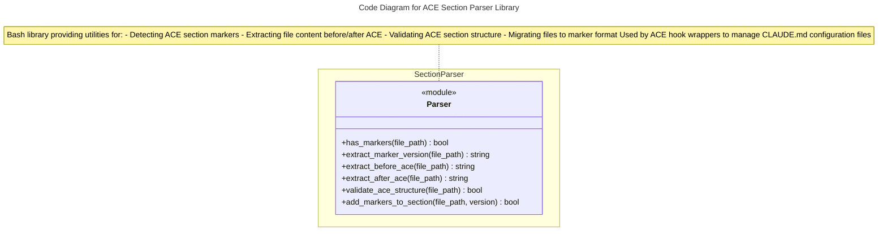
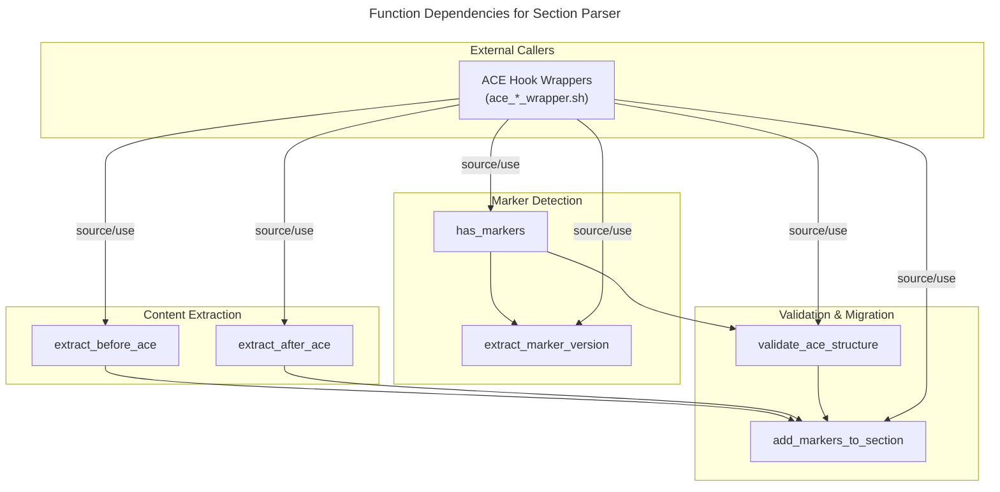
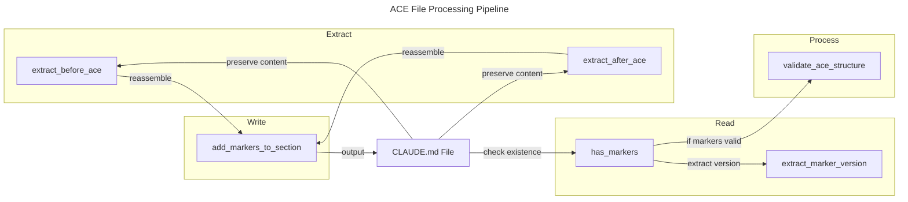

# C4 Code Level: ACE Plugin Scripts Library

## Overview

- **Name**: ACE Plugin Scripts Library - Section Parser
- **Description**: Bash shell library providing shared utility functions for ACE (Automation, Computation, Execution) hook wrapper scripts. Specializes in parsing, extracting, and validating ACE sections within CLAUDE.md configuration files using HTML comment markers.
- **Location**: `/Users/ptsafaridis/repos/github_com/ce-dot-net/ce-claude-marketplace/plugins/ace/scripts/lib/`
- **Language**: Bash (shell script)
- **Purpose**: Provides reusable helper functions for ACE hook wrappers to manage ACE section markers in CLAUDE.md files, enabling version tracking, content extraction, and structural validation across the ACE plugin ecosystem.

## Code Elements

### Functions

#### `has_markers(file_path: string): Exit Code`
- **Description**: Checks if a file contains both ACE section start and end HTML comment markers. Used to detect whether a file has been properly instrumented with ACE metadata.
- **Signature**: `has_markers <file_path>`
- **Parameters**: 
  - `file_path` (string): Full path to the file to check
- **Returns**: 
  - Exit code `0` if both markers are found
  - Exit code `1` if file not found or markers missing
- **Location**: `/Users/ptsafaridis/repos/github_com/ce-dot-net/ce-claude-marketplace/plugins/ace/scripts/lib/section-parser.sh:7-19`
- **Implementation Details**: 
  - Validates file existence before marker checking
  - Uses `grep -q` for both `<!-- ACE_SECTION_START` and `<!-- ACE_SECTION_END` patterns
  - Short-circuit logic: returns 0 on success, 1 on failure
- **Dependencies**: Bash built-ins (`grep`)

#### `extract_marker_version(file_path: string): string`
- **Description**: Extracts the semantic version number from an ACE section start marker. Parses the version component from the marker comment (e.g., extracts "3.2.36" from "<!-- ACE_SECTION_START v3.2.36 -->").
- **Signature**: `extract_marker_version <file_path>`
- **Parameters**: 
  - `file_path` (string): Full path to the file containing the marker
- **Returns**: 
  - Semantic version string (e.g., "3.2.36") printed to stdout
  - Empty string if file not found or version not found
  - Exit code `1` on file not found
- **Location**: `/Users/ptsafaridis/repos/github_com/ce-dot-net/ce-claude-marketplace/plugins/ace/scripts/lib/section-parser.sh:21-37`
- **Implementation Details**: 
  - Searches for first occurrence of `<!-- ACE_SECTION_START` marker
  - Uses regex pattern `v[0-9]\+\.[0-9]\+\.[0-9]\+` to match semantic version
  - Strips leading 'v' character from output using `tr -d 'v'`
  - Returns empty string gracefully if version not found
- **Dependencies**: Bash built-ins (`grep`), text processing (`tr`)

#### `extract_before_ace(file_path: string): string`
- **Description**: Extracts and outputs all content that appears before the ACE section start marker. Used to preserve user content above the ACE block.
- **Signature**: `extract_before_ace <file_path>`
- **Parameters**: 
  - `file_path` (string): Full path to the file
- **Returns**: 
  - Content before the marker printed to stdout
  - Exit code `0` on success
  - Exit code `1` on file not found or marker not found
- **Location**: `/Users/ptsafaridis/repos/github_com/ce-dot-net/ce-claude-marketplace/plugins/ace/scripts/lib/section-parser.sh:39-56`
- **Implementation Details**: 
  - Finds line number of `<!-- ACE_SECTION_START` using `grep -n`
  - Extracts line numbers using `cut -d: -f1`
  - Uses `head -n $((start_line - 1))` to output all lines before the marker
  - Handles edge case when marker is on line 1 (outputs nothing)
- **Dependencies**: Bash built-ins (`grep`, `head`, `cut`)

#### `extract_after_ace(file_path: string): string`
- **Description**: Extracts and outputs all content that appears after the ACE section end marker. Used to preserve user content below the ACE block.
- **Signature**: `extract_after_ace <file_path>`
- **Parameters**: 
  - `file_path` (string): Full path to the file
- **Returns**: 
  - Content after the marker printed to stdout
  - Exit code `0` on success
  - Exit code `1` on file not found or marker not found
- **Location**: `/Users/ptsafaridis/repos/github_com/ce-dot-net/ce-claude-marketplace/plugins/ace/scripts/lib/section-parser.sh:58-75`
- **Implementation Details**: 
  - Finds line number of `<!-- ACE_SECTION_END` using `grep -n`
  - Extracts line numbers using `cut -d: -f1`
  - Uses `tail -n +$((end_line + 1))` to output all lines after the marker
  - Returns empty when marker is at end of file
- **Dependencies**: Bash built-ins (`grep`, `tail`, `cut`)

#### `validate_ace_structure(file_path: string): Exit Code`
- **Description**: Performs comprehensive validation of ACE section structure. Ensures markers are present, properly ordered, and that the ACE section header is positioned correctly between them. Used to verify file integrity before processing.
- **Signature**: `validate_ace_structure <file_path>`
- **Parameters**: 
  - `file_path` (string): Full path to the file to validate
- **Returns**: 
  - Exit code `0` if structure is valid
  - Exit code `1` if any validation check fails
- **Location**: `/Users/ptsafaridis/repos/github_com/ce-dot-net/ce-claude-marketplace/plugins/ace/scripts/lib/section-parser.sh:77-110`
- **Implementation Details**: 
  - Step 1: Validates file existence
  - Step 2: Checks for both markers using `has_markers()`
  - Step 3: Verifies start marker line number is less than end marker line number
  - Step 4: Searches for ACE header line "# ACE Orchestration Plugin"
  - Step 5: Ensures ACE header is positioned between markers (not before/after)
  - Returns 1 immediately if any check fails
- **Dependencies**: Bash built-ins (`grep`, `cut`), internal function `has_markers()`

#### `add_markers_to_section(file_path: string, version: string): Exit Code`
- **Description**: Migration helper function that adds ACE section markers to existing ACE content that lacks them. Useful for upgrading older CLAUDE.md files to the new marker-based format. Automatically detects the ACE section and wraps it with start/end markers.
- **Signature**: `add_markers_to_section <file_path> <version>`
- **Parameters**: 
  - `file_path` (string): Full path to the file to update
  - `version` (string): Semantic version string to include in markers (without 'v' prefix)
- **Returns**: 
  - Exit code `0` on success or if markers already present
  - Exit code `1` on file not found or ACE section not found
- **Location**: `/Users/ptsafaridis/repos/github_com/ce-dot-net/ce-claude-marketplace/plugins/ace/scripts/lib/section-parser.sh:112-161`
- **Implementation Details**: 
  - Step 1: Validates file existence
  - Step 2: Returns 0 immediately if markers already present (idempotent)
  - Step 3: Searches for ACE section start line containing "# ACE Orchestration Plugin"
  - Step 4: Finds ACE section end by searching for next top-level # header or EOF
  - Step 5: Creates temporary file
  - Step 6: Reconstructs file with:
    - Original content before ACE section
    - Start marker: `<!-- ACE_SECTION_START v{version} -->`
    - ACE section content
    - End marker: `<!-- ACE_SECTION_END v{version} -->`
    - Original content after ACE section
  - Step 7: Replaces original file with temporary file
  - Idempotent design: safe to call multiple times on same file
- **Dependencies**: Bash built-ins (`grep`, `sed`, `awk`, `head`, `tail`, `cut`, `mktemp`, `mv`, `wc`), system utilities (`mktemp`)

## Dependencies

### Internal Dependencies

- **Library structure**: All functions are self-contained utilities within a single bash library file
- **Function interdependencies**:
  - `validate_ace_structure()` calls `has_markers()` internally
  - All other functions are independent utility functions

### External Dependencies

- **Bash version**: Bash 3.2+ (standard Unix/Linux shell)
- **Unix utilities**:
  - `grep` - Pattern matching in files (used in all functions)
  - `head` - Extract first N lines (used in `extract_before_ace()`, `add_markers_to_section()`)
  - `tail` - Extract last N lines (used in `extract_after_ace()`, `add_markers_to_section()`)
  - `cut` - Extract columns from lines (used in all line number extraction)
  - `sed` - Stream editor for line range extraction (used in `add_markers_to_section()`)
  - `awk` - Pattern scanning and processing (used in `add_markers_to_section()` for finding section end)
  - `wc` - Count lines (used in `add_markers_to_section()` for file length)
  - `mktemp` - Create temporary files (used in `add_markers_to_section()`)
  - `mv` - Move/rename files (used in `add_markers_to_section()`)
  - `tr` - Character translation (used in `extract_marker_version()` to strip 'v' prefix)

### Caller Dependencies

This library is sourced and used by ACE hook wrapper scripts, including:
- `ace_precompact_wrapper.sh` - PreCompact hook for pattern preservation
- `ace_before_task_wrapper.sh` - Before task execution hook
- `ace_after_task_wrapper.sh` - After task execution hook
- `ace_posttooluse_wrapper.sh` - Post tool use hook
- `ace_pretooluse_wrapper.sh` - Pre tool use hook
- `ace_stop_wrapper.sh` - Stop event hook
- Other ACE orchestration wrapper scripts in `/plugins/ace/scripts/`

## Relationships

### Module Structure

### Function Dependency Graph

### Data Flow for File Processing

The library follows a typical file processing workflow used by ACE hook wrappers:

## Notes

- **Design Pattern**: This library implements the **marker-based section isolation pattern**, where HTML comments are used as delimiters to preserve user content while allowing automated tools to inject and update ACE sections.

- **Idempotency**: The `add_markers_to_section()` function is designed to be idempotent - calling it multiple times on the same file will not corrupt the file or add duplicate markers.

- **Bash Portability**: All functions use POSIX-compliant bash features to ensure cross-platform compatibility across Linux, macOS, and other Unix-like systems.

- **Error Handling**: The library uses exit codes (0 for success, 1 for failure) following Unix conventions. Functions output results to stdout and errors are silent by default, allowing wrapper scripts to handle error messages.

- **File Safety**: The `add_markers_to_section()` function uses temporary files (`mktemp`) for atomic file updates, reducing the risk of data loss if the operation is interrupted.

- **Version Tracking**: The marker format `<!-- ACE_SECTION_START v{version} -->` embeds semantic versioning information directly in the file, enabling version-aware processing and migration support.

- **Use Cases**:
  1. **Pattern Preservation**: ACE hooks use these functions to preserve generated content across file rewrites
  2. **Version Checking**: Extract and validate ACE plugin versions in configuration files
  3. **File Migration**: Upgrade older CLAUDE.md files to the marker-based format
  4. **Content Isolation**: Maintain user content separate from ACE-generated content
