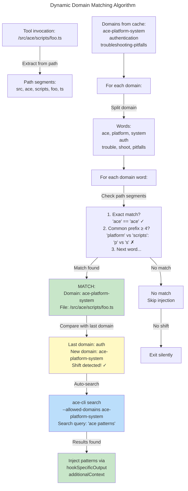
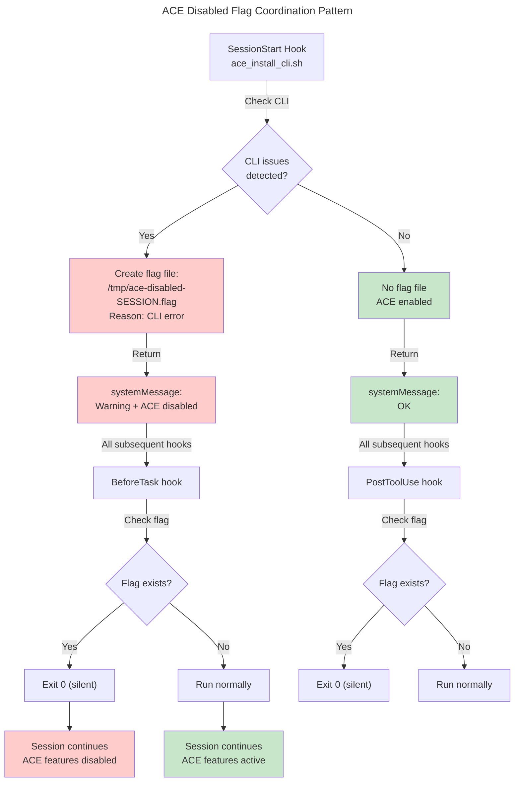

# C4 Code Level: ACE Plugin Scripts

## Overview

- **Name**: ACE Plugin Bash Hook Wrapper Scripts
- **Description**: Bash wrapper scripts that serve as entry points for Claude Code hooks. Each wrapper handles stdin JSON parsing, environment setup, and delegates to Python implementations or external CLI commands.
- **Location**: `/Users/ptsafaridis/repos/github_com/ce-dot-net/ce-claude-marketplace/plugins/ace/scripts/`
- **Language**: Bash (shell scripting), delegates to Python, jq, and CLI utilities
- **Purpose**: Orchestrate ACE plugin lifecycle across Claude Code hook events (SessionStart, BeforeTask, Stop, etc.), manage CLI integration, version checking, configuration migration, pattern storage/recall, and learning capture
- **Version**: v5.4.28 (current production)

## Architecture

The scripts directory implements the **Hook Wrapper Pattern** where:

1. **Claude Code fires hook events** with JSON stdin
2. **Bash wrappers** parse environment, validate configuration, check disabled flags
3. **Conditional delegation** to Python hooks or external CLIs
4. **Atomic operations** using temp files and flag files for inter-hook coordination
5. **Error handling** with exit codes and systemMessage output

### Hook Execution Flow

```
Claude Code Event (e.g., SessionStart)
        ↓
Bash Wrapper (e.g., ace_install_cli.sh)
    ├─ Parse stdin JSON
    ├─ Check ACE_DISABLED_FLAG
    ├─ Validate configuration
    ├─ Run validators
    └─ Delegate to Python or CLI
        ↓
Python Hook (e.g., ace_before_task.py) / CLI Command
    ├─ Perform business logic
    └─ Return JSON response
        ↓
Claude Code output: systemMessage + optional hookSpecificOutput
```

## Code Elements

### Hook Wrapper Scripts

#### ace_install_cli.sh (SessionStart Hook)
- **Type**: CLI Detection & Migration Hook
- **Location**: `/Users/ptsafaridis/repos/github_com/ce-dot-net/ce-claude-marketplace/plugins/ace/scripts/ace_install_cli.sh`
- **Version**: v5.4.27 (with CLAUDE.md cleanup)
- **Purpose**: Initial session validation, CLI detection, version checking, token expiration check, deprecated config detection, and auto-cleanup of obsolete CLAUDE.md content
- **Entry Point**: Called by Claude Code on SessionStart event
- **Input (stdin)**: JSON with fields:
  - `session_id: string` - Unique session identifier
  - `agent_type: string` - "main" or subagent type (Claude Code 2.1.2+)
  - `cwd: string` (optional) - Current working directory
- **Output**: JSON with:
  - `systemMessage: string` - User-facing warning/info
  - No `continue:false` flag (allows Claude Code to continue)
- **Exit Codes**: `0` (success/warning), `1` (error, rare)
- **Key Functions**:
  - Detects `ace-cli` command vs deprecated `ce-ace`
  - Checks version >= 3.10.3
  - Verifies npm package `@ace-sdk/cli` (not deprecated `@ce-dot-net/ce-ace-cli`)
  - Daily update check (cached to prevent npm spam)
  - Token expiration validation via `ace-cli whoami --json`
  - Deprecated config detection in `~/.ace/config.json` and `~/.config/ace/config.json`
  - Auto-cleanup of ACE instructions from CLAUDE.md with markers (`<!-- ACE_SECTION_START -->` / `<!-- ACE_SECTION_END -->`)
  - Saves `agent_type` to `/tmp/ace-agent-type-${SESSION_ID}.txt` for other hooks
  - Creates/clears `ACE_DISABLED_FLAG` (/tmp/ace-disabled-${SESSION_ID}.flag) based on CLI health
- **Dependencies**:
  - External: `jq`, `npm`, `ace-cli` (or deprecated `ce-ace`)
  - Files: `$HOME/CLAUDE.md`, `$PROJECT_DIR/CLAUDE.md`, `$HOME/.ace/config.json`, `$HOME/.config/ace/config.json`

#### ace_before_task_wrapper.sh (BeforeTask Hook)
- **Type**: Pattern Injection Wrapper
- **Location**: `/Users/ptsafaridis/repos/github_com/ce-dot-net/ce-claude-marketplace/plugins/ace/scripts/ace_before_task_wrapper.sh`
- **Version**: v5.4.28
- **Purpose**: Wrapper that runs before each task to inject domain-specific patterns; manages working directory context for Python hook
- **Entry Point**: Called by Claude Code on BeforeTask event
- **Input (stdin)**: JSON with fields:
  - `cwd: string` (optional) - Current working directory
  - `working_directory: string` (optional) - Alternative field name
  - `workingDirectory: string` (optional) - CamelCase variant
  - `transcript_path: string` (optional) - Path to transcript for fallback CWD inference
- **Output**: Delegates to `ace_before_task.py` (Python)
- **Exit Codes**: Inherits from Python hook
- **Key Functions**:
  - Determines working directory from stdin or infers from `transcript_path`
  - Changes to working directory (enables `.claude/settings.json` discovery)
  - Pipes stdin JSON to `uv run ace_before_task.py`
  - Error handling for missing Python script or directory change failures
- **Dependencies**:
  - Internal: `${PLUGIN_ROOT}/shared-hooks/ace_before_task.py`
  - External: `uv`, `jq`, shell utilities

#### ace_after_task_wrapper.sh (AfterTask Hook)
- **Type**: Learning Capture Wrapper
- **Location**: `/Users/ptsafaridis/repos/github_com/ce-dot-net/ce-claude-marketplace/plugins/ace/scripts/ace_after_task_wrapper.sh`
- **Version**: v5.4.28
- **Purpose**: Simple wrapper that delegates task learning capture to Python hook
- **Entry Point**: Called by Claude Code on task completion (Stop/SubagentStop events)
- **Input (stdin)**: JSON with task execution data (delegated to Python)
- **Output**: Delegates to `ace_after_task.py` (Python)
- **Exit Codes**: Inherits from Python hook
- **Key Functions**:
  - Minimal wrapper (just path resolution and delegation)
  - Validates Python script exists
  - Pipes all stdin to Python hook
- **Dependencies**:
  - Internal: `${PLUGIN_ROOT}/shared-hooks/ace_after_task.py`
  - External: `uv`

#### ace_posttooluse_wrapper.sh (PostToolUse Hook)
- **Type**: Tool Accumulation Hook
- **Location**: `/Users/ptsafaridis/repos/github_com/ce-dot-net/ce-claude-marketplace/plugins/ace/scripts/ace_posttooluse_wrapper.sh`
- **Version**: v5.4.7
- **Purpose**: Accumulates tool usage data to SQLite for learning capture; silent operation (no user-facing output)
- **Entry Point**: Called by Claude Code after each tool execution
- **Input (stdin)**: JSON with PostToolUse event data:
  - `session_id: string` - Session identifier
  - `tool_name: string` - Name of tool used (e.g., "Read", "Bash")
  - `tool_input: JSON` - Input parameters to tool
  - `tool_response: JSON` - Tool output/response
  - `tool_use_id: string` - Unique tool invocation ID
  - `cwd: string` (optional) - Working directory
  - `working_directory: string` (optional) - Alternative field
  - `transcript_path: string` (optional) - For CWD fallback
- **Output**: JSON with:
  - `systemMessage: ""` - Empty (silent operation)
  - No hook-specific output (silent)
- **Exit Codes**: `0` (always, even on partial failures)
- **Key Functions**:
  - Checks ACE_DISABLED_FLAG (/tmp/ace-disabled-${SESSION_ID}.flag)
  - Detects CLI command (`ace-cli` or fallback `ce-ace`)
  - Sanitizes invalid UTF-8 sequences with `iconv` to prevent jq failures
  - Extracts working directory with fallback from transcript_path
  - Parses tool metadata with error handling for malformed JSON
  - Calls Python accumulator: `uv run ace_tool_accumulator.py append`
  - Appends to SQLite with: --session-id, --tool-name, --tool-input, --tool-response, --tool-use-id, --working-dir
  - Optional debug logging to /tmp/ace_hook_debug.log (if ACE_DEBUG_HOOKS=1)
- **Dependencies**:
  - Internal: `${PLUGIN_ROOT}/shared-hooks/ace_tool_accumulator.py`, `ace_event_logger.py`
  - External: `uv`, `jq`, `iconv`
  - Temp files: `/tmp/ace-disabled-${SESSION_ID}.flag`

#### ace_precompact_wrapper.sh (PreCompact Hook)
- **Type**: Pattern Preservation Hook
- **Location**: `/Users/ptsafaridis/repos/github_com/ce-dot-net/ce-claude-marketplace/plugins/ace/scripts/ace_precompact_wrapper.sh`
- **Version**: v5.4.28 (Issue #17 fix)
- **Purpose**: Saves pinned patterns to temp file before context compaction; enables SessionStart(compact) to re-inject after compaction
- **Entry Point**: Called by Claude Code before context compaction
- **Input (stdin)**: JSON with UserPromptSubmit data (not used directly, but session context from files)
- **Output**: JSON with:
  - `systemMessage: string` - Pattern count confirmation
  - No `hookSpecificOutput` (side-effect only, PreCompact hooks don't support additionalContext)
- **Exit Codes**: `0` (always)
- **Key Functions**:
  - Checks ACE_DISABLED_FLAG (/tmp/ace-disabled-${SESSION_ID_FOR_FLAG}.flag)
  - Detects CLI command (`ace-cli` or fallback `ce-ace`)
  - Reads PROJECT_ID from `.claude/settings.json`
  - Reads SESSION_ID from `/tmp/ace-session-${PROJECT_ID}.txt` (saved by BeforeTask/UserPromptSubmit)
  - Calls `ace-cli cache recall --session ${SESSION_ID} --json`
  - Filters CLI notifications (lines starting with "💡") to prevent JSON corruption
  - Parses recall response for pattern count and similar_patterns array
  - Formats patterns as markdown list: `• [section] content`
  - Writes atomic temp file: `/tmp/ace-patterns-precompact-${SESSION_ID}.json` with umask 077
  - Returns systemMessage with pattern count confirmation
- **Dependencies**:
  - Internal: None (side-effect only)
  - External: `ace-cli`, `jq`, `mktemp`, `umask`
  - Temp files: `/tmp/ace-patterns-precompact-${SESSION_ID}.json`, `/tmp/ace-session-${PROJECT_ID}.txt`
  - Config: `.claude/settings.json` (read for PROJECT_ID, ORG_ID)

#### ace_sessionstart_compact.sh (SessionStart(compact) Hook)
- **Type**: Pattern Restoration Hook
- **Location**: `/Users/ptsafaridis/repos/github_com/ce-dot-net/ce-claude-marketplace/plugins/ace/scripts/ace_sessionstart_compact.sh`
- **Version**: v5.4.28 (Issue #17 fix)
- **Purpose**: Re-injects patterns after context compaction using data saved by PreCompact hook
- **Entry Point**: Called by Claude Code on SessionStart with matcher: "compact" (after compaction)
- **Input (stdin)**: JSON with SessionStart event:
  - `session_id: string` - Session identifier
  - Other session metadata (unused)
- **Output**: JSON with:
  - `systemMessage: string` - Restoration confirmation
  - `hookSpecificOutput: object` - **Valid SessionStart hook output**:
    - `hookEventName: "SessionStart"`
    - `additionalContext: string` - Markdown with `<ace-patterns-recalled>` tags
- **Exit Codes**: `0` (always)
- **Key Functions**:
  - Checks ACE_DISABLED_FLAG (/tmp/ace-disabled-${SESSION_ID_FOR_FLAG}.flag)
  - Determines SESSION_ID from:
    - Primary: PROJECT_ID + `/tmp/ace-session-${PROJECT_ID}.txt` (same source as PreCompact)
    - Fallback: stdin `session_id` field
  - Reads temp file: `/tmp/ace-patterns-precompact-${SESSION_ID}.json`
  - Extracts patterns, session_id, and count
  - Removes temp file after reading (cleanup)
  - Formats additionalContext with HTML comments and XML-style tags
  - Returns valid hookSpecificOutput for context injection (SessionStart hook supports this)
- **Dependencies**:
  - Temp files: `/tmp/ace-patterns-precompact-${SESSION_ID}.json`, `/tmp/ace-session-${PROJECT_ID}.txt`
  - Config: `.claude/settings.json` (read for PROJECT_ID)
  - External: `jq`

#### ace_pretooluse_wrapper.sh (PreToolUse Hook)
- **Type**: Continuous Auto-Search Hook
- **Location**: `/Users/ptsafaridis/repos/github_com/ce-dot-net/ce-claude-marketplace/plugins/ace/scripts/ace_pretooluse_wrapper.sh`
- **Version**: v5.4.7
- **Purpose**: Automatically searches for domain-specific patterns when Claude shifts to a new domain; injects patterns BEFORE tool execution
- **Entry Point**: Called by Claude Code before each tool invocation
- **Input (stdin)**: JSON with PreToolUse event:
  - `tool_name: string` - Tool name ("Read", "Glob", "Grep", etc.)
  - `tool_input.file_path: string` (optional) - File being read
  - `tool_input.path: string` (optional) - Alternative field
  - `tool_input.pattern: string` (optional) - Grep pattern field
  - `session_id: string` - Session identifier
- **Output**: JSON with:
  - `systemMessage: string` - Info about domain shift or reminder
  - `hookSpecificOutput: object` (conditional) - If domain shift detected and patterns found:
    - `hookEventName: "PreToolUse"`
    - `additionalContext: string` - Patterns wrapped in `<ace-patterns-domain-shift>` tags
- **Exit Codes**: `0` (always)
- **Key Functions**:
  - Checks ACE_DISABLED_FLAG (/tmp/ace-disabled-${SESSION_ID_FOR_FLAG}.flag)
  - Detects CLI command (`ace-cli` or fallback `ce-ace`)
  - Filters to file read operations: ("Read", "Glob", "Grep")
  - Reads stored domains from `/tmp/ace-domains-${PROJECT_ID}.json` (written by BeforeTask)
  - Implements **dynamic domain matching** (no hardcoded lists):
    - Splits hyphenated domain names into words: "ace-platform-system" → ["ace", "platform", "system"]
    - Splits file path into segments: "/ace/scripts/foo.ts" → ["ace", "scripts", "foo", "ts"]
    - Matches words against segments: exact match OR 4+ char common prefix (semantic match)
  - Tracks current domain in `/tmp/ace-domain-${PROJECT_ID}.txt`
  - Detects **domain shift**: when new domain ≠ last domain AND last domain exists
  - On domain shift:
    - Builds search query: first word of domain + "patterns"
    - Calls `ace-cli search --stdin --json --allowed-domains ${MATCHED_DOMAIN}`
    - Parses result for pattern count
    - Logs shift metrics to `.claude/data/logs/ace-relevance.jsonl` (JSON Lines format)
    - Injects patterns via hookSpecificOutput.additionalContext (if successful)
    - Falls back to reminder if search fails
- **Dependencies**:
  - Internal: None (reads domain files written by BeforeTask)
  - External: `ace-cli`, `jq`, `iconv`
  - Temp files: `/tmp/ace-domain-${PROJECT_ID}.txt`, `/tmp/ace-domains-${PROJECT_ID}.json`
  - Config: `.claude/settings.json` (read for PROJECT_ID, ORG_ID)
  - Logs: `.claude/data/logs/ace-relevance.jsonl`

#### ace_stop_wrapper.sh (Stop Hook)
- **Type**: Learning Capture Wrapper (with async support)
- **Location**: `/Users/ptsafaridis/repos/github_com/ce-dot-net/ce-claude-marketplace/plugins/ace/scripts/ace_stop_wrapper.sh`
- **Version**: v5.4.7
- **Purpose**: Captures learning from completed tasks; supports both sync and async modes (Issue #3 fix)
- **Entry Point**: Called by Claude Code when session ends (Stop event)
- **Input (stdin)**: JSON with Stop event:
  - `hook_event_name: string` - Set to "Stop" by wrapper before delegation
  - `cwd: string` (optional) - Working directory
  - `working_directory: string` (optional) - Alternative field
  - `workingDirectory: string` (optional) - CamelCase variant
  - `transcript_path: string` (optional) - Path to transcript
  - Other task metadata
- **Output**: JSON with:
  - `systemMessage: string` - Status message ("✅ [ACE] Learning started in background" for async)
  - `continue: boolean` (optional) - true in async mode
- **Exit Codes**: `0` (success), `1` (error)
- **Environment Variables**:
  - `ACE_ASYNC_LEARNING` (default: 1) - Enable async mode
  - `ACE_EVENT_LOGGING` (default: 0) - Enable event logging
- **Key Functions**:
  - Checks ACE_DISABLED_FLAG (/tmp/ace-disabled-${SESSION_ID}.flag)
  - Detects CLI command (`ace-cli` or fallback `ce-ace`)
  - Verifies Python script and logger exist
  - Extracts working directory with fallback logic
  - Validates global config exists at `${XDG_CONFIG_HOME}/ace/config.json` or `$HOME/.config/ace/config.json`
  - Injects `hook_event_name: "Stop"` into event JSON (used by ace_after_task.py)
  - **Async Mode (ACE_ASYNC_LEARNING=1)**:
    - Writes INPUT_JSON to temp file
    - Spawns `uv run ace_after_task.py` in background
    - Immediately returns "✅ Learning started in background"
    - Logs background errors to `${HOME}/.claude/logs/ace-background-*.log`
  - **Sync Mode (ACE_ASYNC_LEARNING=0)**:
    - Waits for `uv run ace_after_task.py` to complete
    - Returns result directly
  - Execution time measurement (cross-platform milliseconds via Python)
  - Optional event logging via `ace_event_logger.py` (disabled by default)
  - Optional chat transcript saving (disabled by default, ACE_EVENT_LOGGING=1 enables)
  - Optional notifications (disabled by default)
- **Dependencies**:
  - Internal: `${PLUGIN_ROOT}/shared-hooks/ace_after_task.py`, `ace_event_logger.py`
  - External: `uv`, `jq`, `python3`, `ace-cli`
  - Temp files: `/tmp/ace-disabled-${SESSION_ID}.flag`, temp input/output files in async mode
  - Config: `${XDG_CONFIG_HOME:-$HOME/.config}/ace/config.json`

#### ace_subagent_stop_wrapper.sh (SubagentStop Hook)
- **Type**: Subagent Learning Capture Wrapper
- **Location**: `/Users/ptsafaridis/repos/github_com/ce-dot-net/ce-claude-marketplace/plugins/ace/scripts/ace_subagent_stop_wrapper.sh`
- **Version**: v5.4.7
- **Purpose**: Captures learning when Task agents complete; fires after substantial work for better learning signals
- **Entry Point**: Called by Claude Code on SubagentStop event
- **Input (stdin)**: JSON with SubagentStop event:
  - `hook_event_name: string` - Set to "SubagentStop" by wrapper
  - `subagent_type: string` - Type of subagent (e.g., "coder", "reviewer")
  - `cwd: string` (optional) - Working directory
  - `working_directory: string` (optional) - Alternative field
  - `transcript_path: string` (optional) - Path to subagent transcript
  - Other execution metadata
- **Output**: JSON with:
  - `systemMessage: string` - Status message
  - Result from Python hook
- **Exit Codes**: `0` (success), `1` (error)
- **Environment Variables**:
  - `ACE_EVENT_LOGGING` (default: 0) - Enable event logging
- **Key Functions**:
  - Checks ACE_DISABLED_FLAG (/tmp/ace-disabled-${SESSION_ID}.flag)
  - Detects CLI command (`ace-cli` or fallback `ce-ace`)
  - Extracts working directory with fallback logic
  - Injects `hook_event_name: "SubagentStop"` (used by ace_after_task.py for agent_transcript_path selection)
  - Calls `uv run ace_after_task.py` synchronously (waits for completion)
  - Execution time measurement (cross-platform milliseconds via Python)
  - Event logging (same as Stop hook)
  - Optional subagent transcript saving (ACE_EVENT_LOGGING=1)
  - Optional notifications with subagent type identification
- **Dependencies**:
  - Internal: `${PLUGIN_ROOT}/shared-hooks/ace_after_task.py`, `ace_event_logger.py`
  - External: `uv`, `jq`, `python3`, `ace-cli`
  - Temp files: `/tmp/ace-disabled-${SESSION_ID}.flag`

#### ace_permission_request_wrapper.sh (PermissionRequest Hook)
- **Type**: Permission Request Handler
- **Location**: `/Users/ptsafaridis/repos/github_com/ce-dot-net/ce-claude-marketplace/plugins/ace/scripts/ace_permission_request_wrapper.sh`
- **Version**: v5.4.28
- **Purpose**: Auto-approves safe ACE CLI commands, denies dangerous ones; delegates to Python for intelligent approval
- **Entry Point**: Called by Claude Code on PermissionRequest event
- **Input (stdin)**: JSON with permission request data
- **Output**: Delegates to Python for decision
- **Exit Codes**: Inherits from Python hook
- **Key Functions**:
  - Minimal wrapper
  - Directly executes `${PLUGIN_ROOT}/shared-hooks/ace_permission_request.py`
  - Python hook handles all approval/denial logic
- **Dependencies**:
  - Internal: `${PLUGIN_ROOT}/shared-hooks/ace_permission_request.py`

### Utility Scripts

#### ace-bootstrap.sh (Bootstrap Command)
- **Type**: CLI Bootstrap Utility
- **Location**: `/Users/ptsafaridis/repos/github_com/ce-dot-net/ce-claude-marketplace/plugins/ace/scripts/ace-bootstrap.sh`
- **Version**: v5.4.28
- **Purpose**: Bootstraps ACE playbook with initial pattern collection
- **Entry Point**: Called by user via `/ace-bootstrap` command or direct execution
- **Input (arguments)**:
  - `MODE` (optional, default: "hybrid") - Bootstrap mode: "hybrid", "aggressive", "conservative"
  - `THOROUGHNESS` (optional, default: "medium") - Thoroughness level: "low", "medium", "high"
- **Output**: Terminal output from `ace-cli bootstrap` command
- **Exit Codes**: `1` (if ace-cli not found), `1` (if config missing), inherits from ace-cli
- **Key Functions**:
  - Checks `ace-cli` command availability
  - Reads `orgId` and `projectId` from `.claude/settings.json` via jq
  - Validates both ORG_ID and PROJECT_ID are set (errors if missing)
  - Exports context as environment variables: ACE_ORG_ID, ACE_PROJECT_ID
  - Delegates to: `ace-cli bootstrap --mode ${MODE} --thoroughness ${THOROUGHNESS}`
- **Dependencies**:
  - External: `ace-cli`, `jq`
  - Config: `.claude/settings.json` (must contain orgId and projectId)

#### ace-tune.sh (Tune Command)
- **Type**: CLI Tuning Utility
- **Location**: `/Users/ptsafaridis/repos/github_com/ce-dot-net/ce-claude-marketplace/plugins/ace/scripts/ace-tune.sh`
- **Version**: v5.4.28
- **Purpose**: Tunes ACE patterns and configuration via CLI
- **Entry Point**: Called by user via `/ace:ace-tune` command or direct execution
- **Input (arguments)**: All arguments forwarded directly to `ace-cli tune`
- **Output**: Terminal output from `ace-cli tune` command
- **Exit Codes**: `1` (if config missing), inherits from ace-cli
- **Key Functions**:
  - Reads `orgId` and `projectId` from `.claude/settings.json` via jq
  - Validates both ORG_ID and PROJECT_ID are set
  - Exports context as environment variables: ACE_ORG_ID, ACE_PROJECT_ID
  - Passes all arguments through: `ace-cli tune "$@"`
- **Dependencies**:
  - External: `ace-cli`, `jq`
  - Config: `.claude/settings.json`

#### migrate-to-v5.sh (Migration Script)
- **Type**: Migration Utility
- **Location**: `/Users/ptsafaridis/repos/github_com/ce-dot-net/ce-claude-marketplace/plugins/ace/scripts/migrate-to-v5.sh`
- **Version**: v5.4.28 (supports v4.2.6 → v5.0.0 migration)
- **Purpose**: Interactive migration from MCP-based v4 architecture to CLI-based v5 architecture
- **Entry Point**: Called by user for one-time migration
- **Input (interactive)**: User responses to prompts (y/n)
- **Output**: Formatted output with color codes and migration instructions
- **Exit Codes**: `0` (success), `1` (fatal error - usually npm install failure)
- **Key Functions**:
  - **Step 1**: Detects ace-cli, prompts for installation if missing
  - **Step 2**: Checks for old MCP config at `$HOME/.claude/mcp/config.json`
  - **Step 3**: Backs up and cleans MCP config (removes ace-pattern-learning entry via jq)
  - **Step 4**: Checks project CLAUDE.md for old ACE sections (v4 format)
  - **Step 5**: Summarizes migration status with colorized output
  - Final instructions for post-migration setup (run /ace-configure, /ace-status, etc.)
  - Color-coded output: GREEN (✅), RED (❌), YELLOW (⚠️), BLUE (ℹ️)
- **Dependencies**:
  - External: `npm`, `jq`, `command`, shell utilities
  - Files: `$HOME/.claude/mcp/config.json`, `CLAUDE.md`
  - Environment: XDG_CONFIG_HOME (optional)

## Dependencies

### Internal Dependencies

- **Shared Python Hooks** (in `${PLUGIN_ROOT}/shared-hooks/`):
  - `ace_before_task.py` - Pattern injection and domain tracking (BeforeTask hook)
  - `ace_after_task.py` - Learning capture from task execution (Stop/SubagentStop hooks)
  - `ace_tool_accumulator.py` - SQLite-based tool usage accumulation (PostToolUse hook)
  - `ace_event_logger.py` - Event logging for debugging/metrics (optional)
  - `ace_permission_request.py` - Permission approval/denial logic (PermissionRequest hook)

### External Dependencies

- **CLI Tools**:
  - `ace-cli` v3.10.3+ (primary) - ACE SDK command line interface (new v5.0.0+)
  - `ce-ace` (deprecated, fallback) - Legacy command name from @ce-dot-net/ce-ace-cli
  
- **System Utilities**:
  - `bash` - Shell interpreter (bash 4.0+ recommended for string manipulation)
  - `jq` - JSON query/manipulation (used in all hooks for parsing)
  - `sed` - Stream editor (for CLAUDE.md cleanup with regex)
  - `grep` - Pattern matching (for deprecated config detection)
  - `mktemp` - Temp file creation (for atomic writes)
  - `umask` - File permission control (for secure temp files)
  - `sort` - Sorting utility (for version comparison)
  - `cut` - Field extraction (for domain parsing)
  - `tr` - Character translation (for case conversion and field splitting)
  - `iconv` - Character encoding conversion (for UTF-8 sanitization)
  - `cat` - Concatenation (stdin handling)
  - `cp`, `mv`, `rm` - File operations
  - `echo` - Output
  - `date` - Timestamps
  
- **Language Runtimes**:
  - `uv` - Fast Python package manager and runner (for Python hook delegation)
  - `python3` - Python interpreter (for execution time measurement, indirect via uv)
  
- **Package Managers**:
  - `npm` - Node package manager (for ace-cli installation, version checking)

### Temp Files (Runtime Coordination)

These files are created in `/tmp/` for inter-hook coordination and data persistence:

- **Flag Files** (disable ACE on errors):
  - `/tmp/ace-disabled-${SESSION_ID}.flag` - Created by SessionStart if CLI issues detected; checked by all other hooks

- **Context Files** (session metadata):
  - `/tmp/ace-session-${PROJECT_ID}.txt` - Session ID (written by BeforeTask, read by PreCompact/SessionStart(compact))
  - `/tmp/ace-agent-type-${SESSION_ID}.txt` - Agent type from Claude Code 2.1.2+ (written by SessionStart)
  - `/tmp/ace-domain-${PROJECT_ID}.txt` - Current domain context (written by PreToolUse)
  - `/tmp/ace-domains-${PROJECT_ID}.json` - Stored domain names (written by BeforeTask, read by PreToolUse)

- **Pattern Files** (compaction handling):
  - `/tmp/ace-patterns-precompact-${SESSION_ID}.json` - Patterns saved before compaction (written by PreCompact, read by SessionStart(compact))

- **Cache Files** (update checks):
  - `/tmp/ace-update-check-$(date +%Y%m%d).txt` - Latest available CLI version (cached daily)

- **Debug Logs** (optional):
  - `/tmp/ace_hook_debug.log` - Hook execution trace (if ACE_DEBUG_HOOKS=1)
  - `${HOME}/.claude/logs/ace-background-*.log` - Async learning background errors

## Configuration Files

- `.claude/settings.json` - ACE project configuration (read by all hooks for projectId, orgId)
- `.claude/data/logs/` - Directory for hook logs (created as needed)
- `$HOME/.config/ace/config.json` - Global ACE configuration (checked by Stop hook)
- `$HOME/CLAUDE.md` - Global Claude.md instructions (checked for deprecated ACE content)
- `${PROJECT_DIR}/CLAUDE.md` - Project-level Claude.md instructions (checked for deprecated ACE content)

## Error Handling Patterns

### Exit Code Convention

- **0**: Success or recoverable warning (hook completes, Claude Code continues)
- **1**: Fatal error (hook fails, but usually doesn't block Claude Code unless hook output is invalid JSON)

### JSON Output Convention

All hooks output JSON with mandatory `systemMessage` field:

```json
{
  "systemMessage": "User-facing message",
  "hookSpecificOutput": {
    "hookEventName": "HookType",
    "additionalContext": "Optional context injection"
  }
}
```

**Important Notes**:
- `systemMessage` may be empty string `""` for silent operations (PostToolUse)
- `hookSpecificOutput` is optional; only some hooks support context injection
- `continue:false` is **avoided** (would block entire Claude Code session)
- PreCompact hooks support `systemMessage` only (no `hookSpecificOutput`)
- SessionStart/BeforeTask hooks support both `systemMessage` and `hookSpecificOutput.additionalContext`

### Silent Exit Pattern

For hooks that are data collectors (PostToolUse), they:
- Always exit 0
- Return `{"systemMessage": ""}` for silent operation
- Perform side-effects (SQLite append, file write)
- Provide no user feedback

### Fallback Logic Pattern

For directory/file detection:
1. First try: stdin field (`cwd`, `working_directory`, `workingDirectory`)
2. Second try: Infer from `transcript_path` by going up 2 levels
3. Third try: Current working directory (pwd)
4. Always validate directory exists before changing

### Version Comparison Pattern

```bash
if ! printf '%s\n' "$MIN_VERSION" "$CURRENT_VERSION" | sort -V -C 2>/dev/null; then
  # Version is too old
fi
```

Uses `sort -V` for semantic version comparison.

## Relationships & Flow Diagrams

### Hook Execution Sequence (Complete Session Lifecycle)

```mermaid
---
title: ACE Hook Execution Flow (Complete Session)
---
flowchart TD
    Start["Claude Code Session Starts"] -->|SessionStart event| Install["ace_install_cli.sh<br/>- Detect CLI<br/>- Version check<br/>- Token validation<br/>- CLAUDE.md cleanup"]
    
    Install -->|Flag file set?| Disabled["ACE Disabled for Session"]
    Install -->|No issues| TaskReady["Session Ready"]
    
    Disabled -->|All other hooks| SilentExit["Exit 0 (silent)"]
    
    TaskReady -->|BeforeTask event| BeforTask["ace_before_task_wrapper.sh<br/>- Inject patterns<br/>- Track domains<br/>- Save session ID"]
    
    BeforTask --> UserPrompt["User Submits Task"]
    
    UserPrompt -->|During execution| ToolLoop["Tool Loop..."]
    
    ToolLoop -->|PreToolUse event| PreTool["ace_pretooluse_wrapper.sh<br/>- Detect domain shift<br/>- Auto-search patterns<br/>- Inject if match"]
    
    PreTool -->|Tool execution| ToolExec["Tool Runs<br/>(Read, Bash, etc.)"]
    
    ToolExec -->|PostToolUse event| PostTool["ace_posttooluse_wrapper.sh<br/>- Accumulate to SQLite<br/>- Silent operation"]
    
    PostTool -->|Next tool or task end| CheckEnd{End of<br/>Task?}
    
    CheckEnd -->|No| ToolLoop
    CheckEnd -->|Yes| CompactCheck{Context<br/>Compacting?}
    
    CompactCheck -->|Yes| PreCompact["ace_precompact_wrapper.sh<br/>- Recall patterns<br/>- Save to temp file"]
    
    PreCompact -->|Compaction occurs| Compact["Context Compaction"]
    
    Compact -->|SessionStart(compact)| SessionCompact["ace_sessionstart_compact.sh<br/>- Restore patterns<br/>- Re-inject context"]
    
    SessionCompact --> StopEvent["Continue with tasks..."]
    
    CompactCheck -->|No| StopEvent
    
    StopEvent -->|Stop event| Stop["ace_stop_wrapper.sh<br/>- Learning capture<br/>- Async or sync mode"]
    
    Stop -->|SubagentStop event| SubagentStop["ace_subagent_stop_wrapper.sh<br/>- Subagent learning<br/>- Same as Stop hook"]
    
    SubagentStop -->|Session ends| End["Session Complete"]
    
    SilentExit --> End
    
    style Start fill:#e1f5ff
    style End fill:#c8e6c9
    style Disabled fill:#ffcccc
    style SilentExit fill:#ffcccc
```

### Hook Wrapper Architecture

```mermaid
---
title: Hook Wrapper Pattern Architecture
---
classDiagram
    namespace HookWrappers {
        class SessionStartHook {
            <<hook>>
            +stdin: JSON
            +ace_install_cli.sh
            +Detects CLI issues
            +Returns: systemMessage
        }
        
        class BeforeTaskHook {
            <<hook>>
            +stdin: JSON
            +ace_before_task_wrapper.sh
            +Delegates to ace_before_task.py
            +Injects patterns
        }
        
        class PreToolUseHook {
            <<hook>>
            +stdin: JSON
            +ace_pretooluse_wrapper.sh
            +Detects domain shift
            +Auto-searches patterns
            +Returns: hookSpecificOutput
        }
        
        class PostToolUseHook {
            <<hook>>
            +stdin: JSON
            +ace_posttooluse_wrapper.sh
            +Accumulates tool usage
            +Silent operation
        }
        
        class PreCompactHook {
            <<hook>>
            +stdin: JSON
            +ace_precompact_wrapper.sh
            +Saves patterns to temp
            +Returns: systemMessage
        }
        
        class SessionStartCompactHook {
            <<hook>>
            +stdin: JSON
            +ace_sessionstart_compact.sh
            +Restores patterns
            +Returns: hookSpecificOutput
        }
        
        class StopHook {
            <<hook>>
            +stdin: JSON
            +ace_stop_wrapper.sh
            +Captures learning async/sync
            +Delegates to ace_after_task.py
        }
        
        class SubagentStopHook {
            <<hook>>
            +stdin: JSON
            +ace_subagent_stop_wrapper.sh
            +Subagent learning capture
            +Similar to StopHook
        }
    }
    
    namespace PythonHooks {
        class AceBeforeTask {
            <<python>>
            +ace_before_task.py
            +Pattern injection
            +Domain tracking
        }
        
        class AceAfterTask {
            <<python>>
            +ace_after_task.py
            +Learning capture
            +Hook event dispatch
        }
        
        class AceToolAccumulator {
            <<python>>
            +ace_tool_accumulator.py
            +SQLite operations
            +Tool recording
        }
    }
    
    namespace ExternalCLI {
        class AceCLI {
            <<cli>>
            +ace-cli command
            +whoami validation
            +cache recall
            +search operations
            +bootstrap/tune
        }
    }
    
    SessionStartHook -->|checks| AceCLI
    BeforeTaskHook -->|delegates to| AceBeforeTask
    PreToolUseHook -->|calls| AceCLI
    PostToolUseHook -->|delegates to| AceToolAccumulator
    StopHook -->|delegates to| AceAfterTask
    SubagentStopHook -->|delegates to| AceAfterTask
```

### Data Flow: Tool Accumulation & Learning

```mermaid
---
title: Tool Accumulation & Learning Capture Flow
---
flowchart LR
    ToolUse["Tool Execution<br/>(Claude Code)"]
    
    ToolUse -->|PostToolUse| PostToolHook["ace_posttooluse_wrapper.sh<br/>- Parse stdin<br/>- Extract tool data<br/>- Check disabled flag"]
    
    PostToolHook -->|Accumulate| SQLite["SQLite Database<br/>ace_tool_accumulator.py<br/>- session_id<br/>- tool_name<br/>- tool_input<br/>- tool_response<br/>- tool_use_id"]
    
    SQLite -->|Session ends| StopEvent["Stop/SubagentStop Event"]
    
    StopEvent -->|ace_after_task.py| Learning["Learning Extraction<br/>- Query SQLite<br/>- Extract patterns<br/>- Generate embeddings<br/>- Send to API"]
    
    Learning -->|ace-cli cache store| Cache["Pattern Cache<br/>ace-cli cache"]
    
    Cache -->|NextSession| Recall["ace-cli cache recall<br/>- Pattern retrieval<br/>- Domain matching"]
    
    Recall -->|BeforeTask| Injection["Pattern Injection<br/>- Add to context<br/>- Domain-specific"]
    
    style ToolUse fill:#e3f2fd
    style SQLite fill:#fff9c4
    style Cache fill:#f0f4c3
    style Recall fill:#c8e6c9
    style Injection fill:#c8e6c9
```



### Domain Matching Algorithm (PreToolUse)



### Configuration & Disabled Flag Pattern



## Notes

### Key Design Patterns

1. **Flag File Coordination**: `ace_disabled_${SESSION_ID}.flag` enables distributed disable mechanism across hooks without requiring shared process state

2. **Temp File Handoff**: PreCompact → SessionStart(compact) uses `/tmp/ace-patterns-precompact-${SESSION_ID}.json` for context preservation through compaction (limitation workaround: PreCompact hooks don't support hookSpecificOutput)

3. **Atomic File Operations**: Secure temp files with `umask 077` and atomic mv to prevent race conditions

4. **Silent Failures**: PostToolUse always exits 0 even on partial failures to avoid blocking tool execution

5. **Async Learning**: Stop hook supports background execution (ACE_ASYNC_LEARNING=1) to prevent session blocking on learning capture

6. **Dynamic Domain Matching**: No hardcoded lists; splits domain/path into words, uses exact match + 4-char prefix semantic matching

7. **Working Directory Inference**: Multi-level fallback (stdin → transcript_path → pwd) for directory discovery

8. **Version Comparison**: Uses `sort -V` for semantic version ordering (handles v3.10.3 correctly)

9. **UTF-8 Sanitization**: `iconv` strips unpaired surrogates to prevent jq parse errors on malformed JSON

10. **Session Context**: Session ID stored in `/tmp/ace-session-${PROJECT_ID}.txt` (written by BeforeTask, read by PreCompact, SessionStart(compact), PreToolUse)

### Migration from v4.2.6 to v5.0.0

The `migrate-to-v5.sh` script guides users through:
- Installing new `@ace-sdk/cli` package
- Removing deprecated `@ce-dot-net/ce-ace-cli` package  
- Backing up old MCP config from `$HOME/.claude/mcp/config.json`
- Cleaning up old CLAUDE.md ACE sections
- Interactive prompts with color-coded output

### Performance Characteristics

- **SessionStart hook**: ~2-3s (CLI version check, token validation, CLAUDE.md cleanup)
- **BeforeTask hook**: ~100-500ms (pattern injection, domain tracking)
- **PreToolUse hook**: ~50-200ms (domain shift detection, conditional search)
- **PostToolUse hook**: ~10-50ms (SQLite append, silent)
- **PreCompact hook**: ~10-100ms (ace-cli cache recall, temp file write)
- **SessionStart(compact) hook**: ~5-10ms (temp file read, cleanup)
- **Stop hook**: ~1-30s in async mode (returns immediately), ~10-60s in sync mode
- **SubagentStop hook**: Similar to Stop hook

### Security Considerations

1. **Credential Handling**: No hardcoded credentials; all config read from `.claude/settings.json` and `~/.config/ace/config.json`
2. **Temp File Permissions**: Secure temp files with `umask 077` to prevent world-readable access
3. **UTF-8 Sanitization**: All JSON parsed with error handling to prevent injection attacks
4. **Permission Request Hook**: Delegates to Python for intelligent approval/denial logic (prevents accidental dangerous operations)
5. **Disabled Flag Pattern**: Fail-safe design (if CLI issues detected, all hooks gracefully disable)

### Debugging & Logging

Enable debug logging with environment variables:

```bash
# Hook execution trace
export ACE_DEBUG_HOOKS=1  # Logs to /tmp/ace_hook_debug.log

# Event logging (disabled by default, ~42GB/session)
export ACE_EVENT_LOGGING=1  # Enables ace_event_logger.py

# Async learning logs
# Errors logged to: ${HOME}/.claude/logs/ace-background-*.log

# Tool accumulation logs via ace-relevance.jsonl
# Location: .claude/data/logs/ace-relevance.jsonl
```

### Version History

- **v5.4.28**: PreCompact → SessionStart(compact) handoff (Issue #17 fix)
- **v5.4.27**: CLAUDE.md auto-cleanup with marker detection
- **v5.4.23**: Deprecated config detection for apiToken format
- **v5.4.13**: Token expiration check on SessionStart
- **v5.4.11**: Agent type capture from Claude Code 2.1.2+
- **v5.4.7**: Flag-based hook disable + daily update check
- **v5.3.0**: SQLite-based tool accumulation (PostToolUse)
- **v5.0.0**: CLI-based architecture (MCP → ace-cli migration)

