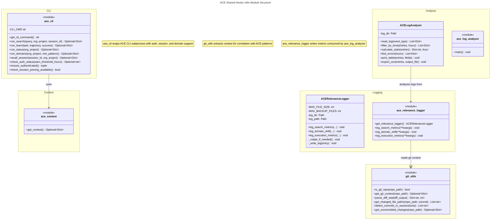

# C4 Code Level: ACE Shared-Hooks Utilities

## Overview

- **Name**: ACE Shared-Hooks Utilities Module
- **Description**: Core utility modules providing context management, CLI interaction, git integration, relevance logging, and log analysis for ACE hook implementations in Claude Code
- **Location**: `/plugins/ace/shared-hooks/utils/`
- **Language**: Python 3.7+
- **Purpose**: Provides foundational utilities for ACE hook integration with ACE CLI, git repository tracking, pattern relevance metrics, and diagnostic analysis. These utilities abstract CLI communication, context resolution, git operations, and logging metrics used by all ACE hooks.

## Code Elements

### Module: ace_context.py

**Purpose**: Context resolution module that reads ACE organization and project IDs from Claude Code settings.

#### Functions

- `get_context() -> Optional[Dict[str, str]]`
  - **Description**: Read orgId and projectId from .claude/settings.json with fallback to environment variables. Supports both direct format (`{\"orgId\": \"...\", \"projectId\": \"...\"}`) and env wrapper format (`{\"env\": {\"ACE_ORG_ID\": \"...\", \"ACE_PROJECT_ID\": \"...\"}}`)
  - **Location**: `/plugins/ace/shared-hooks/utils/ace_context.py:10-51`
  - **Parameters**:
    - None
  - **Returns**: `Optional[Dict[str, str]]` - Dictionary with 'org' and 'project' keys, or None if not found
  - **Dependencies**:
    - Standard library: `json`, `os`, `pathlib.Path`, `typing`
    - Reads: `.claude/settings.json` file
    - Fallback environment variables: `ACE_ORG_ID`, `ACE_PROJECT_ID`

---

### Module: ace_cli.py

**Purpose**: ACE CLI subprocess wrapper providing high-level functions for ACE CLI operations (search, learn, status, domains, session recall, authentication).

#### Functions

- `get_cli_command() -> str`
  - **Description**: Determine the ACE CLI command name available in PATH. Checks for 'ace-cli' first (preferred), falls back to 'ce-ace'
  - **Location**: `/plugins/ace/shared-hooks/utils/ace_cli.py:7-15`
  - **Parameters**: None
  - **Returns**: `str` - 'ace-cli' if available, otherwise 'ce-ace'
  - **Dependencies**: `shutil.which()` for PATH lookup

- `run_search(query: str, org: str = None, project: str = None, session_id: str = None) -> Optional[Dict[str, Any]]`
  - **Description**: Call ace-cli search --stdin with optional session pinning. Returns parsed JSON response with similar_patterns, domains_summary, count, and threshold. Implements v5.4.21 auth failure detection returning `{\"error\": \"not_authenticated\", \"message\": \"...\"}` on auth failure instead of None
  - **Location**: `/plugins/ace/shared-hooks/utils/ace_cli.py:19-81`
  - **Parameters**:
    - `query: str` - Search query text
    - `org: str = None` - Organization ID (passed via environment)
    - `project: str = None` - Project ID (passed via environment)
    - `session_id: str = None` - Session ID for pattern pinning (requires ace-cli v1.0.11+)
  - **Returns**: `Optional[Dict[str, Any]]` - Parsed JSON response or None on failure. On auth failure, returns `{\"error\": \"not_authenticated\", \"message\": \"...\"}`
  - **Response fields**: `similar_patterns`, `domains_summary`, `count`, `threshold`
  - **Dependencies**: `subprocess`, `json`, `os`, environment variables `ACE_ORG_ID`, `ACE_PROJECT_ID`
  - **Changes**:
    - v5.4.21: Returns structured error dict on auth failure
    - v1.0.11+: Session pinning support via `--pin-session` flag

- `run_learn(task: str, trajectory: str, success: bool, org: str = None, project: str = None, patterns_used: Optional[list] = None) -> Optional[Dict[str, Any]]`
  - **Description**: Call ace-cli learn --stdin with JSON payload. Returns parsed response including learning_statistics (v1.0.13+ servers only). Implements backward compatibility for older servers without learning_statistics
  - **Location**: `/plugins/ace/shared-hooks/utils/ace_cli.py:84-149`
  - **Parameters**:
    - `task: str` - Task description
    - `trajectory: str` - Execution steps taken
    - `success: bool` - Whether task succeeded
    - `org: str = None` - Organization ID
    - `project: str = None` - Project ID
    - `patterns_used: Optional[list] = None` - List of pattern IDs used
  - **Returns**: `Optional[Dict[str, Any]]` - Parsed JSON response or None on failure
  - **Response fields**: `success`, `analysis_performed`, `learning_statistics` (optional: patterns_created, patterns_updated, patterns_pruned, average_confidence, by_section)
  - **Dependencies**: `subprocess`, `json`, `os`
  - **Changes**:
    - v1.0.13+: Returns learning_statistics field
    - Backward compatible with v3.9.x servers

- `run_status(org: str = None, project: str = None) -> Optional[Dict[str, Any]]`
  - **Description**: Call ace-cli status --json to get current ACE server status
  - **Location**: `/plugins/ace/shared-hooks/utils/ace_cli.py:152-179`
  - **Parameters**:
    - `org: str = None` - Organization ID
    - `project: str = None` - Project ID
  - **Returns**: `Optional[Dict[str, Any]]` - Parsed JSON status or None on failure
  - **Dependencies**: `subprocess`, `json`, `os`

- `run_domains(org: str = None, project: str = None, min_patterns: int = None) -> Optional[Dict[str, Any]]`
  - **Description**: Call ace-cli domains --json to list available pattern domains (v3.4.0+). Filters out update notification lines (💡) before parsing JSON. Supports optional min_patterns filter (v3.4.1+)
  - **Location**: `/plugins/ace/shared-hooks/utils/ace_cli.py:182-228`
  - **Parameters**:
    - `org: str = None` - Organization ID
    - `project: str = None` - Project ID
    - `min_patterns: int = None` - Minimum pattern count to include domain
  - **Returns**: `Optional[Dict[str, Any]]` - Parsed JSON response or None on failure
  - **Response fields**: `domains` (List of {name: str, count: int}), `total_domains`, `total_patterns`
  - **Dependencies**: `subprocess`, `json`, `os`
  - **Requirements**: ace-cli v3.4.0+
  - **Use Case**: User discovery of domain names for --allowed-domains filtering

- `recall_session(session_id: str, org: str = None, project: str = None) -> Optional[Dict[str, Any]]`
  - **Description**: Recall pinned patterns from session storage (v1.0.11+). Fast local recall (~10ms), non-fatal failure (returns None if session not found/expired). Sessions expire after 24 hours (configurable TTL)
  - **Location**: `/plugins/ace/shared-hooks/utils/ace_cli.py:231-271`
  - **Parameters**:
    - `session_id: str` - Session ID to recall
    - `org: str = None` - Organization ID
    - `project: str = None` - Project ID
  - **Returns**: `Optional[Dict[str, Any]]` - Recalled patterns as dict or None on error
  - **Response fields**: `similar_patterns`, `count`, `threshold`, `session_id`, `pinned_at`, `expires_at`
  - **Dependencies**: `subprocess`, `json`, `os`
  - **Requirements**: ace-cli v1.0.11+

- `check_auth_status(warn_threshold_hours: float = 2.0) -> Optional[str]`
  - **Description**: Check ACE authentication status with intelligent warning UX (v5.4.21). Implements sliding window token TTL logic - only warns for: hard cap approaching (7-day limit), idle state + token expiring, or actual expiration. Non-blocking, returns None on any error
  - **Location**: `/plugins/ace/shared-hooks/utils/ace_cli.py:274-382`
  - **Parameters**:
    - `warn_threshold_hours: float = 2.0` - Warning threshold for idle detection (ignored for active users)
  - **Returns**: `Optional[str]` - Warning message string if auth issues detected, None if OK
  - **Key Logic**:
    - Don't warn active users (sliding window auto-extends tokens)
    - Check `is_hard_cap_approaching` for 7-day limit
    - Check `last_used_at` for idle detection (only warn if idle ~47h)
    - Parse stdout regardless of returncode (v5.4.21 fix)
  - **Dependencies**: `subprocess`, `json`, `datetime`, `os`
  - **Changes**:
    - v5.4.21: Parse stdout even when returncode != 0
    - v5.4.19: Implement smart idle detection

- `ensure_authenticated() -> tuple`
  - **Description**: Pre-flight synchronous authentication check for ACE operations (v5.4.21). Returns (is_authenticated: bool, error_message: Optional[str]) tuple. Use at start of slash commands/utility functions to fail fast with clear message
  - **Location**: `/plugins/ace/shared-hooks/utils/ace_cli.py:385-423`
  - **Parameters**: None
  - **Returns**: `tuple` - (True, None) if authenticated, (False, \"error message\") if not
  - **Usage**: `is_ok, error = ensure_authenticated(); if not is_ok: return {\"error\": \"not_authenticated\", \"message\": error}`
  - **Dependencies**: `subprocess`, `json`, `os`

- `check_session_pinning_available() -> bool`
  - **Description**: Check if ace-cli CLI supports session pinning (v1.0.11+). Parses CLI version and checks if >= 1.0.11. Used for graceful degradation in features requiring session support
  - **Location**: `/plugins/ace/shared-hooks/utils/ace_cli.py:426-472`
  - **Parameters**: None
  - **Returns**: `bool` - True if session pinning available (v1.0.11+), False otherwise
  - **Usage**: Graceful feature degradation based on CLI version availability
  - **Dependencies**: `subprocess`

#### Module Variables

- `CLI_CMD: str` - Cached CLI command name determined at module load time via `get_cli_command()`
  - **Location**: `/plugins/ace/shared-hooks/utils/ace_cli.py:18`

---

### Module: git_utils.py

**Purpose**: Git repository utilities for extracting commit context and tracking changes during ACE learning sessions.

#### Functions

- `is_git_repo(repo_path: str) -> bool`
  - **Description**: Check if path is inside a git repository by running `git rev-parse --is-inside-work-tree`
  - **Location**: `/plugins/ace/shared-hooks/utils/git_utils.py:22-37`
  - **Parameters**:
    - `repo_path: str` - Path to check
  - **Returns**: `bool` - True if inside git repository
  - **Dependencies**: `subprocess`, git command-line tool
  - **Error handling**: Returns False on any exception

- `get_git_context(repo_path: str) -> Optional[Dict]`
  - **Description**: Extract comprehensive git context from repository for AI-Trail correlation (Issue #6). Captures current commit state including hash, message, author, timestamp, branch, changed files, and diff statistics
  - **Location**: `/plugins/ace/shared-hooks/utils/git_utils.py:40-105`
  - **Parameters**:
    - `repo_path: str` - Path to git repository
  - **Returns**: `Optional[Dict]` - Dictionary with git context or None if not a git repo
  - **Response fields**:
    - `commit_hash: str` - Full commit SHA
    - `commit_message: str` - Commit subject line
    - `author: str` - Committer name
    - `author_email: str` - Committer email
    - `timestamp: str` - ISO format timestamp
    - `branch: str` - Current branch name
    - `files_changed: List[str]` - List of changed file paths (Issue #7 fix)
    - `insertions: int` - Number of line insertions
    - `deletions: int` - Number of line deletions
  - **Dependencies**: `subprocess`, git command-line tool
  - **Changes**:
    - v5.2.10: Initial implementation
    - v5.2.11: Fix files_changed to return List[str] instead of int (Issue #7)

- `parse_diff_stat(diff_output: str) -> Dict[str, int]`
  - **Description**: Parse git diff --stat output to extract statistics (files_changed, insertions, deletions). Handles summary line format: \"3 files changed, 45 insertions(+), 12 deletions(-)\". Returns default zeros if output is empty or unparseable
  - **Location**: `/plugins/ace/shared-hooks/utils/git_utils.py:108-141`
  - **Parameters**:
    - `diff_output: str` - Output from git diff --stat
  - **Returns**: `Dict[str, int]` - Dictionary with files_changed, insertions, deletions
  - **Dependencies**: `re` (regex), standard library

- `get_changed_file_paths(repo_path: str, commit: str = \"HEAD\") -> List[str]`
  - **Description**: Get list of files changed in a commit. Primary method uses `git diff --name-only commit~1 commit`, with fallback to `git show --name-only` for first commit (which has no parent). Returns actual file paths instead of integer count (Issue #7)
  - **Location**: `/plugins/ace/shared-hooks/utils/git_utils.py:144-176`
  - **Parameters**:
    - `repo_path: str` - Path to git repository
    - `commit: str = \"HEAD\"` - Commit hash to check (default: HEAD)
  - **Returns**: `List[str]` - List of file paths changed in the commit
  - **Dependencies**: `subprocess`, git command-line tool
  - **Changes**:
    - Issue #7: Return List[str] for server compatibility

- `detect_commits_in_session(tools: List) -> List[str]`
  - **Description**: Find git commits made during ACE session by scanning Bash tool calls. Correlates patterns with specific changes (Issue #6). Parses Bash tool responses for git commit commands and extracts commit SHAs from output
  - **Location**: `/plugins/ace/shared-hooks/utils/git_utils.py:179-212`
  - **Parameters**:
    - `tools: List` - List of tuples (tool_name, tool_input_json, tool_response_json, tool_use_id)
  - **Returns**: `List[str]` - List of commit SHAs detected from git commit commands
  - **Regex pattern**: Matches \"[branch SHA] message\" format (e.g., \"[main abc1234] Fix bug\")
  - **Dependencies**: `json`, `re` (regex)
  - **Use Case**: Track commits made during the coding session for correlation with learned patterns

- `get_uncommitted_changes(repo_path: str) -> Optional[Dict]`
  - **Description**: Check for uncommitted changes in repository. Useful for understanding if learning occurred before or after commit
  - **Location**: `/plugins/ace/shared-hooks/utils/git_utils.py:215-251`
  - **Parameters**:
    - `repo_path: str` - Path to git repository
  - **Returns**: `Optional[Dict]` - Dictionary with staged and unstaged file counts, or None if not a git repo
  - **Response fields**:
    - `staged_files: int` - Count of staged files
    - `unstaged_files: int` - Count of unstaged files
    - `has_uncommitted: bool` - Whether any changes are uncommitted
  - **Dependencies**: `subprocess`, git command-line tool

---

### Module: ace_relevance_logger.py

**Purpose**: Tracks pattern relevance metrics to measure how relevant injected patterns are to actual tasks.

#### Classes

- `ACERelevanceLogger`
  - **Description**: Logger for pattern relevance metrics with automatic file rotation to prevent unbounded log growth
  - **Location**: `/plugins/ace/shared-hooks/utils/ace_relevance_logger.py:11-174`

  **Class Variables**:
  - `MAX_FILE_SIZE: int = 10 * 1024 * 1024` - 10MB file size threshold
  - `MAX_BACKUP_FILES: int = 3` - Number of rotated backup files to keep

  **Methods**:

  - `__init__(self, log_dir: str = \".claude/data/logs\") -> None`
    - **Description**: Initialize logger with log directory path. Creates directory if it doesn't exist
    - **Parameters**:
      - `log_dir: str = \".claude/data/logs\"` - Directory for log files
    - **Side effects**: Creates log directory and log file

  - `_rotate_if_needed(self) -> None`
    - **Description**: Rotate log file if it exceeds MAX_FILE_SIZE (10MB). Maintains 3 backup files (ace-relevance.1.jsonl, .2.jsonl, .3.jsonl). Non-fatal failure
    - **Location**: `/plugins/ace/shared-hooks/utils/ace_relevance_logger.py:22-42`
    - **Algorithm**:
      1. Check if ace-relevance.jsonl exists and exceeds 10MB
      2. Rotate existing backups (3→delete, 2→3, 1→2)
      3. Move current file to .1

  - `_write_log(self, entry: Dict[str, Any]) -> None`
    - **Description**: Write a log entry to the JSONL file with automatic rotation. Silent failure on any exception to avoid breaking hooks
    - **Location**: `/plugins/ace/shared-hooks/utils/ace_relevance_logger.py:44-50`
    - **Parameters**:
      - `entry: Dict[str, Any]` - Log entry as dictionary
    - **Format**: JSON Lines (JSONL) - one JSON object per line

  - `log_search_metrics(self, hook: str, session_id: str, user_prompt: str, search_query: str, patterns_returned: List[Dict[str, Any]], patterns_injected: List[Dict[str, Any]], domains: List[str], project_id: Optional[str] = None, org_id: Optional[str] = None) -> None`
    - **Description**: Log pattern search and injection metrics called from UserPromptSubmit and PreToolUse hooks. Calculates average confidence from injected patterns
    - **Location**: `/plugins/ace/shared-hooks/utils/ace_relevance_logger.py:52-95`
    - **Parameters**:
      - `hook: str` - Hook name ('UserPromptSubmit' or 'PreToolUse')
      - `session_id: str` - Session ID for correlation
      - `user_prompt: str` - User's input prompt (truncated to 200 chars)
      - `search_query: str` - Query sent to ACE (truncated to 100 chars)
      - `patterns_returned: List[Dict[str, Any]]` - All patterns returned by search
      - `patterns_injected: List[Dict[str, Any]]` - Patterns actually injected (typically top-k filtered)
      - `domains: List[str]` - Pattern domains (limited to 10)
      - `project_id: Optional[str] = None` - Project ID for multi-project analysis
      - `org_id: Optional[str] = None` - Organization ID
    - **Logged fields**:
      - `timestamp`, `event`: 'search'
      - `hook`, `session_id`, `project_id`, `org_id`
      - `user_prompt` (truncated), `search_query` (truncated)
      - `patterns_returned`, `patterns_injected`, `patterns_filtered`
      - `avg_confidence` (rounded to 3 decimals)
      - `domains` (limited to 10)
      - `top_patterns` (top 5 with id, confidence, helpful, harmful, domain, section)
    - **Calculations**: `avg_confidence = sum(confidences) / len(patterns_injected)`

  - `log_domain_shift(self, session_id: str, from_domain: str, to_domain: str, file_path: str, patterns_found: int, search_succeeded: bool, project_id: Optional[str] = None) -> None`
    - **Description**: Log domain shift detection and auto-search metrics called from PreToolUse hook when domain shifts are detected
    - **Location**: `/plugins/ace/shared-hooks/utils/ace_relevance_logger.py:97-119`
    - **Parameters**:
      - `session_id: str` - Session ID
      - `from_domain: str` - Previous domain
      - `to_domain: str` - New domain
      - `file_path: str` - Current file path (truncated to 200 chars)
      - `patterns_found: int` - Number of patterns found for new domain
      - `search_succeeded: bool` - Whether search completed successfully
      - `project_id: Optional[str] = None` - Project ID
    - **Logged fields**:
      - `timestamp`, `event`: 'domain_shift'
      - `hook`: 'PreToolUse'
      - `session_id`, `project_id`
      - `from_domain`, `to_domain`, `file_path`
      - `patterns_found`, `search_succeeded`

  - `log_execution_metrics(self, session_id: str, patterns_used: List[str], tools_executed: int, state_changing_tools: int, success: bool, execution_time_seconds: float, learning_sent: bool, project_id: Optional[str] = None) -> None`
    - **Description**: Log task execution metrics for correlation with pattern usage called from Stop hook after task completion
    - **Location**: `/plugins/ace/shared-hooks/utils/ace_relevance_logger.py:121-148`
    - **Parameters**:
      - `session_id: str` - Session ID
      - `patterns_used: List[str]` - List of pattern IDs used during execution
      - `tools_executed: int` - Total number of tools executed
      - `state_changing_tools: int` - Count of state-changing tool calls
      - `success: bool` - Whether task succeeded
      - `execution_time_seconds: float` - Total execution time
      - `learning_sent: bool` - Whether learning was sent to server
      - `project_id: Optional[str] = None` - Project ID
    - **Logged fields**:
      - `timestamp`, `event`: 'execution'
      - `hook`: 'Stop'
      - `session_id`, `project_id`
      - `patterns_used_count`, `pattern_ids` (limited to 20)
      - `tools_executed`, `state_changing_tools`
      - `success`, `execution_time_seconds` (rounded to 2 decimals)
      - `learning_sent`

#### Module Functions

- `get_relevance_logger() -> ACERelevanceLogger`
  - **Description**: Get singleton relevance logger instance. Lazily initializes on first call
  - **Location**: `/plugins/ace/shared-hooks/utils/ace_relevance_logger.py:153-160`
  - **Returns**: `ACERelevanceLogger` - Singleton instance
  - **Pattern**: Singleton with lazy initialization

- `log_search_metrics(**kwargs) -> None`
  - **Description**: Convenience function to log search metrics using singleton instance
  - **Location**: `/plugins/ace/shared-hooks/utils/ace_relevance_logger.py:163-165`
  - **Parameters**: `**kwargs` - Same as ACERelevanceLogger.log_search_metrics()

- `log_domain_shift(**kwargs) -> None`
  - **Description**: Convenience function to log domain shift metrics using singleton instance
  - **Location**: `/plugins/ace/shared-hooks/utils/ace_relevance_logger.py:168-170`
  - **Parameters**: `**kwargs` - Same as ACERelevanceLogger.log_domain_shift()

- `log_execution_metrics(**kwargs) -> None`
  - **Description**: Convenience function to log execution metrics using singleton instance
  - **Location**: `/plugins/ace/shared-hooks/utils/ace_relevance_logger.py:173-175`
  - **Parameters**: `**kwargs` - Same as ACERelevanceLogger.log_execution_metrics()

#### Output

- **Log file format**: JSONL (JSON Lines) at `.claude/data/logs/ace-relevance.jsonl`
- **Rotation**: Files rotate at 10MB with 3 backup files kept (ace-relevance.{1,2,3}.jsonl)
- **Timestamp**: ISO 8601 UTC format

---

### Module: ace_log_analyzer.py

**Purpose**: Diagnostic tool for analyzing ACE hook logs. Executable script (via `uv run`) with CLI interface for log inspection, filtering, statistics, and CSV export.

#### Classes

- `ACELogAnalyzer`
  - **Description**: Analyze ACE hook logs from JSONL files. Provides methods for reading, filtering, calculating statistics, and exporting logs
  - **Location**: `/plugins/ace/shared-hooks/utils/ace_log_analyzer.py:18-172`

  **Methods**:

  - `__init__(self, log_dir: str = \".claude/data/logs\") -> None`
    - **Description**: Initialize analyzer with log directory path
    - **Parameters**:
      - `log_dir: str = \".claude/data/logs\"` - Directory containing log files

  - `read_log(self, event_type: str) -> List[Dict[str, Any]]`
    - **Description**: Read all entries from an event log file (ace-{event_type}.jsonl). Skips lines with JSON parse errors silently
    - **Location**: `/plugins/ace/shared-hooks/utils/ace_log_analyzer.py:28-39`
    - **Parameters**:
      - `event_type: str` - Event type (Stop, PreCompact, etc.)
    - **Returns**: `List[Dict[str, Any]]` - List of parsed JSON entries
    - **File format**: JSONL (one JSON object per line)

  - `filter_by_time(self, entries: List[Dict[str, Any]], hours: Optional[int] = None) -> List[Dict[str, Any]]`
    - **Description**: Filter entries by time window. Compares entry['timestamp'] (ISO 8601) to current UTC time minus N hours
    - **Location**: `/plugins/ace/shared-hooks/utils/ace_log_analyzer.py:41-56`
    - **Parameters**:
      - `entries: List[Dict[str, Any]]` - Log entries to filter
      - `hours: Optional[int] = None` - Hours to look back (None = no filter)
    - **Returns**: `List[Dict[str, Any]]` - Filtered entries
    - **Error handling**: Silently skips entries with invalid timestamps

  - `calculate_stats(self, entries: List[Dict[str, Any]]) -> Dict[str, Any]`
    - **Description**: Calculate statistics from log entries including execution time metrics, error/success rates
    - **Location**: `/plugins/ace/shared-hooks/utils/ace_log_analyzer.py:58-98`
    - **Parameters**:
      - `entries: List[Dict[str, Any]]` - Log entries to analyze
    - **Returns**: `Dict[str, Any]` - Statistics dictionary
    - **Computed fields**:
      - `total_events: int`
      - `avg_execution_time_ms: float`
      - `max_execution_time_ms: float`
      - `min_execution_time_ms: float`
      - `error_rate: float` (percentage)
      - `success_rate: float` (percentage)
      - `errors: int`
      - `successes: int`
    - **Assumptions**: Checks for 'execution_time_ms', 'error', 'exit_code' fields

  - `find_errors(self, hours: Optional[int] = None) -> List[Dict[str, Any]]`
    - **Description**: Find all errors across all logs from ace-errors.jsonl
    - **Location**: `/plugins/ace/shared-hooks/utils/ace_log_analyzer.py:100-118`
    - **Parameters**:
      - `hours: Optional[int] = None` - Optional time window filter
    - **Returns**: `List[Dict[str, Any]]` - List of error entries

  - `print_table(self, entries: List[Dict[str, Any]], fields: List[str]) -> None`
    - **Description**: Print entries as a formatted ASCII table. Calculates column widths dynamically from data (sampling first 10 entries)
    - **Location**: `/plugins/ace/shared-hooks/utils/ace_log_analyzer.py:120-147`
    - **Parameters**:
      - `entries: List[Dict[str, Any]]` - Log entries to display
      - `fields: List[str]` - Column names to display
    - **Output**: Prints to stdout with header, separator, and aligned columns
    - **Behavior**: Shows "No entries found." if entries list is empty

  - `export_csv(self, entries: List[Dict[str, Any]], output_file: str) -> None`
    - **Description**: Export entries to CSV file. Discovers all unique keys across entries and creates CSV with all columns
    - **Location**: `/plugins/ace/shared-hooks/utils/ace_log_analyzer.py:149-166`
    - **Parameters**:
      - `entries: List[Dict[str, Any]]` - Log entries to export
      - `output_file: str` - Output CSV file path
    - **Output**: Creates CSV file and prints success message

#### Module Functions

- `main() -> None`
  - **Description**: CLI entry point with argument parsing. Supports event type analysis, statistics, error filtering, time windows, and CSV export
  - **Location**: `/plugins/ace/shared-hooks/utils/ace_log_analyzer.py:169-234`
  - **CLI Arguments**:
    - `--event-type {Type}` - Event type to analyze (Stop, PreCompact, etc.)
    - `--last N` - Show last N entries
    - `--hours N` - Filter entries from last N hours
    - `--stats` - Show statistics
    - `--errors` - Show errors only (reads ace-errors.jsonl)
    - `--export FILE` - Export to CSV file
    - `--log-dir PATH` - Log directory (default: .claude/data/logs)
  - **Usage Examples**:
    ```bash
    uv run ace_log_analyzer.py --event-type Stop --last 10
    uv run ace_log_analyzer.py --event-type Stop --stats
    uv run ace_log_analyzer.py --errors --hours 24
    uv run ace_log_analyzer.py --event-type Stop --export stop_hooks.csv
    ```
  - **Default output**: ASCII table with columns [timestamp, phase, execution_time_ms, exit_code]

#### Script Features

- **Shebang**: `#!/usr/bin/env -S uv run --script` - Executable with uv
- **Python requirement**: `requires-python = \">=3.11\"`
- **Standard library only**: No external dependencies

---

## Dependencies

### Internal Dependencies

- **Module dependencies**:
  - `ace_context.py` (no dependencies on other modules)
  - `ace_cli.py` (depends on `ace_context.py` for environment variable usage)
  - `git_utils.py` (no dependencies on other modules)
  - `ace_relevance_logger.py` (no dependencies on other modules)
  - `ace_log_analyzer.py` (no dependencies on other modules)

### External Dependencies

#### Python Standard Library

- **ace_context.py**:
  - `json` - JSON parsing/serialization
  - `os` - Environment variable access, path operations
  - `pathlib.Path` - File path handling
  - `typing` - Type hints (Optional, Dict)

- **ace_cli.py**:
  - `subprocess` - CLI command execution
  - `json` - JSON parsing/serialization
  - `os` - Environment variable manipulation
  - `shutil` - Utility functions (which)
  - `typing` - Type hints (Optional, Dict, Any, list)
  - `datetime` - ISO 8601 timestamp parsing (in check_auth_status)

- **git_utils.py**:
  - `subprocess` - Git command execution
  - `os` - Path operations
  - `json` - JSON parsing for tool responses
  - `re` - Regex for parsing git output
  - `pathlib.Path` - File path handling
  - `typing` - Type hints (Optional, Dict, List)

- **ace_relevance_logger.py**:
  - `json` - JSON serialization
  - `os` - Directory operations
  - `datetime` - Timestamp generation and timezone
  - `pathlib.Path` - File path handling
  - `typing` - Type hints (Dict, Any, List, Optional)

- **ace_log_analyzer.py**:
  - `argparse` - CLI argument parsing
  - `json` - JSON parsing
  - `sys` - System exit
  - `datetime` - Timestamp parsing and calculations
  - `pathlib.Path` - File path handling
  - `typing` - Type hints (List, Dict, Any, Optional)
  - `collections.defaultdict` - Not used in provided code
  - `csv` - CSV writing (imported dynamically in export_csv)

#### External Command-Line Tools

- **ace_cli.py**:
  - `ace-cli` or `ce-ace` - ACE CLI command (called via subprocess)
  - Commands: `search`, `learn`, `status`, `domains`, `cache recall`, `whoami`
  - Minimum version: v1.0.11 for session pinning support, v3.4.0 for domains support, v1.0.13 for learning_statistics

- **git_utils.py**:
  - `git` - Git command-line tool
  - Commands: `rev-parse`, `log`, `diff`, `show`

#### Configuration Files

- **ace_context.py**:
  - `.claude/settings.json` - Settings file with orgId/projectId or env variable configuration

- **ace_relevance_logger.py**:
  - `.claude/data/logs/` - Log directory (created if missing)
  - `.claude/data/logs/ace-relevance.jsonl` - Main log file

- **ace_log_analyzer.py**:
  - `.claude/data/logs/ace-{event_type}.jsonl` - Event log files (read-only)
  - `.claude/data/logs/ace-errors.jsonl` - Error log file (read-only)

#### Environment Variables

- `ACE_ORG_ID` - Organization ID (used by ace_cli.py)
- `ACE_PROJECT_ID` - Project ID (used by ace_cli.py)

---

## Relationships

The ACE utilities form a coordinated subsystem for pattern management, execution tracking, and diagnostics:



### Data Flow

**Pattern Injection Pipeline**:
1. `ace_cli.run_search()` - Query ACE for relevant patterns
2. `ace_relevance_logger.log_search_metrics()` - Record search metrics
3. Hook injects patterns into user context
4. User executes tools with pattern assistance
5. `ace_cli.run_learn()` - Send execution trace to ACE
6. `git_utils.get_git_context()` - Attach git context to learning
7. `ace_relevance_logger.log_execution_metrics()` - Record execution outcome

**Diagnostic Pipeline**:
1. Hooks write to `.claude/data/logs/ace-*.jsonl` files
2. `ace_log_analyzer.read_log()` - Read event log
3. `ace_log_analyzer.calculate_stats()` or `print_table()` - Analyze
4. Optional `export_csv()` for further analysis

### Hook Integration Points

- **UserPromptSubmit hook**: Calls `ace_cli.run_search()` → `ace_relevance_logger.log_search_metrics()`
- **PreToolUse hook**: Detects domain shifts → `ace_relevance_logger.log_domain_shift()`, recalls sessions via `ace_cli.recall_session()`
- **PreCompact hook**: Calls `ace_cli.run_learn()` with `git_utils.get_git_context()`
- **Stop hook**: Calls `ace_relevance_logger.log_execution_metrics()`

---

## Key Design Patterns

### 1. **Singleton Logger Pattern** (ace_relevance_logger.py)
- Global `_logger` instance lazily initialized via `get_relevance_logger()`
- Convenience functions (`log_search_metrics()`, etc.) delegate to singleton
- Enables shared state across multiple hook calls in a session

### 2. **Graceful Degradation** (ace_cli.py)
- `check_session_pinning_available()` allows conditional feature support
- Auth failure returns structured error dict instead of None (v5.4.21)
- Non-fatal failures return None without breaking hooks

### 3. **Silent Failures** (ace_relevance_logger.py, git_utils.py)
- Logging exceptions caught and silently ignored via `pass`
- Prevents hook failures due to logging/git issues
- Critical for production robustness

### 4. **Lazy Module Initialization**
- `CLI_CMD` cached at module load time in ace_cli.py
- Singleton logger lazily initialized on first use
- Reduces runtime overhead for repeated operations

### 5. **Backward Compatibility** (ace_cli.py)
- `run_learn()` handles servers without `learning_statistics` field
- `check_auth_status()` parses both new JSON format and legacy token_status string
- Version checks enable feature gating (session pinning, domains)

### 6. **Time Window Filtering** (ace_log_analyzer.py)
- ISO 8601 timestamp parsing with timezone awareness
- UTC comparison allows cross-timezone analysis
- Silent skip of invalid timestamps preserves data integrity

### 7. **Subprocess Context Isolation** (ace_cli.py)
- Environment variables (ACE_ORG_ID, ACE_PROJECT_ID) copied and modified per-call
- Preserves parent process environment while providing CLI context
- Enables multi-org/multi-project support

---

## File Organization

```
plugins/ace/shared-hooks/utils/
├── __init__.py (not shown - likely empty or re-exports)
├── ace_context.py (74 lines) - Context resolution
├── ace_cli.py (472 lines) - CLI wrapper with search, learn, status, domains, session pinning
├── git_utils.py (251 lines) - Git context extraction and commit tracking
├── ace_relevance_logger.py (175 lines) - Pattern metrics logging with rotation
└── ace_log_analyzer.py (234 lines) - Diagnostic analysis tool
```

**Total**: ~1,206 lines of Python code across 5 utility modules

---

## Notable Implementation Details

1. **JSONL Format**: All logs use JSON Lines (JSONL) for efficient streaming and analysis without loading entire files into memory

2. **File Rotation**: ace_relevance_logger rotates at 10MB to prevent unbounded growth, keeping 3 backup files

3. **CLI Command Detection**: ace_cli detects available CLI command (ace-cli or ce-ace) at module load time and caches result

4. **Git Context**: Comprehensive commit metadata captured including files changed as list (not count) per Issue #7 fix

5. **Auth State Tracking**: check_auth_status implements sliding window TTL logic - doesn't warn active users since API calls auto-extend tokens by 48 hours

6. **Domain Shift Detection**: ace_relevance_logger.log_domain_shift() enables tracking when users switch between code domains (e.g., Python → JavaScript)

7. **Subprocess Timeout**: All CLI calls have 5-10 second timeouts to prevent hanging on network issues

8. **Error Handling Asymmetry**: Authentication checks distinguish between "not authenticated" (structured error) vs other failures (None), enabling better user messaging

---

## Version History

**ace_context.py**: Initial (no version tracking in file)

**ace_cli.py**:
- v5.4.21: Auth failure detection returns structured error dict, whoami JSON parsing fix
- v5.4.19: Smart idle detection, hard cap approaching check
- v1.0.13+: learning_statistics in run_learn() response
- v1.0.11+: Session pinning support

**git_utils.py**:
- v5.2.11: Fix files_changed to return List[str] instead of int (Issue #7)
- v5.2.10: Initial implementation for git context extraction (Issue #6)

**ace_relevance_logger.py**:
- v5.4.5: Add file rotation to prevent unbounded log growth

**ace_log_analyzer.py**: Initial (no version tracking in docstring)

