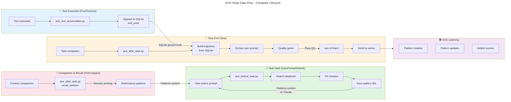

# C4 Code Level: ACE Shared Hooks

## Overview

- **Name**: ACE Plugin Shared Hooks - Core Hook Implementations
- **Description**: Core Python hook implementations for ACE (Adaptive Context Engine) plugin that provides pattern search, learning, and trajectory accumulation across Claude Code lifecycle events
- **Location**: `/Users/ptsafaridis/repos/github_com/ce-dot-net/ce-claude-marketplace/plugins/ace/shared-hooks/`
- **Language**: Python 3.11+
- **Purpose**: Implements ACE hooks for pattern search on task start (BeforeTask), tool execution accumulation (PostToolUse), and learning on task completion (AfterTask/Stop). Forms the bridge between Claude Code's plugin architecture and ACE Server learning pipeline.

## Code Elements

### Main Hook Modules

#### ace_before_task.py
Hook handler for UserPromptSubmit events when user starts a task.

**Functions:**

- `sanitize_unicode(text: str) -> str`
  - Description: Remove invalid Unicode surrogate pairs that break JSON parsing. Surrogates are UTF-16 encoding artifacts (U+D800 to U+DFFF) that shouldn't appear in valid UTF-8 strings.
  - Location: ace_before_task.py:19-26
  - Dependencies: Built-in `str` type
  - Handles: JSON parser compatibility

- `sanitize_response(obj: Any) -> Any`
  - Description: Recursively sanitize all strings in a dict/list structure to remove invalid Unicode surrogates.
  - Location: ace_before_task.py:29-35
  - Dependencies: sanitize_unicode()
  - Returns: Sanitized object with valid Unicode

- `expand_abbreviations(prompt: str) -> str`
  - Description: Minimal query enhancement. Expands ONLY common abbreviations (JWT, API, DB, env, auth, config, deps, repo) for semantic clarity. Based on server team feedback: semantic search uses embeddings, not keyword matching. Generic keywords actually dilute the semantic signal. Natural language queries: 0.82 NDCG vs keyword-stuffed: 0.71 NDCG (worse!).
  - Location: ace_before_task.py:38-62
  - Parameters: `prompt (str)` - User's task prompt
  - Returns: `str` - Prompt with abbreviations expanded
  - Implementation: Simple string replacement with word boundary matching

- `main()`
  - Description: Main hook entry point - UserPromptSubmit event handler. Orchestrates pattern search from ACE server, filters low-quality results, saves pattern IDs for reinforcement learning, builds context for Claude, and outputs JSON with system message and pattern context.
  - Location: ace_before_task.py:65-440
  - Dependencies: 
    - Internal: ace_cli.run_search(), check_session_pinning_available(), check_auth_status(), ace_context.get_context(), ace_relevance_logger.log_search_metrics()
    - External: json, re, sys, uuid, pathlib
  - Process:
    1. Read event from stdin (event.json)
    2. Get context from .claude/settings.json
    3. Check session pinning availability and auth status
    4. Expand abbreviations for semantic search
    5. Call ace-cli search with optional session pinning
    6. Sanitize response (remove invalid Unicode)
    7. Client-side filtering: confidence >= 0.5 or helpful >= 2
    8. Log search metrics
    9. Save pattern IDs for reinforcement learning (.claude/data/logs/ace-patterns-used-{session_id}.json)
    10. Build and output JSON with patterns context
  - Output: JSON with `systemMessage` and `hookSpecificOutput.additionalContext` containing ace-patterns XML
  - Error handling: Non-fatal - continues without search on error

#### ace_after_task.py
Hook handler for Stop/SubagentStop events when task completes.

**Functions:**

- `is_trivial_task(task_description: str) -> bool`
  - Description: Filter out trivial tasks that shouldn't trigger learning. Per ACE Research Paper: learning should only occur with meaningful execution feedback. Filters ACE commands, simple queries, git status checks, file listing, greetings, system messages.
  - Location: ace_after_task.py:63-104
  - Parameters: `task_description (str)` - User's task description
  - Returns: `bool` - True if task is trivial (should be skipped)
  - Implementation: Regex pattern matching against trivial patterns list

- `has_substantial_work_from_accumulated(tools: list) -> bool`
  - Description: Check for substantial work using accumulated tool data. GROUND TRUTH - no semantic analysis needed. Per ACE Research Paper: requires meaningful execution feedback. State-changing tools (Edit, Write, Bash, MCP tools) = meaningful work.
  - Location: ace_after_task.py:107-124
  - Parameters: `tools (list)` - List of tuples (tool_name, tool_input, tool_response, tool_use_id)
  - Returns: `bool` - True if ANY state-changing tool was used
  - Implementation: Checks tool names against state_changing list

- `summarize_tool_action(tool_name: str, tool_input: dict) -> str`
  - Description: Create human-readable action summary for tool call. Per ACE Research Paper Page 19: trajectory should show what tool did. Extracts key information from different tool types.
  - Location: ace_after_task.py:127-160
  - Parameters: 
    - `tool_name (str)` - Name of the tool (Edit, Write, Read, Bash, Grep, Glob, Task, TodoWrite, mcp__)
    - `tool_input (dict)` - Tool input parameters
  - Returns: `str` - Human-readable summary (e.g., "Edited file.py", "Ran: ls -la", "Searched for: pattern")
  - Implementation: Tool-specific summarization with truncation for long commands

- `summarize_tool_response(tool_name: str, tool_response: dict) -> str`
  - Description: Create human-readable result summary for tool response. Per ACE Research Paper Page 19: trajectory should show execution feedback. Extracts results from tool responses.
  - Location: ace_after_task.py:163-208
  - Parameters:
    - `tool_name (str)` - Name of the tool
    - `tool_response (dict)` - Tool response/result
  - Returns: `str` - Human-readable result summary (e.g., "Success", "Error: ...", "Found 5 files", "Read 120 lines")
  - Implementation: Tool-specific result extraction with error handling

- `build_trajectory_from_accumulated_tools(session_id: str, working_dir: str = None) -> tuple`
  - Description: Build REAL trajectory from PostToolUse accumulated data. This is GROUND TRUTH - actual tool execution data. No transcript parsing required! Per ACE Research Paper: page 5 generator produces trajectories, page 19 trajectory contains tool calls with inputs and outputs.
  - Location: ace_after_task.py:211-252
  - Parameters:
    - `session_id (str)` - Claude Code session ID
    - `working_dir (str, optional)` - Project working directory
  - Returns: `tuple` - (trajectory_list, tools_list) where each trajectory step contains: step, tool, action, result
  - Dependencies: ace_tool_accumulator.get_session_tools(), summarize_tool_action(), summarize_tool_response()
  - Process:
    1. Load session tools from SQLite accumulator
    2. For each tool: parse JSON input/response
    3. Summarize action and result
    4. Build trajectory with real data

- `skip_learning(reason, event=None) -> dict`
  - Description: Skip learning with user feedback. Per ACE Research Paper: users should understand when learning is skipped. Logs to /tmp/ace_hook_debug.log if ACE_DEBUG_HOOKS=1.
  - Location: ace_after_task.py:255-268
  - Parameters:
    - `reason (str)` - Reason for skipping
    - `event (dict, optional)` - Event context
  - Returns: `dict` - JSON response with continue=True and systemMessage
  - Side effects: Optional debug logging

- `get_user_prompt_from_transcript(transcript_path: str) -> str`
  - Description: Extract the user's prompt from transcript for task description. This is the ONLY transcript parsing done - just to get the user's request. All tool execution data comes from accumulated tools. Searches backwards through transcript for last non-tool_result user message.
  - Location: ace_after_task.py:271-318
  - Parameters: `transcript_path (str)` - Path to transcript file
  - Returns: `str` - User's prompt (max 2000 chars) or "No user prompt found"
  - Implementation: JSONL parsing with backwards search, filters tool_result messages, extracts text content

- `main()`
  - Description: Main hook entry point - Stop/SubagentStop event handler. Processes accumulated tool data to build trajectory and send to ace-cli learn for pattern creation/updating. CRITICAL ARCHITECTURE: No transcript parsing for tools - only accumulated SQLite data is ground truth.
  - Location: ace_after_task.py:321-591
  - Dependencies:
    - Internal: build_trajectory_from_accumulated_tools(), get_user_prompt_from_transcript(), is_trivial_task(), has_substantial_work_from_accumulated(), ace_tool_accumulator.clear_session(), ace_context.get_context(), ace_cli.recall_session(), git_utils.get_git_context(), ace_relevance_logger.log_execution_metrics()
    - External: json, sys, subprocess, os, shutil, pathlib, datetime
  - Process:
    1. Read Stop event from stdin
    2. Get project context
    3. Build trajectory from accumulated tools (GROUND TRUTH)
    4. Extract user prompt from transcript
    5. Quality gate 1: Check for trivial task
    6. Quality gate 2: Check for substantial work
    7. Build ExecutionTrace with git context
    8. Send to ace-cli learn --stdin
    9. Parse response for learning statistics
    10. Log execution metrics
    11. Clear accumulated tools
    12. Output JSON with learning feedback
  - Output: JSON with `systemMessage` containing learning results and optional `hookSpecificOutput` with recalled patterns
  - Error handling: Non-fatal - logs to debug, continues without blocking

#### ace_tool_accumulator.py
SQLite-based accumulator for PostToolUse hook tool data. Provides GROUND TRUTH tool execution data.

**Functions:**

- `get_db_path(working_dir: str = None) -> Path`
  - Description: Get database path in project's .claude/data/logs/ directory.
  - Location: ace_tool_accumulator.py:27-30
  - Parameters: `working_dir (str, optional)` - Project working directory
  - Returns: `Path` - Path to ace-tools.db
  - Default: `.claude/data/logs/ace-tools.db`

- `init_db(db_path: Path = None) -> sqlite3.Connection`
  - Description: Initialize SQLite database for tool accumulation. Creates tool_uses table with session_id, tool_name, tool_input, tool_response, tool_use_id, timestamp. Adds index on session_id for fast queries.
  - Location: ace_tool_accumulator.py:33-49
  - Parameters: `db_path (Path, optional)` - Database path
  - Returns: `sqlite3.Connection` - Active database connection
  - Side effects: Creates directory and tables if not exists, creates index

- `append_tool(session_id: str, tool_name: str, tool_input: dict, tool_response: dict, tool_use_id: str, working_dir: str = None) -> bool`
  - Description: Append tool use to accumulator (called by PostToolUse hook). Stores tool execution data in SQLite for later retrieval by Stop hook.
  - Location: ace_tool_accumulator.py:52-78
  - Parameters:
    - `session_id (str)` - Claude Code session ID
    - `tool_name (str)` - Name of the tool (Edit, Write, Bash, etc.)
    - `tool_input (dict)` - Tool input parameters
    - `tool_response (dict)` - Tool response/result
    - `tool_use_id (str)` - Unique tool use ID
    - `working_dir (str, optional)` - Project working directory
  - Returns: `bool` - True if appended successfully
  - Process:
    1. Get DB path and initialize connection
    2. JSON-serialize input and response
    3. INSERT INTO tool_uses with unique constraint on tool_use_id
    4. Commit and close
  - Error handling: Logs to /tmp/ace_hook_debug.log if ACE_DEBUG_HOOKS=1

- `get_session_tools(session_id: str, working_dir: str = None) -> list`
  - Description: Get all tools for session (called by Stop hook). Returns tools in order they were executed.
  - Location: ace_tool_accumulator.py:81-100
  - Parameters:
    - `session_id (str)` - Claude Code session ID
    - `working_dir (str, optional)` - Project working directory
  - Returns: `list` - List of tuples: (tool_name, tool_input_json, tool_response_json, tool_use_id)
  - Process: SELECT from tool_uses WHERE session_id ORDER BY id
  - Error handling: Returns empty list on error

- `clear_session(session_id: str, working_dir: str = None) -> bool`
  - Description: Clear tools after Stop hook processes them. Cleanup operation to prevent unbounded database growth.
  - Location: ace_tool_accumulator.py:103-119
  - Parameters:
    - `session_id (str)` - Claude Code session ID
    - `working_dir (str, optional)` - Project working directory
  - Returns: `bool` - True if cleared successfully
  - Process: DELETE FROM tool_uses WHERE session_id
  - Error handling: Returns True if DB doesn't exist (idempotent)

- `get_session_stats(session_id: str, working_dir: str = None) -> dict`
  - Description: Get statistics for a session (for debugging). Counts total tools and state-changing tools.
  - Location: ace_tool_accumulator.py:122-143
  - Parameters:
    - `session_id (str)` - Claude Code session ID
    - `working_dir (str, optional)` - Project working directory
  - Returns: `dict` - {total_tools, state_changing_tools, tool_names}

- `main()`
  - Description: CLI interface for ace_tool_accumulator with subcommands.
  - Location: ace_tool_accumulator.py:146-220
  - Subcommands:
    - `append --session-id ID --tool-name NAME --tool-input JSON --tool-response JSON --tool-use-id ID [--working-dir DIR]`
    - `get --session-id ID [--working-dir DIR]`
    - `clear --session-id ID [--working-dir DIR]`
    - `stats --session-id ID [--working-dir DIR]`
  - Returns: JSON output with results

#### ace_event_logger.py
Core logging utility for ACE hook events with file rotation.

**Classes:**

- `ACEEventLogger`
  - Description: Core logging utility for ACE hook events with rotation. Prevents unbounded log growth by rotating files at 5MB.
  - Location: ace_event_logger.py:18-115
  - Attributes:
    - `MAX_FILE_SIZE = 5 * 1024 * 1024` (5MB)
    - `MAX_BACKUP_FILES = 2` (keep 2 rotated files)
    - `log_dir (Path)` - Logging directory
  - Methods:
    - `__init__(log_dir: str = ".claude/data/logs")`
      - Initialize logger with log directory
      - Side effects: Creates .claude/data/logs directory if not exists
    
    - `_rotate_if_needed(log_path: Path) -> None`
      - Rotate log file if it exceeds MAX_FILE_SIZE
      - Renames current to .1, .1 to .2, etc.
      - Deletes oldest backup if exceeds MAX_BACKUP_FILES
      - Error handling: Silent fail
    
    - `get_log_path(event_type: str) -> Path`
      - Get log file path for event type
      - Returns: `.claude/data/logs/ace-{event_type}.jsonl`
    
    - `log_event(event_type: str, event_data: dict, phase: str = "complete", metadata: dict = None, execution_time_ms: int = None, exit_code: int = None, error: str = None) -> None`
      - Log a hook event to JSONL file
      - Parameters: event_type, event_data, phase (start/end/complete/error), metadata, execution_time_ms, exit_code, error
      - Output format: JSONL with timestamp, event_type, phase, event_data, metadata, execution_time_ms, exit_code, error
      - Side effects: Creates/appends to log file with rotation
    
    - `log_error(event_type: str, error: str, context: dict = None) -> None`
      - Log an error to both event-specific log and errors log
      - Parameters: event_type, error message, optional context
      - Side effects: Writes to event-specific log and ace-errors.jsonl with rotation

**Functions:**

- `main()`
  - Description: CLI interface for logging ACE events
  - Location: ace_event_logger.py:118-166
  - Usage: `echo '{"data": "json"}' | uv run ace_event_logger.py --event-type Stop --phase start`
  - Arguments:
    - `--event-type` (required): Hook event type
    - `--phase`: Event phase (start/end/complete/error), default "complete"
    - `--exit-code`: Exit code (for end phase)
    - `--execution-time-ms`: Execution time in milliseconds
    - `--log-dir`: Log directory path, default .claude/data/logs
    - `--error`: Error message (for error phase)
  - Process:
    1. Parse arguments
    2. Read JSON event from stdin
    3. Get metadata from environment (ACE_PLUGIN_VERSION, CLAUDE_VERSION, CLAUDE_MODEL)
    4. Initialize logger
    5. Call log_event() or log_error()
    6. Echo input to stdout
  - Returns: JSON output with event data

#### ace_permission_request.py
Auto-approval/denial of safe and dangerous ACE CLI commands.

**Functions:**

- `main()`
  - Description: Hook handler for PermissionRequest events. Auto-approves safe read-only ACE commands (search, status, patterns, top, get-playbook, doctor, tune). Auto-denies dangerous commands (clear). Passes through others for user decision.
  - Location: ace_permission_request.py:18-78
  - Dependencies: json, sys
  - Safe commands (auto-approve):
    - `ace-cli search`, `ace-cli status`, `ace-cli patterns`, `ace-cli top`, `ace-cli get-playbook`, `ace-cli doctor`, `ace-cli tune`
  - Dangerous commands (auto-deny):
    - `ace-cli clear`
  - Process:
    1. Read permission event from stdin
    2. Extract tool_name and command
    3. Only handle Bash tool
    4. Check if ACE CLI command
    5. Auto-approve safe commands with message
    6. Auto-deny dangerous commands with message
    7. Pass through others (empty response)
  - Output: JSON with decision (allow/deny) and optional message
  - Error handling: Non-fatal - passes through on error

#### test_session_pinning.py
Test utility for session pinning, rich context extraction, and full workflow simulation.

**Functions:**

- `test_version_check() -> bool`
  - Description: Test 1 - Version compatibility check. Verifies ace-cli v1.0.11+ for session pinning.
  - Location: test_session_pinning.py:24-40
  - Returns: `bool` - True if session pinning available
  - Dependencies: check_session_pinning_available()

- `test_session_pinning() -> bool`
  - Description: Test 2 - Session pinning and recall workflow. Tests pin → search → recall → verify workflow with real project.
  - Location: test_session_pinning.py:43-98
  - Returns: `bool` - True if all steps successful
  - Requirements: Real ACE project in .claude/settings.json
  - Tests:
    1. Get context and generate session ID
    2. Store session ID to /tmp/ace-session-{project}.txt
    3. Search with pinning
    4. Recall from session
    5. Verify pattern counts match
    6. Verify recall performance (<100ms)

- `test_rich_context_extraction() -> bool`
  - Description: Test 3 - Rich context extraction. Verifies that context is not generic ("Edit:", "Edit: ", "unknown").
  - Location: test_session_pinning.py:101-160
  - Returns: `bool` - True if context is non-generic
  - Tests: PostToolUse and PreCompact rich context extraction

- `test_full_workflow() -> bool`
  - Description: Test 4 - Full workflow simulation. Tests complete flow: UserPromptSubmit → Work → Compaction → PreCompact → Recall.
  - Location: test_session_pinning.py:163-213
  - Returns: `bool` - True if workflow completes successfully
  - Requirements: Real ACE project
  - Simulates: Search → Work → Compaction → Recall

- `main() -> int`
  - Description: Run all tests and output summary
  - Location: test_session_pinning.py:216-244
  - Returns: `int` - 0 if all tests pass, 1 if any fail
  - Runs tests in order, skips remaining tests if version check fails
  - Output: Detailed test results and summary

## Dependencies

### Internal Dependencies

The shared-hooks directory depends on utility modules in `utils/` subdirectory:

- **ace_cli.py** (utils/)
  - `run_search(query, org, project, session_id)` - Execute pattern search via ace-cli
  - `check_session_pinning_available()` - Check ace-cli version >= 1.0.11
  - `check_auth_status(warn_threshold_hours)` - Check token expiration
  - `recall_session(session_id, org, project)` - Recall pinned patterns

- **ace_context.py** (utils/)
  - `get_context()` - Read .claude/settings.json for project/org context

- **ace_relevance_logger.py** (utils/)
  - `log_search_metrics()` - Log search relevance metrics
  - `log_execution_metrics()` - Log execution metrics

- **git_utils.py** (utils/)
  - `get_git_context(working_dir)` - Extract git repository context
  - `detect_commits_in_session(tools)` - Detect commits made in session

### External Dependencies

**Standard Library:**
- `json` - JSON parsing and serialization
- `sys` - System operations (stdin, exit)
- `subprocess` - Execute ace-cli commands
- `os` - Environment variables, path operations
- `shutil` - File operations (which)
- `pathlib.Path` - File system path handling
- `datetime` - Timestamp generation and parsing
- `sqlite3` - Database operations for tool accumulation
- `re` (regex) - Pattern matching for trivial task detection
- `uuid` - Generate session IDs
- `time` - Timing measurements
- `argparse` - CLI argument parsing

**External CLI:**
- `ace-cli` / `ce-ace` - ACE Server CLI for search, learn, recall operations

**Framework:**
- Claude Code plugin architecture (stdin/stdout JSON event handling)
- Claude Code session tracking (session_id in events)

### File System Dependencies

**Read:**
- `.claude/settings.json` - Project context (ACE_PROJECT_ID, ACE_ORG_ID)
- `.claude/data/logs/ace-patterns-used-{session_id}.json` - Pattern IDs from BeforeTask
- `/tmp/ace-session-{project}.txt` - Session ID from BeforeTask (for PreCompact hook)
- `/tmp/ace-agent-type-{session_id}.txt` - Agent type from SessionStart hook
- Transcript file (for user prompt extraction)

**Write:**
- `.claude/data/logs/ace-tools.db` - SQLite database for tool accumulation
- `.claude/data/logs/ace-patterns-used-{session_id}.json` - Pattern IDs for reinforcement learning
- `.claude/data/logs/ace-{event_type}.jsonl` - Event logs
- `.claude/data/logs/ace-errors.jsonl` - Error logs
- `/tmp/ace_hook_debug.log` - Debug logging (if ACE_DEBUG_HOOKS=1)
- `/tmp/ace-session-{project}.txt` - Session ID for pattern recall
- `/tmp/ace-domains-{project}.json` - Domain summary for next task

## Relationships

### Hook Lifecycle Data Flow

The hooks implement a 3-stage processing pipeline that follows the ACE Research Paper (arXiv:2510.04618v1) on agent trajectory learning:



### Component Structure Diagram

The shared-hooks module contains specialized hook handlers coordinated through a central data accumulation pattern:

```mermaid
---
title: ACE Shared Hooks Module Structure
---
classDiagram
    namespace Hooks {
        class BeforeTaskHook {
            <<module>>
            +main()
            +expand_abbreviations() string
            +sanitize_response() dict
        }
        
        class ToolAccumulatorDB {
            <<module>>
            +append_tool() bool
            +get_session_tools() list
            +clear_session() bool
            +get_session_stats() dict
        }
        
        class StopHook {
            <<module>>
            +main()
            +build_trajectory_from_accumulated_tools() tuple
            +is_trivial_task() bool
            +has_substantial_work() bool
        }
        
        class PermissionHook {
            <<module>>
            +main()
            -auto_approve_safe_commands()
            -auto_deny_dangerous_commands()
        }
        
        class EventLogger {
            <<class>>
            +log_event()
            +log_error()
            -_rotate_if_needed()
            -get_log_path()
        }
    }

    namespace Utils {
        class ACECli {
            <<module>>
            +run_search() dict
            +check_session_pinning_available() bool
            +check_auth_status() string
            +recall_session() dict
        }
        
        class ACEContext {
            <<module>>
            +get_context() dict
        }
        
        class Loggers {
            <<module>>
            +log_search_metrics()
            +log_execution_metrics()
        }
        
        class GitUtils {
            <<module>>
            +get_git_context() dict
            +detect_commits_in_session() list
        }
    }

    BeforeTaskHook -->|Uses| ACECli
    BeforeTaskHook -->|Uses| ACEContext
    BeforeTaskHook -->|Uses| Loggers
    
    ToolAccumulatorDB -->|SQLite ground truth|StopHook
    StopHook -->|Uses| ACECli
    StopHook -->|Uses| ACEContext
    StopHook -->|Uses| GitUtils
    StopHook -->|Uses| Loggers
    
    PermissionHook -->|No dependencies|Utils
    
    EventLogger -->|Writes logs| ACEContext
    
    Loggers -->|Depends on| ACEContext
    GitUtils -->|Reads git|ACEContext
```

### Key Data Structures

**Session ID Flow:**
- Generated: `uuid.uuid4()` in BeforeTask
- Stored: `/tmp/ace-session-{project}.txt` by BeforeTask
- Used by: ToolAccumulator (session_id parameter)
- Retrieved by: StopHook for pattern recall

**Pattern IDs Flow:**
- Created: List of pattern IDs from search response in BeforeTask
- Stored: `.claude/data/logs/ace-patterns-used-{session_id}.json` by BeforeTask
- Retrieved: By StopHook for reinforcement learning feedback
- Sent: In ExecutionTrace to ace-cli learn

**ExecutionTrace Structure:**
```json
{
  "task": "User request: ...",
  "trajectory": [
    {"step": 1, "tool": "Edit", "action": "...", "result": "..."},
    {"step": 2, "tool": "Bash", "action": "...", "result": "..."}
  ],
  "result": {"success": true, "output": "..."},
  "playbook_used": ["pattern-id-1", "pattern-id-2"],
  "git": {git_context},
  "timestamp": "2026-02-11T...",
  "agent_type": "main"
}
```

### State Files and Databases

**SQLite Database** (ace-tools.db):
- Location: `.claude/data/logs/ace-tools.db`
- Schema: table tool_uses(id, session_id, tool_name, tool_input, tool_response, tool_use_id, timestamp)
- Index: idx_session on session_id
- Purpose: GROUND TRUTH for tool execution data
- Lifecycle: Written by PostToolUse hook, read by Stop hook, cleared after processing

**JSON State Files**:
- `ace-patterns-used-{session_id}.json`: Pattern IDs for learning feedback
- `ace-domains-{project}.json`: Domain summary for next task
- `ace-agent-type-{session_id}.txt`: Agent type for pattern attribution

**JSONL Log Files** (with 5MB rotation):
- `ace-userpromptsubmit.jsonl`: UserPromptSubmit hook events
- `ace-stop.jsonl`: Stop hook events  
- `ace-errors.jsonl`: Error log across all hooks

### Authentication and Authorization

- **Pattern Search**: Requires ACE_ORG_ID and ACE_PROJECT_ID from .claude/settings.json
- **Token Expiration**: Checked by check_auth_status() with 2-hour warning threshold (v5.4.18)
- **Standby Mode**: Caught by check_auth_status() for 48h standby scenario
- **Permission Requests**: PermissionRequest hook auto-approves safe ACE CLI commands, auto-denies destructive ones

### Version Compatibility

- **Python**: 3.11+ (via uvscript shebang `#!/usr/bin/env -S uv run --script`)
- **ace-cli**: v1.0.11+ required for session pinning (check_session_pinning_available())
- **Claude Code**: 2.1.2+ for agent_type support (SessionStart hook creates agent_type file)
- **Fallback**: `ce-ace` CLI supported as fallback for ace-cli

## Implementation Notes

### PostToolUse Accumulation Architecture (v5.3.0)

Previous approach (broken):
- Stop hook received only transcript_path (no tool data)
- Transcript parsing is lossy and unreliable
- tool_result messages confuse task boundaries

Current approach (v5.3.0):
- **PostToolUse hook** appends EVERY tool call to SQLite immediately
- **Stop hook** queries SQLite to build trajectory (GROUND TRUTH)
- Trajectory contains REAL tool calls with inputs/outputs
- No transcript parsing required! Only user prompt extraction

Per ACE Research Paper (arXiv:2510.04618v1):
- Page 5: "Generator produces reasoning trajectories"
- Page 7: "leveraging natural execution feedback"
- Page 19: "FULL AGENT-ENVIRONMENT TRAJECTORY"

### Quality Gates in Stop Hook

1. **Trivial Task Filter**: Skip learning for ACE commands, simple queries, git status checks
2. **Substantial Work Filter**: Require at least one state-changing tool (Edit, Write, Bash, etc.)
3. **Error Detection**: Track if any tool call returned an error
4. **Trajectory Validation**: Ensure trajectory contains meaningful steps

### Session Pinning for Pattern Persistence (v5.4.11+)

Problem: Context compaction loses pattern context
Solution: Pin session → Recall patterns after compaction

- **BeforeTask**: Saves session_id to `/tmp/ace-session-{project}.txt` if pinning available
- **PreCompact (Not in this file)**: Reads session_id, calls recall_session() to get patterns
- **Performance**: Recall must be <100ms to avoid blocking compaction

### Agent Type Attribution (v5.4.11+)

- **SessionStart hook** (not in this directory): Creates `/tmp/ace-agent-type-{session_id}.txt`
- **BeforeTask**: Reads agent_type, includes in ace-patterns context tag
- **Stop hook**: Reads agent_type, includes in ExecutionTrace for server-side weighting
- **Purpose**: Server can track which agent types learn patterns (main, refactorer, coder, etc.)

### Unicode Sanitization (v5.3.5+)

Problem: Invalid Unicode surrogates break Claude API JSON parser
Solution: Remove UTF-16 encoding artifacts (U+D800-U+DFFF) before returning to Claude

- Occurs after ace-cli search response
- Recursive sanitization of dict/list structures
- Silent replacement with valid UTF-8 characters

### Client-Side Pattern Filtering (v5.4.2+)

Server returns top patterns (default top_k=10), client optionally filters:
- Keep patterns with confidence >= 0.5 OR helpful >= 2
- Only filter if more than 5 patterns returned (keep at least 3)
- Reduces low-quality patterns from context while preserving coverage

### Relevance Logging (v5.4.2+)

Metrics logged to analyze search effectiveness:
- User prompt and search query
- Patterns returned vs patterns injected (shows filtering effectiveness)
- Domains extracted from patterns
- Session ID for correlation with git commits (Issue #6)

## Error Handling Strategy

**Non-Fatal Design**: All hooks continue on error (exit 0) to never block Claude Code workflow.

- **Search failure**: Returns empty pattern list, shows user message
- **Learning failure**: Logs warning but allows user to manually trigger `/ace-learn`
- **Database corruption**: Silently falls back to default behavior
- **Missing dependencies**: Gracefully handles missing ace-cli or git

Debug mode: Set `ACE_DEBUG_HOOKS=1` to write detailed logs to `/tmp/ace_hook_debug.log`

## Performance Considerations

- **Search latency**: Depends on ace-cli and server response time
- **Accumulator queries**: SQLite with index on session_id for fast lookups
- **Learning latency**: 5-minute timeout for ace-cli learn process
- **Log rotation**: 5MB file rotation with 2 backup files to prevent disk bloat

