# C4 Code Level: ACE Testing & Tooling

## Overview

- **Name**: ACE Testing & Tooling Suite
- **Description**: Comprehensive test suite and release management agent for the ACE (ACE Orchestration Plugin) plugin. Covers unit tests, integration tests, and release automation across Python/Bash implementations.
- **Location**: `/Users/ptsafaridis/repos/github_com/ce-dot-net/ce-claude-marketplace/tests/`, `/Users/ptsafaridis/repos/github_com/ce-dot-net/ce-claude-marketplace/plugins/ace/tests/`, `/Users/ptsafaridis/repos/github_com/ce-dot-net/ce-claude-marketplace/.claude/agents/`
- **Languages**: Python (pytest, unittest), Bash (bats, subprocess testing), Markdown (agent definitions)
- **Purpose**: Test coverage for ACE hook functionality (PreCompact, SessionStart, version checks), issue regressions (Issue #15, #16, #17), and automated plugin release management with version verification

## Code Elements

### Test Suites

#### test_claude_md_cleaner.py

- **Path**: `/Users/ptsafaridis/repos/github_com/ce-dot-net/ce-claude-marketplace/tests/test_claude_md_cleaner.py`
- **Test Count**: 48 tests across 12 test classes
- **Purpose**: TDD tests for the `cleanup_deprecated_claude()` bash function that removes deprecated ACE sections from user CLAUDE.md files
- **Key Classes**:
  - `TestV3MarkersWithUserContent` (6 tests): v3.x marker removal with user content preservation
  - `TestV5MarkersNowCleaned` (4 tests): v5.4.27 fix - v5.x sections now cleaned
  - `TestSkillReferencesNoMarkers` (3 tests): Warning for deprecated skill refs without HTML markers
  - `TestNoAceContentAtAll` (4 tests): No modification when file has no ACE content
  - `TestFileDoesNotExist` (4 tests): Graceful handling of nonexistent files
  - `TestBackupCreation` (3 tests): Atomic backup file creation before modification
  - `TestMultipleBlankLinesCleanup` (3 tests): Blank line collapse after section removal
  - `TestV4MarkersNowCleaned` (4 tests): v4.x section removal support
  - `TestEntireFileSafety` (3 tests): CRITICAL - file never deleted even if ACE section is entire content
  - `TestMarkerOnFirstLine` (3 tests): Edge case handling when ACE section starts at line 1
  - `TestSourceCodeAnalysis` (9 tests): Static analysis of ace_install_cli.sh bash function
  - `TestAllVersionsCleaned` (3 tests): Regression test - all versions (v3, v4, v5) are cleaned

- **Key Test Fixtures**:
  - `V3_SECTION_WITH_USER_CONTENT`: v3.x HTML markers with surrounding user documentation
  - `V5_SECTION_ONLY`: v5.x markers with minimal user content
  - `SKILL_REFS_NO_MARKERS`: Deprecated skill references without HTML markers
  - `V3_SECTION_IS_ENTIRE_FILE`: CRITICAL case - ACE section is entire file content
  - `V3_MARKER_ON_LINE_ONE`: Edge case with marker starting at file beginning

- **Key Assertions**:
  - ACE section markers removed while preserving all user content
  - Backup files created with `.ace-backup-YYYYMMDD-HHMMSS` format
  - Files never deleted (critical safety requirement)
  - All version markers (v3, v4, v5) handled consistently
  - Blank line collapse prevents triple-newlines post-removal

- **Dependencies**: `subprocess`, `tempfile`, `pathlib`, `textwrap`, `re`

#### test_version_check.py

- **Path**: `/Users/ptsafaridis/repos/github_com/ce-dot-net/ce-claude-marketplace/tests/test_version_check.py`
- **Test Count**: 51 tests across 7 test classes
- **Purpose**: TDD tests for SessionStart hook version check logic (lines 53-97 of ace_install_cli.sh)
- **Key Classes**:
  - `TestCLIDetection` (3 tests): CLI detection with fallback from ace-cli → ce-ace
  - `TestDeprecatedPackageDetection` (4 tests): npm global package detection for @ce-dot-net/ce-ace-cli
  - `TestVersionComparison` (9 tests): CRITICAL - sort -V -C version comparison logic with boundary testing
  - `TestDailyUpdateCheck` (7 tests): Cache file management and update availability warnings
  - `TestIntegrationScenarios` (6 tests): Full flow integration tests (happy path, sad path, error states)
  - `TestSourceCodeAnalysis` (10 tests): Static analysis of ace_install_cli.sh source
  - `TestEdgeCases` (12 tests): Version number edge cases (10 vs 9, patch boundaries, high versions)

- **Key Test Harness**: `VersionCheckHarness` class creates isolated bash environment with:
  - Stub binaries (ace-cli, ce-ace, npm, jq) in fake /bin directory
  - Isolated PATH manipulation (excludes system npm, nvm, homebrew)
  - Temp directories for cache files and disable flags
  - JSON parsing of hook output messages

- **Key Constants**:
  - `MIN_VERSION = "3.10.3"` - minimum required CLI version
  - `ACE_DISABLED_FLAG` - path: `/tmp/ace-disabled-${SESSION_ID}.flag`
  - `CACHE_FILE` - daily update check cache with date-based naming

- **Key Test Scenarios**:
  - Version equality (3.10.3 == 3.10.3) passes
  - Version comparison (3.11.0 > 3.10.3) passes
  - Old versions (3.9.0 < 3.10.3) disable hooks
  - sort -V semantics (3.10.3 > 3.9.0, not string sort)
  - Deprecated package triggers early exit before version check
  - npm show failures handled gracefully with empty cache

- **Dependencies**: `subprocess`, `tempfile`, `pytest`, `pathlib`, `textwrap`, `json`

#### test_precompact_handoff.py

- **Path**: `/Users/ptsafaridis/repos/github_com/ce-dot-net/ce-claude-marketplace/tests/test_precompact_handoff.py`
- **Test Count**: 68 tests across 20 test classes
- **Purpose**: TDD tests for Issue #17 fix - PreCompact → SessionStart handoff pattern with NO hookSpecificOutput in PreCompact
- **Issue Context**: PreCompact hook was outputting invalid `hookEventName: "PreCompact"` in hookSpecificOutput, causing Claude Code JSON validation failure
- **Fix Strategy**: Two-script handoff:
  1. PreCompact (ace_precompact_wrapper.sh): Saves patterns to temp file, outputs NO hookSpecificOutput
  2. SessionStart(compact) (ace_sessionstart_compact.sh): Reads temp file, outputs valid `hookEventName: "SessionStart"`

- **Key Classes**:
  - `TestPreCompactTempFileSave` (3 tests): Correct temp file path and format
  - `TestPreCompactAtomicWrite` (1 test): No staging files left behind (mktemp + mv pattern)
  - `TestPreCompactTempFilePermissions` (1 test): Restrictive permissions (umask 077 = 0600)
  - `TestPreCompactNoHookSpecificOutput` (3 tests): CRITICAL - NO hookSpecificOutput in stdout
  - `TestPreCompactExitCode` (2 tests): Always exits 0
  - `TestPreCompactDisabledFlag` (1 test): Respects ACE_DISABLED flag
  - `TestPreCompactEmptyResults` (2 tests): No temp file when zero patterns
  - `TestSessionStartCompactReadsTempFile` (1 test): Patterns read from temp file
  - `TestSessionStartCompactValidJSON` (2 tests): CRITICAL - hookEventName MUST be "SessionStart"
  - `TestSessionStartCompactAdditionalContext` (3 tests): Patterns wrapped in XML tags with session reference
  - `TestSessionStartCompactTempFileCleanup` (2 tests): Temp file deleted after reading
  - `TestSessionStartCompactNoTempFile` (3 tests): Graceful no-op when file missing
  - `TestSessionStartCompactCorruptTempFile` (2 tests): Corrupt JSON handling
  - `TestSessionStartCompactSessionIDExtraction` (2 tests): Session ID consistency between scripts
  - `TestHooksJsonConfig` (5 tests): hooks.json routing configuration for compact matcher
  - `TestFullHandoffCycle` (3 tests): End-to-end cycles with file cleanup
  - `TestPreCompactSourceAnalysis` (6 tests): Static source code verification
  - `TestSessionStartCompactSourceAnalysis` (7 tests): hookEventName value verification
  - `TestBothScriptsConsistency` (7 tests): Temp file path and session ID derivation consistency
  - `TestEdgeCases` (4 tests): Set -euo pipefail, exit codes, reference comments

- **Key Test Harnesses**:
  - `PreCompactHarness`: Manages PreCompact script execution with fake ace-cli, jq
  - `SessionStartCompactHarness`: Manages SessionStart(compact) script with stdin/temp file setup

- **Key Temp Files**:
  - PreCompact writes: `/tmp/ace-patterns-precompact-${SESSION_ID}.json`
  - SessionStart reads: `/tmp/ace-patterns-precompact-${SESSION_ID}.json`
  - Temp file deleted after SessionStart reads (one-time use)

- **Critical Assertions**:
  - PreCompact stdout MUST NOT contain `hookSpecificOutput` or `hookEventName`
  - SessionStart stdout MUST contain `hookSpecificOutput` with `hookEventName: "SessionStart"`
  - `hookEventName` MUST NEVER be "PreCompact" (root cause of Issue #17)
  - Both scripts use identical temp file path pattern
  - Both scripts derive session_id from same sources (.claude/settings.json)

- **Dependencies**: `subprocess`, `tempfile`, `pytest`, `pathlib`, `textwrap`, `json`, `glob`

#### test_session_id_mismatch.py

- **Path**: `/Users/ptsafaridis/repos/github_com/ce-dot-net/ce-claude-marketplace/tests/test_session_id_mismatch.py`
- **Test Count**: 8 tests across 2 test classes
- **Purpose**: TDD tests for Issue #16 fix - Session ID mismatch between before_task and after_task hooks
- **Issue Context**: before_task.py used `uuid.uuid4()` for state file name while after_task.py used `event.get('session_id')` - causing 16,042 traces with empty playbook_used
- **Fix**: Both hooks now use `event.get('session_id', str(uuid.uuid4()))`

- **Key Classes**:
  - `TestSessionIdMismatch` (6 tests): Proves mismatch causes playbook_used to always be empty
  - `TestBeforeTaskSessionIdSource` (2 tests): Source code verification of event.get('session_id') usage

- **Key Test Scenarios**:
  - UUID4 never matches event session_id
  - State file roundtrip with consistent session_id works
  - Orphaned files accumulate with uuid4 approach
  - playbook_used empty when session IDs mismatch (the bug)
  - playbook_used populated after fix (both hooks use event session_id)

- **Critical Assertions**:
  - `session_id = str(uuid.uuid4())` is THE BUG
  - Correct: `session_id = event.get('session_id', str(uuid.uuid4()))`
  - State file path uses session_id: `ace-patterns-used-${session_id}.json`

- **Dependencies**: `tempfile`, `pathlib`, `json`, `uuid`, `unittest.mock`

#### test_playbook_used_populated.py

- **Path**: `/Users/ptsafaridis/repos/github_com/ce-dot-net/ce-claude-marketplace/tests/test_playbook_used_populated.py`
- **Test Count**: 8 tests
- **Purpose**: Integration tests PROVING playbook_used is now populated after Issue #16 fix
- **Key Classes**: `TestPlaybookUsedPopulated` (8 tests)

- **Key Test Scenarios**:
  - Fixed path - playbook_used populated with correct patterns
  - Broken path - playbook_used empty (demonstrates original bug)
  - Trace dict structure matches ace-cli learn API
  - Multiple task cycles each populate correctly
  - No patterns found → empty list (expected behavior)
  - Source code verification of event.get('session_id') fix
  - State file path consistency between before_task and after_task
  - Full roundtrip with real SQLite tool accumulation

- **Production Code Paths Tested**:
  - Lines 219-229 of ace_before_task.py (state file write)
  - Lines 462-495 of ace_after_task.py (state file read + trace building)
  - ace_tool_accumulator.py SQLite operations

- **Dependencies**: `json`, `tempfile`, `pathlib`, `uuid`, `datetime`, `subprocess`, `sys`

#### test_quality_filters.py

- **Path**: `/Users/ptsafaridis/repos/github_com/ce-dot-net/ce-claude-marketplace/tests/test_quality_filters.py`
- **Purpose**: Tests for pattern quality filtering logic
- **Dependencies**: `pytest`, `pathlib`, `json`

#### test_per_task_delta.py

- **Path**: `/Users/ptsafaridis/repos/github_com/ce-dot-net/ce-claude-marketplace/tests/test_per_task_delta.py`
- **Purpose**: Tests for per-task delta computation and state tracking
- **Dependencies**: `pytest`, `pathlib`

#### test_hook_verification.py

- **Path**: `/Users/ptsafaridis/repos/github_com/ce-dot-net/ce-claude-marketplace/tests/test_hook_verification.py`
- **Purpose**: Tests for hook JSON schema validation and hook execution verification
- **Dependencies**: `pytest`, `json`, `subprocess`

### Plugin-Specific Tests (Bash)

#### test_issue17_precompact_invalid_json.sh

- **Path**: `/Users/ptsafaridis/repos/github_com/ce-dot-net/ce-claude-marketplace/plugins/ace/tests/test_issue17_precompact_invalid_json.sh`
- **Test Count**: 7 regression tests
- **Purpose**: Bash regression tests for Issue #17 fix (PreCompact hook JSON validation)
- **Tests**:
  1. PreCompact hook output valid JSON
  2. NO hookSpecificOutput in PreCompact stdout
  3. NO hookEventName in PreCompact stdout
  4. SessionStart(compact) has hookEventName: "SessionStart"
  5. SessionStart(compact) has hookSpecificOutput
  6. Temp file cleanup after SessionStart read
  7. Multiple compact cycles work independently

- **Dependencies**: `bash`, `jq`, `jshell` (JSON validation), `tempfile`

#### test_precompact_sessionstart_handoff.sh

- **Path**: `/Users/ptsafaridis/repos/github_com/ce-dot-net/ce-claude-marketplace/plugins/ace/tests/test_precompact_sessionstart_handoff.sh`
- **Test Count**: 5 integration tests
- **Purpose**: Integration tests for the two-script handoff pattern
- **Tests**:
  1. PreCompact → SessionStart(compact) data transfer
  2. Patterns injected via additionalContext
  3. Temp file atomic write (no partial files)
  4. Session ID consistency between scripts
  5. Graceful handling when PreCompact produces no patterns

- **Dependencies**: `bash`, `jq`, `tempfile`, `subprocess`

#### test_issue15_edge_cases.py

- **Path**: `/Users/ptsafaridis/repos/github_com/ce-dot-net/ce-claude-marketplace/plugins/ace/tests/test_issue15_edge_cases.py`
- **Purpose**: Edge case tests for Issue #15 (likely related to context resolution or CLI integration)
- **Dependencies**: `pytest`, `pathlib`, `json`, `subprocess`

#### test_ace_context.py

- **Path**: `/Users/ptsafaridis/repos/github_com/ce-dot-net/ce-claude-marketplace/plugins/ace/tests/test_ace_context.py`
- **Purpose**: Tests for .claude/settings.json context resolution (projectId, orgId)
- **Key Tests**:
  - Successful context resolution
  - Missing settings file handling
  - Missing required fields
  - Invalid JSON error handling

#### test_ace_cli.py

- **Path**: `/Users/ptsafaridis/repos/github_com/ce-dot-net/ce-claude-marketplace/plugins/ace/tests/test_ace_cli.py`
- **Purpose**: Tests for CLI subprocess wrapper (mocked)
- **Key Tests**:
  - Successful search call
  - Search failure (non-zero exit)
  - Search timeout
  - Invalid JSON response
  - Successful learn call
  - Learn failure
  - Status call

### Utility Scripts

#### rate_limiter.py

- **Path**: `/Users/ptsafaridis/repos/github_com/ce-dot-net/ce-claude-marketplace/tests/rate_limiter.py`
- **Purpose**: Rate limiting utility for test execution
- **Functions**:
  - `rate_limit(calls_per_second, timeout)`: Decorator for rate-limited execution
  - `acquire_slot()`: Get next available time slot

#### todo_cli.py

- **Path**: `/Users/ptsafaridis/repos/github_com/ce-dot-net/ce-claude-marketplace/tests/todo_cli.py`
- **Purpose**: CLI interface for test status tracking
- **Functions**:
  - `create_todo(description, status)`: Create test task
  - `update_status(task_id, new_status)`: Update task status
  - `list_todos(filter)`: Display test tasks

#### show_learning_payload.py

- **Path**: `/Users/ptsafaridis/repos/github_com/ce-dot-net/ce-claude-marketplace/tests/show_learning_payload.py`
- **Purpose**: Display ACE learning payload structure
- **Functions**:
  - `show_payload(session_id)`: Display accumulated learning payload
  - `format_patterns(patterns)`: Format pattern list for display

### Agent Definitions

#### release-manager.md

- **Path**: `/Users/ptsafaridis/repos/github_com/ce-dot-net/ce-claude-marketplace/.claude/agents/release-manager.md`
- **Type**: Claude Code Agent Definition (Markdown)
- **Purpose**: Automated plugin release management with version verification
- **Key Capabilities**:
  - Version number verification across ALL plugin files
  - Commit strategy with multi-file staging (marketplace.json, plugin.json, plugin.template.json)
  - Git tagging and GitHub release creation
  - Prevention of common release mistakes (missing files, version mismatches)
  - Handles plugin.template.json version sync (critical for users copying template)

- **Critical Files Tracked**:
  - `plugins/ace/.claude-plugin/plugin.json` (Claude Code plugin manifest)
  - `plugins/ace/.claude-plugin/plugin.template.json` (template for users)
  - `.claude-plugin/marketplace.json` (marketplace metadata)
  - `plugins/ace/commands/*.md` (command documentation)
  - `plugins/ace/CHANGELOG.md` (release notes)

- **Release Checklist**:
  1. Version Verification: Find and verify all version numbers match
  2. File Update Verification: Stage all modified files with git add
  3. Commit Strategy: Single commit with all plugin files
  4. Publishing Sequence: Push commit, tag, create GitHub release
  5. Post-Release Verification: Verify all files in tagged commit

- **Mistake Prevention**:
  - Detects forgotten marketplace.json with `git show HEAD --name-only`
  - Detects forgotten plugin.json/plugin.template.json
  - Prevents tagging before everything is committed
  - Prevents plugin.template.json version mismatch with plugin.json
  - Ensures exit code 0 (never disrupts Claude Code)

- **Release Types Supported**:
  - Patch (x.x.N): Bug fixes, documentation
  - Minor (x.N.0): New features, new commands/hooks
  - Major (N.0.0): Breaking changes, API redesign

- **Architecture Context**: ACE Plugin is CLI-based with @ce-dot-net/ce-ace-cli package (separate repo). This repo handles plugin distribution only, no CLI source code.

## Dependencies

### Internal Dependencies

- `plugins/ace/scripts/ace_install_cli.sh`: Core installation and version checking script
- `plugins/ace/scripts/ace_precompact_wrapper.sh`: PreCompact hook wrapper for pattern saving
- `plugins/ace/scripts/ace_sessionstart_compact.sh`: SessionStart(compact) hook for pattern injection
- `plugins/ace/shared-hooks/ace_before_task.py`: Before-task hook for pattern search and state file write (session_id: event.get)
- `plugins/ace/shared-hooks/ace_after_task.py`: After-task hook for state file read and trace building
- `plugins/ace/shared-hooks/ace_tool_accumulator.py`: SQLite accumulator for tool call tracking
- `plugins/ace/hooks/hooks.json`: Hook routing configuration (PreCompact, SessionStart, PostToolUse, etc.)
- `.claude-plugin/marketplace.json`: Plugin marketplace metadata (version field)
- `plugins/ace/.claude-plugin/plugin.json`: Claude Code plugin manifest (version field)
- `plugins/ace/.claude-plugin/plugin.template.json`: Plugin template for users (version field)

### External Dependencies

- **Python Testing**: `pytest`, `unittest.mock`, `subprocess`
- **Python Libraries**: `json`, `tempfile`, `pathlib`, `textwrap`, `re`, `uuid`, `datetime`
- **Bash Testing**: `bash`, `bats` (test framework), `jq` (JSON parsing), `tempfile`
- **System Tools**: `sort` (version comparison), `npm` (package detection), `jshell` (JSON validation)
- **npm Packages**: `@ce-dot-net/ce-ace-cli` (ACE CLI), `@ace-sdk/cli` (deprecated name), `@ce-dot-net/ce-ace-cli` (deprecated old package)

## Relationships

```mermaid
---
title: ACE Testing & Tooling Architecture
---
graph TB
    subgraph Tests["Root Test Suite (tests/)"]
        TCleaner["test_claude_md_cleaner.py<br/>(48 tests)"]
        TVersion["test_version_check.py<br/>(51 tests)"]
        TPreComp["test_precompact_handoff.py<br/>(68 tests)"]
        TSessID["test_session_id_mismatch.py<br/>(8 tests)"]
        TPlaybook["test_playbook_used_populated.py<br/>(8 tests)"]
        TQuality["test_quality_filters.py"]
        TPDelta["test_per_task_delta.py"]
        THookVer["test_hook_verification.py"]
    end

    subgraph PluginTests["Plugin Tests (plugins/ace/tests/)"]
        TIssue17["test_issue17_precompact_invalid_json.sh<br/>(7 bash tests)"]
        THand["test_precompact_sessionstart_handoff.sh<br/>(5 bash tests)"]
        TIssue15["test_issue15_edge_cases.py"]
        TContext["test_ace_context.py"]
        TCLI["test_ace_cli.py"]
    end

    subgraph Scripts["Production Scripts"]
        InstallCLI["ace_install_cli.sh"]
        PreCompactWrap["ace_precompact_wrapper.sh"]
        SessionCompact["ace_sessionstart_compact.sh"]
        BeforeTask["ace_before_task.py"]
        AfterTask["ace_after_task.py"]
        Accumulator["ace_tool_accumulator.py"]
    end

    subgraph Config["Configuration"]
        HooksJSON["hooks.json"]
        MarketplaceJSON["marketplace.json"]
        PluginJSON["plugin.json"]
        PluginTemplate["plugin.template.json"]
    end

    subgraph Agent["Release Agent"]
        ReleaseManager["release-manager.md"]
    end

    TCleaner -->|tests| InstallCLI
    TVersion -->|tests| InstallCLI
    TPreComp -->|tests| PreCompactWrap
    TPreComp -->|tests| SessionCompact
    TSessID -->|tests| BeforeTask
    TPlaybook -->|tests integration| BeforeTask
    TPlaybook -->|tests integration| AfterTask
    TPlaybook -->|tests| Accumulator
    THookVer -->|tests| HooksJSON
    
    TIssue17 -->|regression tests| PreCompactWrap
    TIssue17 -->|regression tests| SessionCompact
    THand -->|integration tests| PreCompactWrap
    THand -->|integration tests| SessionCompact
    TContext -->|tests| BeforeTask
    TCLI -->|tests| BeforeTask
    
    PreCompactWrap -->|writes temp file| SessionCompact
    SessionCompact -->|reads temp file| SessionCompact
    BeforeTask -->|writes state file| AfterTask
    AfterTask -->|reads state file| AfterTask
    BeforeTask -->|appends tools| Accumulator
    AfterTask -->|reads tools| Accumulator
    
    InstallCLI -->|configured in| HooksJSON
    PreCompactWrap -->|routed by| HooksJSON
    SessionCompact -->|routed by| HooksJSON
    
    ReleaseManager -->|bumps versions in| PluginJSON
    ReleaseManager -->|bumps versions in| PluginTemplate
    ReleaseManager -->|bumps versions in| MarketplaceJSON
    ReleaseManager -->|commits & tags| Config

    style TCleaner fill:#e1f5ff
    style TVersion fill:#e1f5ff
    style TPreComp fill:#fff9c4
    style TSessID fill:#fff9c4
    style TPlaybook fill:#f3e5f5
    style InstallCLI fill:#e8f5e9
    style PreCompactWrap fill:#e8f5e9
    style SessionCompact fill:#e8f5e9
    style BeforeTask fill:#e8f5e9
    style AfterTask fill:#e8f5e9
    style ReleaseManager fill:#ffe0b2
```

### Test Coverage Mapping

| Production Component | Test Suite | Test Count | Status |\n|---|---|---|---|\n| ace_install_cli.sh (cleanup) | test_claude_md_cleaner.py | 48 | ✅ Comprehensive |\n| ace_install_cli.sh (version check) | test_version_check.py | 51 | ✅ Comprehensive |\n| ace_precompact_wrapper.sh | test_precompact_handoff.py | 68 | ✅ Comprehensive (Issue #17) |\n| ace_sessionstart_compact.sh | test_precompact_handoff.py | 68 | ✅ Comprehensive (Issue #17) |\n| ace_before_task.py (session_id) | test_session_id_mismatch.py | 8 | ✅ Complete (Issue #16) |\n| ace_after_task.py (playbook_used) | test_playbook_used_populated.py | 8 | ✅ Integration (Issue #16) |\n| hooks.json routing | test_hook_verification.py | TBD | ⏳ In Progress |\n| CLI context resolution | test_ace_context.py | TBD | ⏳ In Progress |\n| Pattern quality filtering | test_quality_filters.py | TBD | ⏳ In Progress |\n| Version Release Process | release-manager.md | N/A | ✅ Automated |\n\n### Issue Resolution Timeline

- **Issue #15**: Edge case handling for CLI integration (test_issue15_edge_cases.py)\n- **Issue #16**: Session ID mismatch (before_task uuid4 vs after_task event.session_id)\n  - Fix: `session_id = event.get('session_id', str(uuid.uuid4()))`\n  - Verified: test_session_id_mismatch.py, test_playbook_used_populated.py\n  - Impact: 16,042 traces with empty playbook_used now populated\n- **Issue #17**: PreCompact hook JSON validation failure (hookEventName: \"PreCompact\" invalid)\n  - Fix: Two-script handoff with PreCompact → SessionStart(compact)\n  - PreCompact outputs NO hookSpecificOutput (valid for PreCompact hook)\n  - SessionStart(compact) outputs hookEventName: \"SessionStart\" (valid in discriminated union)\n  - Verified: test_precompact_handoff.py (68 tests), test_issue17_precompact_invalid_json.sh (7 tests)\n\n### Critical Test Patterns\n\n1. **Subprocess Harness Pattern** (test_version_check.py, test_precompact_handoff.py)\n   - Extract bash logic into minimal test harness\n   - Stub external commands via fake /bin directory (PATH manipulation)\n   - Isolate from system-installed tools (nvm, homebrew, etc.)\n   - Each test creates fresh temp environment\n\n2. **Production Code Path Testing** (test_playbook_used_populated.py)\n   - Import actual production modules (ace_before_task.py, ace_after_task.py)\n   - Test exact code paths that would run in production\n   - Use real SQLite accumulation instead of mocks\n   - Verify data flows through complete pipeline\n\n3. **Static Source Code Analysis**\n   - Extract and verify patterns from bash/python source\n   - Check for safety invariants (set -euo pipefail, exit 0)\n   - Detect regression patterns (e.g., bare uuid.uuid4() in before_task)\n   - Verify version number constants (MIN_VERSION = \"3.10.3\")\n\n4. **Edge Case Boundary Testing** (test_version_check.py TestEdgeCases)\n   - Exact version boundaries (3.10.3 == 3.10.3, 3.10.2 < 3.10.3)\n   - Numeric vs string sorting (3.10.3 > 3.9.0 with sort -V)\n   - Very high versions (99.99.99)\n   - Fallback values (0.0.0 when --version fails)\n\n5. **Atomic Write Pattern** (test_precompact_handoff.py)\n   - mktemp + mv for atomic file creation\n   - No staging files left behind on success\n   - Restrictive permissions (umask 077 = owner-only 0600)\n   - One-time read semantics (file deleted after read)\n\n### Test Execution Patterns\n\n1. **Standalone Test Runner**: All tests can run independently with `python -m pytest tests/`\n2. **Manual Test Runner**: Each test file includes `run_tests()` function for standalone execution\n3. **Subprocess Isolation**: Tests spawn fresh processes with controlled environment\n4. **No External Service Calls**: All tests use stubs or mocks (except integration tests with real ace-cli)\n5. **Temporary File Cleanup**: Each test cleans up /tmp files on completion\n6. **Deterministic Results**: No timing-dependent or random-dependent tests\n\n## Notes\n\n### Version Management\n\n- **Current Plugin Version**: Managed by release-manager.md with three-file sync (plugin.json, plugin.template.json, marketplace.json)\n- **MIN_VERSION for CLI**: 3.10.3 (hardcoded in ace_install_cli.sh, verified by test_version_check.py)\n- **Minimum Python Version**: 3.6+ (f-strings used in test files)\n\n### Issue #16 Fix Verification\n\nThe playbook_used population fix is verified across three test suites:\n1. **test_session_id_mismatch.py**: Unit tests proving the root cause and fix\n2. **test_playbook_used_populated.py**: Integration tests with real production code paths\n3. **Manual verification**: Database queries show 16,042 traces now have populated playbook_used\n\n### Issue #17 Fix Verification\n\nThe PreCompact JSON validation fix uses a comprehensive test suite:\n1. **test_precompact_handoff.py**: 68 tests covering all handoff scenarios\n2. **test_issue17_precompact_invalid_json.sh**: 7 bash regression tests\n3. **hooks.json configuration**: Two separate hook routes (PreCompact for side effects, SessionStart for injection)\n\n### Release Manager Capabilities\n\nThe release-manager agent prevents common mistakes through:\n1. Pre-release version verification across all files\n2. Post-commit file verification (checks git show HEAD for all required files)\n3. Double-commit strategy if critical files are missing\n4. Tag verification to ensure files are in tagged commit\n5. GitHub release creation with proper notes\n\nThis ensures releases never forget marketplace.json or plugin.json, and versions always match across all configuration files.\n