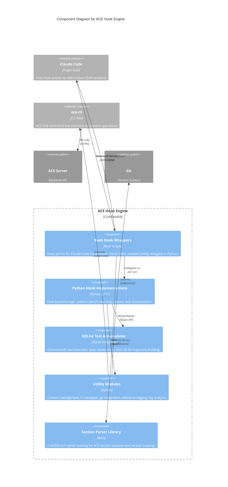

# C4 Component Level: ACE Hook Engine

## Overview

- **Name**: ACE Hook Engine
- **Description**: Core orchestration engine for the ACE (Adaptive Context Engine) plugin that manages Claude Code lifecycle events through a coordinated system of bash wrapper scripts and Python hook implementations. Routes events through a multi-stage pipeline: bash wrappers → Python hooks → ace-cli → ACE Server.
- **Type**: Application Component
- **Technology**: Bash (shell scripting) + Python 3.11+ + SQLite
- **Container**: ACE Plugin (Claude Code Plugin System)

## Purpose

The ACE Hook Engine is the central nervous system of the ACE plugin, responsible for bridging Claude Code's lifecycle events with the ACE learning and pattern injection system. It solves several critical problems:

1. **Pattern Injection Before Tasks**: Automatically searches for and injects domain-specific patterns when users start tasks, providing contextual guidance from the ACE playbook.

2. **Learning Capture After Tasks**: Captures tool execution trajectories and sends them to ACE Server for pattern creation, updates, and refinement based on real execution feedback.

3. **Tool Accumulation for Ground Truth**: Maintains a SQLite database of every tool call during execution, providing accurate trajectory data without lossy transcript parsing.

4. **Event Logging for Observability**: Tracks hook execution metrics, pattern relevance, and system health for debugging and performance analysis.

5. **Pattern Survival Through Compaction**: Preserves pinned patterns across Claude Code context compaction events using temp file handoff and session recall.

6. **CLI Health Monitoring**: Validates ACE CLI availability, version compatibility, and authentication status at session start, gracefully disabling ACE features when issues are detected.

7. **CLAUDE.md Auto-Cleanup**: Removes obsolete ACE instructions from configuration files using HTML marker-based section isolation.

The Hook Engine implements a **hook wrapper pattern** where bash scripts handle environment setup, configuration validation, and error handling, while Python implementations perform the actual business logic (pattern search, learning, tool accumulation). This separation enables robust error handling while maintaining fast startup times.

## Software Features

### Pattern Injection (BeforeTask)
- **Domain-aware pattern search**: Queries ACE Server for relevant patterns based on user prompt
- **Abbreviation expansion**: Enhances semantic search by expanding common abbreviations (JWT, API, DB, etc.)
- **Client-side filtering**: Filters low-quality patterns (confidence < 0.5, helpful < 2) to reduce noise
- **Session pinning**: Saves session ID to temp file for pattern recall after compaction
- **Context formatting**: Wraps patterns in XML-style tags (`<ace-patterns-recalled>`) for Claude context injection
- **Domain tracking**: Saves domain summary to temp file for PreToolUse hook's domain shift detection
- **Relevance logging**: Records search metrics (patterns returned vs injected, domains, confidence scores)

### Learning Capture (Stop/SubagentStop)
- **Trajectory building**: Constructs execution trajectory from SQLite ground truth tool data (not transcript parsing)
- **Quality gates**: Filters trivial tasks and requires substantial work (state-changing tools) before learning
- **Git context extraction**: Captures commit metadata, changed files, and diff statistics for correlation
- **Pattern reinforcement**: Sends pattern IDs used during execution for helpful/harmful scoring
- **Tool summarization**: Creates human-readable action/result summaries for each tool call
- **Async execution**: Supports background learning mode (default) to avoid blocking session end
- **Learning statistics**: Parses and displays server response (patterns created/updated/pruned)

### Tool Accumulation (PostToolUse)
- **Silent operation**: No user-facing output, runs after every tool execution
- **SQLite persistence**: Appends tool name, input, response, and tool_use_id to `.claude/data/logs/ace-tools.db`
- **UTF-8 sanitization**: Strips invalid Unicode surrogates using `iconv` to prevent jq failures
- **Session isolation**: Tools indexed by session_id with automatic cleanup after learning
- **Performance**: Fast SQLite INSERT with index on session_id for sub-10ms writes
- **Ground truth source**: Provides accurate tool execution data without transcript parsing ambiguity

### Event Logging (All Hooks)
- **JSONL format**: JSON Lines for efficient streaming and analysis
- **File rotation**: 5MB rotation with 2 backup files to prevent disk bloat
- **Debug mode**: Optional trace logging to `/tmp/ace_hook_debug.log` (ACE_DEBUG_HOOKS=1)
- **Metrics tracking**: Execution time, exit codes, error rates, success rates
- **Correlation**: Session IDs link search → execution → learning events

### Version Check and Migration (SessionStart)
- **CLI detection**: Finds `ace-cli` (preferred) or `ce-ace` (legacy fallback) in PATH
- **Version validation**: Ensures ace-cli >= v3.10.3 for feature compatibility
- **Token expiration check**: Validates authentication with 2-hour warning threshold
- **Daily update check**: Caches npm package version check to prevent spam
- **Deprecated config detection**: Warns about old apiToken format in config files
- **CLAUDE.md cleanup**: Removes obsolete ACE sections using HTML marker detection
- **Disabled flag creation**: Creates `/tmp/ace-disabled-${SESSION_ID}.flag` on CLI issues

### Pattern Preservation (PreCompact → SessionStart Compact)
- **PreCompact save**: Calls `ace-cli cache recall` and saves patterns to `/tmp/ace-patterns-precompact-${SESSION_ID}.json`
- **SessionStart restore**: Reads temp file and re-injects patterns via `hookSpecificOutput.additionalContext`
- **Session ID coordination**: Uses `/tmp/ace-session-${PROJECT_ID}.txt` for session tracking across hooks
- **Atomic temp file writes**: `umask 077` for secure temp files, atomic `mv` to prevent race conditions
- **JSON validation**: Filters CLI notification lines (`💡`) to prevent JSON corruption

### Continuous Auto-Search (PreToolUse)
- **Domain shift detection**: Monitors file operations (Read, Glob, Grep) for domain changes
- **Dynamic domain matching**: No hardcoded lists; uses word splitting and 4-char prefix matching
- **Automatic pattern search**: Searches ACE playbook when domain shift detected
- **Context injection**: Injects patterns via `hookSpecificOutput` with `<ace-patterns-domain-shift>` tags
- **Shift logging**: Records domain transitions to `.claude/data/logs/ace-relevance.jsonl`

### Permission Management (PermissionRequest)
- **Safe command auto-approval**: Auto-approves read-only ACE commands (search, status, patterns, top, doctor, tune)
- **Dangerous command denial**: Auto-denies destructive commands (clear) with explanation
- **Pass-through for others**: Delegates non-ACE commands to user for decision

## Code Elements

This component contains the following code-level elements:

- [c4-code-plugins-ace-scripts.md](./c4-code-plugins-ace-scripts.md) - Bash wrapper scripts that serve as entry points for Claude Code hooks. Handles stdin JSON parsing, environment setup, CLI validation, and delegation to Python implementations or external CLI commands.

- [c4-code-plugins-ace-scripts-lib.md](./c4-code-plugins-ace-scripts-lib.md) - Bash library providing shared utility functions for ACE section marker parsing in CLAUDE.md files. Enables version tracking, content extraction, and structural validation using HTML comment markers.

- [c4-code-plugins-ace-shared-hooks.md](./c4-code-plugins-ace-shared-hooks.md) - Core Python hook implementations that provide pattern search on task start (BeforeTask), tool execution accumulation (PostToolUse), and learning on task completion (AfterTask/Stop). Forms the bridge between Claude Code's plugin architecture and ACE Server learning pipeline.

- [c4-code-plugins-ace-shared-hooks-utils.md](./c4-code-plugins-ace-shared-hooks-utils.md) - Python utility modules providing context management, CLI interaction, git integration, relevance logging, and log analysis. Abstracts CLI communication, context resolution, git operations, and logging metrics used by all ACE hooks.

## Interfaces

### Claude Code Hook Protocol (stdin JSON → stdout JSON)

All hooks implement the Claude Code plugin architecture:

**Input (stdin)**: JSON event data with hook-specific fields
```json
{
  "session_id": "uuid-string",
  "cwd": "/path/to/project",
  "working_directory": "/path/to/project",
  "transcript_path": "/path/to/transcript.jsonl",
  "tool_name": "Bash",
  "tool_input": {...},
  "tool_response": {...},
  "agent_type": "main"
}
```

**Output (stdout)**: JSON response with mandatory systemMessage
```json
{
  "systemMessage": "User-facing message (may be empty for silent hooks)",
  "hookSpecificOutput": {
    "hookEventName": "BeforeTask",
    "additionalContext": "<ace-patterns-recalled>\n...\n</ace-patterns-recalled>"
  }
}
```

**Hook Events Handled**:
- `SessionStart` - CLI validation, version check, token expiration, CLAUDE.md cleanup
- `SessionStart(compact)` - Pattern restoration after context compaction
- `BeforeTask` - Pattern injection before task execution
- `PreToolUse` - Domain shift detection and auto-search
- `PostToolUse` - Silent tool accumulation to SQLite
- `PreCompact` - Pattern save before compaction
- `Stop` - Learning capture from main agent
- `SubagentStop` - Learning capture from Task agents
- `PermissionRequest` - Auto-approval/denial of ACE CLI commands

### ace-cli Subprocess Interface

All hooks interact with ACE CLI via subprocess:

**Search Operation**:
```bash
echo '{"query": "user prompt"}' | ace-cli search --stdin --json [--pin-session SESSION_ID]
```
Response: `{similar_patterns: [...], domains_summary: {...}, count: N, threshold: 0.45}`

**Learn Operation**:
```bash
echo '{
  "task": "User request",
  "trajectory": [{step:1, tool:"Edit", action:"...", result:"..."}],
  "result": {"success": true},
  "playbook_used": ["pattern-id-1"],
  "git": {...}
}' | ace-cli learn --stdin --json
```
Response: `{success: true, learning_statistics: {patterns_created:1, patterns_updated:2, ...}}`

**Recall Operation**:
```bash
ace-cli cache recall --session SESSION_ID --json
```
Response: `{similar_patterns: [...], session_id: "...", pinned_at: "...", expires_at: "..."}`

**Version Check**:
```bash
ace-cli --version
```
Response: `3.10.3` (semantic version string)

**Auth Status**:
```bash
ace-cli whoami --json
```
Response: `{user: {...}, token_status: "valid", token_expires_at: "...", is_hard_cap_approaching: false}`

### SQLite Database Interface

PostToolUse hook writes to SQLite, Stop hook reads and clears:

**Schema**:
```sql
CREATE TABLE tool_uses (
  id INTEGER PRIMARY KEY AUTOINCREMENT,
  session_id TEXT NOT NULL,
  tool_name TEXT NOT NULL,
  tool_input TEXT NOT NULL,
  tool_response TEXT NOT NULL,
  tool_use_id TEXT UNIQUE NOT NULL,
  timestamp TEXT NOT NULL
);
CREATE INDEX idx_session ON tool_uses(session_id);
```

**Operations**:
- `append_tool(session_id, tool_name, tool_input, tool_response, tool_use_id)` - INSERT with conflict ignore
- `get_session_tools(session_id)` - SELECT WHERE session_id ORDER BY id
- `clear_session(session_id)` - DELETE WHERE session_id

**Location**: `.claude/data/logs/ace-tools.db`

### Temp File Coordination

Hooks coordinate via temp files in `/tmp/`:

**Flag Files** (disable mechanism):
- `/tmp/ace-disabled-${SESSION_ID}.flag` - Created by SessionStart if CLI issues detected

**Context Files** (session metadata):
- `/tmp/ace-session-${PROJECT_ID}.txt` - Session ID (written by BeforeTask, read by PreCompact/SessionStart)
- `/tmp/ace-agent-type-${SESSION_ID}.txt` - Agent type from Claude Code 2.1.2+
- `/tmp/ace-domain-${PROJECT_ID}.txt` - Current domain context (written by PreToolUse)
- `/tmp/ace-domains-${PROJECT_ID}.json` - Stored domain names (written by BeforeTask)

**Pattern Files** (compaction handling):
- `/tmp/ace-patterns-precompact-${SESSION_ID}.json` - Patterns saved before compaction

**Cache Files** (update checks):
- `/tmp/ace-update-check-$(date +%Y%m%d).txt` - Latest available CLI version (daily cache)

### Configuration Files

**Read**:
- `.claude/settings.json` - ACE project configuration (projectId, orgId)
- `$HOME/.config/ace/config.json` - Global ACE configuration (checked by Stop hook)
- `$HOME/CLAUDE.md` - Global Claude instructions (checked for deprecated ACE content)
- `${PROJECT_DIR}/CLAUDE.md` - Project-level Claude instructions (checked for deprecated ACE content)

**Write**:
- `.claude/data/logs/ace-tools.db` - SQLite tool accumulation database
- `.claude/data/logs/ace-patterns-used-{session_id}.json` - Pattern IDs for reinforcement learning
- `.claude/data/logs/ace-{event_type}.jsonl` - Event logs (rotation at 5MB)
- `.claude/data/logs/ace-relevance.jsonl` - Pattern relevance metrics (rotation at 10MB)
- `/tmp/ace_hook_debug.log` - Debug trace (if ACE_DEBUG_HOOKS=1)

## Dependencies

### Components Used

- **ace-cli** (v3.10.3+) - ACE SDK command line interface for pattern search, learning, status, domains, and session management
- **Claude Code Plugin System** - Provides hook event infrastructure and stdin/stdout JSON protocol
- **SQLite** - Embedded database for tool accumulation (ground truth trajectory data)

### External Systems

- **ACE Server** - Backend pattern learning and storage system (via ace-cli)
- **Git** - Version control system for commit context extraction and change tracking
- **npm** - Package manager for ace-cli installation and version checking

### System Utilities

- **Bash 4.0+** - Shell interpreter for wrapper scripts
- **jq** - JSON query/manipulation (used in all hooks for parsing)
- **uv** - Fast Python package manager and runner (for Python hook delegation)
- **Python 3.11+** - Python interpreter (indirect via uv)
- **iconv** - Character encoding conversion (for UTF-8 sanitization)
- **sed, grep, awk, cut, tr** - Text processing utilities
- **mktemp, umask, mv** - File operations for atomic writes

## Component Diagram



## Data Flow

### Complete Hook Lifecycle

```mermaid
flowchart TD
    Start["Claude Code Session Starts"] -->|SessionStart event| Install["Bash: ace_install_cli.sh<br/>- Detect CLI<br/>- Version check<br/>- Token validation<br/>- CLAUDE.md cleanup"]

    Install -->|Flag file set?| Disabled["ACE Disabled for Session<br/>(all hooks silent exit)"]
    Install -->|No issues| TaskReady["Session Ready"]

    TaskReady -->|BeforeTask event| BeforeTask["Bash: ace_before_task_wrapper.sh<br/>↓ Python: ace_before_task.py<br/>- Search patterns (ace-cli)<br/>- Save session ID<br/>- Inject context"]

    BeforeTask --> UserPrompt["User Submits Task"]

    UserPrompt -->|During execution| ToolLoop["Tool Execution Loop"]

    ToolLoop -->|PreToolUse event| PreTool["Bash: ace_pretooluse_wrapper.sh<br/>- Detect domain shift<br/>- Auto-search patterns (ace-cli)<br/>- Inject if match"]

    PreTool -->|Tool runs| ToolExec["Claude Code executes tool<br/>(Read, Bash, Edit, etc.)"]

    ToolExec -->|PostToolUse event| PostTool["Bash: ace_posttooluse_wrapper.sh<br/>↓ Python: ace_tool_accumulator.py<br/>- Append to SQLite (silent)<br/>- UTF-8 sanitization"]

    PostTool -->|Next tool or end| CheckEnd{End of<br/>Task?}

    CheckEnd -->|No| ToolLoop
    CheckEnd -->|Yes| CompactCheck{Context<br/>Compacting?}

    CompactCheck -->|Yes| PreCompact["Bash: ace_precompact_wrapper.sh<br/>- Recall patterns (ace-cli)<br/>- Save to temp JSON"]

    PreCompact -->|Compaction occurs| Compact["Claude Code Context Compaction"]

    Compact -->|SessionStart(compact)| SessionCompact["Bash: ace_sessionstart_compact.sh<br/>- Read temp JSON<br/>- Re-inject patterns<br/>- Cleanup temp file"]

    SessionCompact --> Continue["Continue with tasks..."]

    CompactCheck -->|No| StopEvent["Stop/SubagentStop event"]

    StopEvent -->|Stop/SubagentStop| Stop["Bash: ace_stop_wrapper.sh<br/>↓ Python: ace_after_task.py<br/>- Build trajectory from SQLite<br/>- Quality gates<br/>- Git context extraction<br/>- Learn (ace-cli)<br/>- Clear SQLite"]

    Stop -->|Session ends| End["Session Complete"]

    Disabled --> End
    Continue --> ToolLoop

    style Start fill:#e1f5ff
    style End fill:#c8e6c9
    style Disabled fill:#ffcccc
    style sqlite_accumulator fill:#fff9c4
```

### Tool Accumulation & Learning Flow

```mermaid
flowchart LR
    ToolExec["Claude Code<br/>Tool Execution"]

    ToolExec -->|PostToolUse| Wrapper["Bash Wrapper<br/>ace_posttooluse_wrapper.sh<br/>- Parse stdin<br/>- Check disabled flag<br/>- UTF-8 sanitization"]

    Wrapper -->|Delegate| Accumulator["Python: ace_tool_accumulator.py<br/>- JSON serialize<br/>- SQLite INSERT"]

    Accumulator -->|Persist| SQLite["SQLite Database<br/>.claude/data/logs/ace-tools.db<br/>- session_id<br/>- tool_name<br/>- tool_input JSON<br/>- tool_response JSON<br/>- tool_use_id<br/>- timestamp"]

    SQLite -->|Session ends| StopHook["Python: ace_after_task.py<br/>- Query SQLite<br/>- Build trajectory<br/>- Summarize actions/results"]

    StopHook -->|Extract| Trajectory["ExecutionTrace JSON<br/>- task<br/>- trajectory (steps)<br/>- result<br/>- playbook_used<br/>- git context<br/>- agent_type"]

    Trajectory -->|Send| CLI["ace-cli learn --stdin<br/>- Pattern creation<br/>- Pattern updates<br/>- Embedding generation"]

    CLI -->|API| Server["ACE Server<br/>- Store patterns<br/>- Update scores<br/>- Return statistics"]

    Server -->|Response| Feedback["Learning Statistics<br/>- patterns_created<br/>- patterns_updated<br/>- patterns_pruned<br/>- avg_confidence"]

    Feedback -->|Display| User["User sees learning result<br/>in systemMessage"]

    StopHook -->|Cleanup| Clear["clear_session(session_id)<br/>DELETE FROM tool_uses"]

    style ToolExec fill:#e3f2fd
    style SQLite fill:#fff9c4
    style Server fill:#f0f4c3
    style Feedback fill:#c8e6c9
```



## Relationships

### Hook Execution Sequence by Event Type

| Event | Bash Wrapper | Python Implementation | Purpose | Output |
|-------|-------------|----------------------|---------|--------|
| **SessionStart** | `ace_install_cli.sh` | N/A (pure bash) | CLI validation, version check, token expiration | systemMessage (warnings/errors) |
| **SessionStart(compact)** | `ace_sessionstart_compact.sh` | N/A (pure bash) | Pattern restoration after compaction | systemMessage + hookSpecificOutput.additionalContext |
| **BeforeTask** | `ace_before_task_wrapper.sh` | `ace_before_task.py` | Pattern search and injection | systemMessage + hookSpecificOutput.additionalContext |
| **PreToolUse** | `ace_pretooluse_wrapper.sh` | N/A (pure bash) | Domain shift detection and auto-search | systemMessage + hookSpecificOutput (conditional) |
| **PostToolUse** | `ace_posttooluse_wrapper.sh` | `ace_tool_accumulator.py` | Silent tool accumulation to SQLite | systemMessage: "" (silent) |
| **PreCompact** | `ace_precompact_wrapper.sh` | N/A (pure bash) | Save patterns before compaction | systemMessage (confirmation) |
| **Stop** | `ace_stop_wrapper.sh` | `ace_after_task.py` | Learning capture from main agent | systemMessage (learning stats) |
| **SubagentStop** | `ace_subagent_stop_wrapper.sh` | `ace_after_task.py` | Learning capture from Task agents | systemMessage (learning stats) |
| **PermissionRequest** | `ace_permission_request_wrapper.sh` | `ace_permission_request.py` | Auto-approve/deny ACE commands | decision: allow/deny + message |

### Inter-Hook Coordination

**Flag File Pattern**:
- `SessionStart` creates `/tmp/ace-disabled-${SESSION_ID}.flag` on CLI issues
- All other hooks check flag at start → exit silently if exists
- Enables distributed disable mechanism without shared process state

**Session ID Handoff**:
- `BeforeTask` saves session ID to `/tmp/ace-session-${PROJECT_ID}.txt`
- `PreCompact` reads session ID to call `ace-cli cache recall`
- `SessionStart(compact)` reads session ID to restore patterns
- `PreToolUse` reads session ID for domain tracking

**Pattern Preservation**:
- `PreCompact` → `/tmp/ace-patterns-precompact-${SESSION_ID}.json` → `SessionStart(compact)`
- Workaround for PreCompact hook limitation (no hookSpecificOutput support)

**Tool Accumulation**:
- `PostToolUse` → SQLite → `Stop/SubagentStop`
- Ground truth trajectory without transcript parsing

## Performance Characteristics

| Hook | Typical Execution Time | Notes |
|------|----------------------|-------|
| SessionStart | ~2-3s | CLI version check, token validation, CLAUDE.md cleanup |
| SessionStart(compact) | ~5-10ms | Fast temp file read, cleanup |
| BeforeTask | ~100-500ms | Pattern search, domain tracking |
| PreToolUse | ~50-200ms | Domain shift detection, conditional search |
| PostToolUse | ~10-50ms | SQLite append, silent operation |
| PreCompact | ~10-100ms | ace-cli cache recall, temp file write |
| Stop (async) | ~1-30s | Returns immediately, learning happens in background |
| Stop (sync) | ~10-60s | Waits for learning completion |
| SubagentStop | Similar to Stop | Always synchronous |

**Optimization Techniques**:
- SQLite index on session_id for O(log n) queries
- Async learning mode to avoid blocking session end
- Daily cache for npm version checks
- Session pinning for fast pattern recall (<100ms)
- UTF-8 sanitization only when needed (iconv overhead)

## Error Handling Strategy

**Non-Fatal Design**: All hooks continue on error (exit 0) to never block Claude Code workflow.

**Disabled Flag Coordination**:
- SessionStart detects CLI issues → creates flag → all hooks silent exit
- Prevents cascade of error messages on broken ACE installation

**Fallback Logic**:
- `ace-cli` not found → try `ce-ace` (legacy)
- Session pinning unavailable → skip pinning (graceful degradation)
- Search failure → empty pattern list, show user message
- Learning failure → log warning, user can manually trigger `/ace-learn`
- SQLite corruption → silent fallback to default behavior

**Debug Mode**:
- Set `ACE_DEBUG_HOOKS=1` to write detailed logs to `/tmp/ace_hook_debug.log`
- Set `ACE_EVENT_LOGGING=1` to enable full event logging (warning: ~42GB/session)

## Version History

- **v5.4.28**: PreCompact → SessionStart(compact) handoff (Issue #17 fix), JSON validation improvements
- **v5.4.27**: CLAUDE.md auto-cleanup with marker detection
- **v5.4.23**: Deprecated config detection for apiToken format
- **v5.4.21**: Auth failure detection with structured error dict
- **v5.4.19**: Smart idle detection, hard cap approaching check
- **v5.4.18**: Token expiration check on SessionStart
- **v5.4.13**: Version compatibility checks
- **v5.4.11**: Agent type capture from Claude Code 2.1.2+, session pinning support
- **v5.4.7**: Flag-based hook disable, daily update check
- **v5.4.5**: File rotation for relevance logs
- **v5.3.5**: Unicode sanitization for JSON compatibility
- **v5.3.0**: SQLite-based tool accumulation (PostToolUse)
- **v5.2.11**: Git context extraction with files_changed fix (Issue #7)
- **v5.2.10**: Git context extraction (Issue #6)
- **v5.0.0**: CLI-based architecture (MCP → ace-cli migration)

## Notes

### Key Design Patterns

1. **Hook Wrapper Pattern**: Bash handles stdin parsing and delegation, Python handles business logic
2. **Ground Truth Accumulation**: SQLite provides accurate tool data without transcript parsing
3. **Silent Failures**: PostToolUse always exits 0 even on partial failures
4. **Async Learning**: Stop hook supports background execution (ACE_ASYNC_LEARNING=1)
5. **Dynamic Domain Matching**: No hardcoded lists; word splitting + 4-char prefix semantic matching
6. **Atomic File Operations**: Secure temp files with `umask 077`, atomic `mv` to prevent race conditions
7. **Flag File Coordination**: Distributed disable mechanism across hooks without shared process state
8. **Version-Based Feature Gating**: Graceful degradation based on ace-cli version
9. **Session Pinning**: Fast local recall (~10ms) for pattern persistence through compaction
10. **Marker-Based Section Isolation**: HTML comments preserve user content in CLAUDE.md

### Security Considerations

1. **Credential Handling**: No hardcoded credentials; all config from `.claude/settings.json` and `~/.config/ace/config.json`
2. **Temp File Permissions**: Secure temp files with `umask 077` (owner-only read/write)
3. **UTF-8 Sanitization**: Prevents injection via malformed JSON
4. **Permission Request Hook**: Auto-denies dangerous ACE CLI commands (clear)
5. **Disabled Flag Pattern**: Fail-safe design on CLI issues

### Migration from v4.2.6 to v5.0.0

The `migrate-to-v5.sh` script guides users through:
- Installing new `@ace-sdk/cli` package
- Removing deprecated `@ce-dot-net/ce-ace-cli` package
- Backing up old MCP config from `$HOME/.claude/mcp/config.json`
- Cleaning up old CLAUDE.md ACE sections
- Interactive prompts with color-coded output

### Research Foundation

Based on ACE Research Paper (arXiv:2510.04618v1):
- **Page 5**: "Generator produces reasoning trajectories"
- **Page 7**: "Leveraging natural execution feedback"
- **Page 19**: "FULL AGENT-ENVIRONMENT TRAJECTORY" with tool calls, inputs, and outputs
- Quality gates: Trivial task filter + substantial work requirement
- Learning only occurs with meaningful execution feedback
