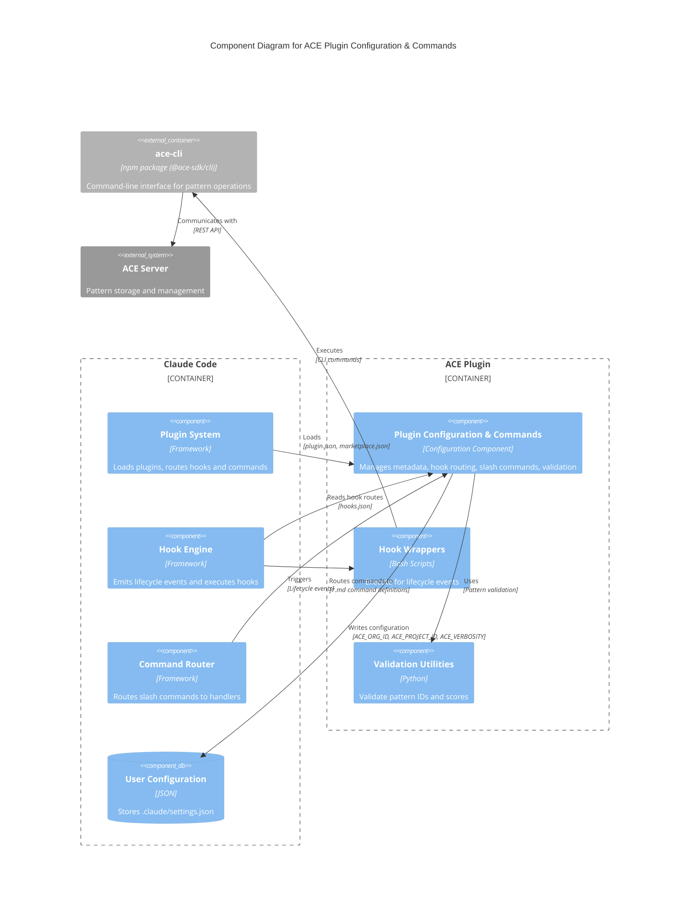

# C4 Component Level: ACE Plugin Configuration & Commands

## Overview

- **Name**: ACE Plugin Configuration & Commands
- **Description**: Plugin configuration, metadata management, hook routing, and user-facing slash commands that enable ACE pattern learning integration with Claude Code
- **Type**: Configuration Component
- **Technology**: JSON (configuration), Markdown (command definitions), Python (validation utilities), Bash (wrapper scripts)

## Purpose

This component serves as the integration layer between Claude Code and the ACE pattern learning system. It provides:

1. **Plugin Registration**: Defines plugin metadata for Claude Code marketplace discovery and installation
2. **Hook Routing**: Maps Claude Code lifecycle events to ACE wrapper scripts that execute at specific points in the conversation lifecycle
3. **Command Interface**: Exposes 22 slash commands for users to interact with ACE pattern learning features
4. **Validation**: Ensures data integrity for pattern IDs and score formatting
5. **Configuration Management**: Manages user-specific and project-specific ACE server connection settings

The component enables Claude Code to automatically retrieve relevant patterns before tasks, capture learning after task execution, and provide users with manual control over pattern management through slash commands.

## Software Features

### Hook Routing (8 Lifecycle Events)

- **PreToolUse Hook**: Retrieve relevant patterns before tool/function execution (5s timeout)
- **PreCompact Hook**: Validate JSON before context compaction (10s timeout)
- **SessionStart Hook**: Install ace-cli on session initialization (30s timeout) or handle compaction session start (10s timeout)
- **UserPromptSubmit Hook**: Retrieve patterns before user prompt processing (15s timeout)
- **PostToolUse Hook**: Capture learning after tool execution (130s timeout for ML processing)
- **PermissionRequest Hook**: Handle permission requests during tool execution (5s timeout)
- **Stop Hook**: Finalize learning and logging when conversation stops (130s timeout)
- **SubagentStop Hook**: Handle subagent termination with notifications (130s timeout)

### Slash Commands (22 Total)

#### Pattern Learning & Management
- **`/ace:learn`**: Capture learning from completed work interactively using AskUserQuestion UI
- **`/ace:bootstrap`**: Bootstrap playbook from docs, git history, and/or current code (modes: hybrid, both, local-files, git-history, docs-only)
- **`/ace:patterns`**: View playbook organized by section (strategies, snippets, troubleshooting, APIs)
- **`/ace:search`**: Semantic search for patterns using natural language (reduces context by 50-92%)
- **`/ace:top`**: Show highest-rated patterns
- **`/ace:export-patterns`**: Export playbook to JSON
- **`/ace:import-patterns`**: Import playbook from JSON

#### Configuration & Authentication
- **`/ace:configure`**: Interactive wizard for ACE server connection setup (organization, project, verbosity)
- **`/ace:login`**: Authenticate with ACE server
- **`/ace:domains`**: Manage playbook domains (whitelist/blacklist)
- **`/ace:tune`**: Tune ACE behavior and thresholds

#### Status & Diagnostics
- **`/ace:status`**: Show playbook statistics (total patterns, by section, top helpful/harmful)
- **`/ace:doctor`**: Diagnose ACE configuration issues
- **`/ace:test`**: Test ACE configuration
- **`/ace:delta`**: Show changes in playbook over time
- **`/ace:relevance-report`**: Generate relevance report for patterns

#### Maintenance
- **`/ace:install-cli`**: Install or update ace-cli
- **`/ace:enable-auto-update`**: Enable automatic ACE updates
- **`/ace:cleanup`**: Clean up temporary files and caches
- **`/ace:clear`**: Clear playbook and start fresh

### Plugin Metadata Management

- **plugin.json**: Plugin registration with version (5.4.28), description, author, keywords, license
- **plugin.template.json**: Template for plugin configuration during releases
- **marketplace.json**: Central marketplace configuration with plugin listings and categorization

### Validation Utilities

- **Pattern ID Validation**: Validate "ctx-" prefixed pattern IDs with lowercase alphanumeric format
- **Score Formatting**: Format helpful/harmful scores in "+N/-M" format
- **JSON Validation**: Validate JSON before context compaction to prevent corruption

## Code Elements

This component contains the following code-level elements:

- [c4-code-plugins-ace-config-commands.md](./c4-code-plugins-ace-config-commands.md) - Hook configurations, slash command definitions, plugin metadata, and validation utilities

## Interfaces

### 1. Claude Code Plugin API

**Protocol**: JSON configuration files

**Description**: Defines plugin metadata and registration for Claude Code marketplace

**Schema**:
```json
{
  "name": "string",
  "version": "semver",
  "description": "string",
  "author": { "name": "string", "email": "string" },
  "homepage": "url",
  "repository": "url",
  "license": "string",
  "keywords": ["array", "of", "strings"]
}
```

**Operations**:
- Plugin registration and discovery in marketplace
- Version management and update detection
- Keyword-based search and categorization

### 2. Hook Routing Interface

**Protocol**: JSON configuration + Bash scripts

**Description**: Maps Claude Code lifecycle events to ACE wrapper scripts

**Configuration Format** (hooks.json):
```json
{
  "eventType": "PreToolUse|PreCompact|SessionStart|UserPromptSubmit|PostToolUse|PermissionRequest|Stop|SubagentStop",
  "matcher": "string (empty for all, or specific matcher)",
  "command": "path/to/wrapper_script.sh",
  "timeout": "milliseconds"
}
```

**Event Flow**:
1. Claude Code emits lifecycle event
2. hooks.json routes event to wrapper script based on eventType and matcher
3. Wrapper script executes with timeout constraint
4. Result returned to Claude Code

**Supported Events**:
- `PreToolUse`: Before tool/function execution → retrieve patterns
- `PreCompact`: Before context compaction → validate JSON
- `SessionStart`: Session initialization → install CLI or handle compaction
- `UserPromptSubmit`: Before user prompt → retrieve patterns
- `PostToolUse`: After tool execution → capture learning
- `PermissionRequest`: Permission request → handle permissions
- `Stop`: Conversation stop → finalize learning
- `SubagentStop`: Subagent termination → log and notify

### 3. Slash Command Interface

**Protocol**: Markdown files with YAML frontmatter

**Description**: User-invocable commands for pattern management and configuration

**Command Definition Format**:
```markdown
---
description: "Command description"
argument-hint: "[optional] [parameters]"
context: "fork|normal"
---

# Command Instructions

[Markdown instructions for Claude Code to execute]
```

**Command Categories**:
- **Learning**: `/ace:learn`, `/ace:bootstrap`, `/ace:export-patterns`, `/ace:import-patterns`
- **Retrieval**: `/ace:patterns`, `/ace:search`, `/ace:top`
- **Configuration**: `/ace:configure`, `/ace:login`, `/ace:domains`, `/ace:tune`
- **Diagnostics**: `/ace:status`, `/ace:doctor`, `/ace:test`, `/ace:delta`, `/ace:relevance-report`
- **Maintenance**: `/ace:install-cli`, `/ace:enable-auto-update`, `/ace:cleanup`, `/ace:clear`

### 4. Validation Interface

**Protocol**: Python module

**Description**: Data validation utilities for pattern IDs and scores

**Functions**:
- `validate_pattern_id(pattern_id: str) -> tuple[bool, Optional[str]]`
  - Validates pattern ID format: "ctx-" prefix + lowercase alphanumeric
  - Returns: (is_valid, error_message)

- `is_valid_pattern_id(pattern_id: str) -> bool`
  - Simple boolean validation check
  - Returns: True if valid, False otherwise

- `format_pattern_score(helpful: int, harmful: int) -> str`
  - Formats pattern scores for display
  - Returns: "+N/-M" formatted string

### 5. Configuration Storage Interface

**Protocol**: JSON files

**Description**: Stores user-specific and project-specific ACE configuration

**Storage Locations**:
- `.claude-plugin/plugin.json`: Plugin-level configuration
- `.claude/settings.json`: Project-level user settings
- `.claude-plugin/hooks.json`: Hook routing configuration

**Settings Schema** (.claude/settings.json):
```json
{
  "env": {
    "ACE_ORG_ID": "uuid",
    "ACE_PROJECT_ID": "uuid",
    "ACE_VERBOSITY": "detailed|compact"
  }
}
```

## Dependencies

### Components Used

- **ACE Hook Engine**: Executes wrapper scripts for lifecycle events (PreToolUse, PostToolUse, etc.)
- **ace-cli**: Command-line interface for pattern learning operations (npm: @ace-sdk/cli >= 3.10.3)

### External Systems

- **Claude Code Plugin System** (>= 2.1.2):
  - Provides hook infrastructure for lifecycle events
  - Provides slash command routing and execution
  - Provides AskUserQuestion UI for interactive commands

- **ACE Server**:
  - Authentication and authorization (token-based)
  - Pattern storage and retrieval
  - Organization and project management

- **Node.js & npm**:
  - Required for ace-cli installation and execution
  - Package manager for @ace-sdk/cli

- **System Utilities**:
  - `bash` (v3.2+): Shell interpreter for wrapper scripts
  - `jq`: JSON processor for configuration parsing
  - `git` (optional): For git-history bootstrap mode

## Component Diagram



## Interaction Patterns

### Hook Event Flow

1. **Pattern Retrieval (PreToolUse, UserPromptSubmit)**:
   - Claude Code emits event → hooks.json routes to wrapper script → ace-cli retrieves patterns → patterns injected into context → Claude Code continues with enriched context

2. **Learning Capture (PostToolUse, Stop, SubagentStop)**:
   - Claude Code emits event → hooks.json routes to wrapper script → ace-cli captures learning from execution → patterns updated in ACE server → success/failure logged

3. **Validation (PreCompact)**:
   - Context compaction triggered → hooks.json routes to validation wrapper → JSON validated → compaction proceeds if valid, aborts if invalid

4. **Installation (SessionStart)**:
   - Session starts → hooks.json routes to install script → ace-cli installed/updated → session continues with CLI available

### Slash Command Flow

1. **Interactive Commands (/ace:learn, /ace:configure)**:
   - User invokes command → Command Router loads .md definition → Claude Code executes instructions → AskUserQuestion UI collects input → ace-cli processes → results displayed

2. **Retrieval Commands (/ace:patterns, /ace:search, /ace:status)**:
   - User invokes command → Command Router loads .md definition → ace-cli retrieves data → results formatted and displayed → user views patterns/statistics

3. **Configuration Commands (/ace:configure)**:
   - User invokes command → Interactive wizard → ace-cli fetches organizations/projects → user selects → settings written to `.claude/settings.json` → configuration verified

## Technology Stack

- **Configuration**: JSON (plugin.json, marketplace.json, hooks.json, settings.json)
- **Command Definitions**: Markdown with YAML frontmatter
- **Validation**: Python 3.x
- **Hook Wrappers**: Bash 3.2+
- **CLI Integration**: Node.js, npm (@ace-sdk/cli)
- **Utilities**: jq (JSON processing), git (optional for bootstrap)

## Deployment Considerations

- **Plugin Installation**: Installed via Claude Code marketplace or manual installation to `~/.claude/plugins/ace/`
- **CLI Dependency**: ace-cli must be installed (auto-installed on SessionStart hook)
- **Configuration Scope**: Project-level settings stored in `.claude/settings.json` at repository root
- **Hook Execution**: Hooks execute in subprocess with timeouts (5s-130s depending on operation)
- **Version Requirements**: Claude Code >= 2.1.2, ace-cli >= 3.10.3

## Notes

- **Current Version**: 5.4.28 (Released: Fix PreCompact JSON validation - Issue #17)
- **Hook Timeout Strategy**: Short timeouts (5s-15s) for retrieval operations to keep Claude Code responsive; long timeouts (130s) for learning operations that involve ML processing
- **Pattern ID Format**: Strict format enforced: "ctx-" prefix + lowercase alphanumeric (e.g., "ctx-abc123")
- **Playbook Structure**: 4 sections (strategies_and_hard_rules, useful_code_snippets, troubleshooting_and_pitfalls, apis_to_use)
- **Auth Model**: Token-based authentication required for all ACE operations (via `/ace:login`)
- **Learning Flow**: Automatic pattern retrieval before tasks + automatic learning capture after tasks + manual learning via `/ace:learn`
- **Context Reduction**: Semantic search reduces context by 50-92% vs full playbook retrieval
- **SessionStart Matchers**: Special handling for "compact" matcher during context compaction (separate hook entry with different timeout)
- **Marketplace Integration**: Plugin registered in ce-dot-net-marketplace with category "productivity" and 10 searchable keywords
