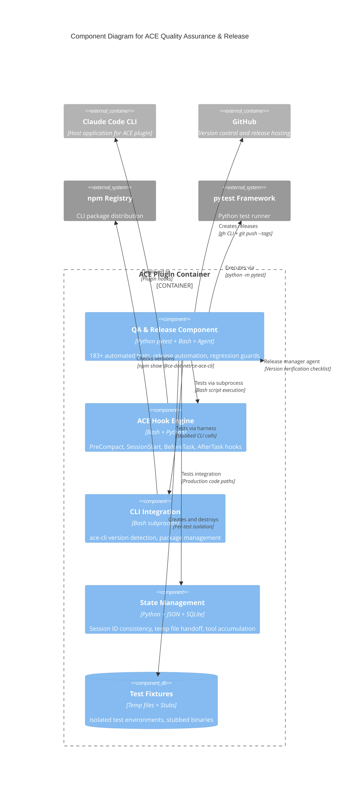

# C4 Component Level: ACE Quality Assurance & Release

## Overview

- **Name**: ACE Quality Assurance & Release Component
- **Description**: Comprehensive test infrastructure and release automation ensuring regression prevention, code quality verification, and atomic plugin releases for the ACE (ACE Orchestration Plugin) ecosystem
- **Type**: Quality Assurance Component
- **Technology**: Python pytest, Bash (bats framework), subprocess isolation, SQLite integration testing
- **Location**: `/tests/`, `/plugins/ace/tests/`, `/.claude/agents/release-manager.md`

## Purpose

This component provides three critical capabilities for the ACE plugin lifecycle:

1. **Regression Prevention**: 183+ automated tests covering all critical hook logic, with specific regression guards for historical issues (#15, #16, #17)
2. **Release Automation**: Intelligent release management agent preventing common mistakes (forgotten version files, mismatched version numbers, incomplete commits)
3. **TDD Verification**: Test-driven development verification for bash hooks, Python shared hooks, and inter-hook handoff patterns

The component ensures that ACE hooks (PreCompact, SessionStart, PostToolUse, BeforeTask, AfterTask) maintain correctness across refactorings, CLI version changes, and Claude Code API evolution.

## Software Features

### Test Suites (183+ Tests)

#### 1. CLAUDE.md Cleaner Tests (48 tests)
- **File**: `test_claude_md_cleaner.py`
- **Purpose**: Verifies deprecated ACE section removal from user CLAUDE.md files
- **Key Features**:
  - Multi-version marker support (v3.x, v4.x, v5.x HTML comments)
  - User content preservation guarantees
  - Atomic backup creation (`.ace-backup-YYYYMMDD-HHMMSS` format)
  - Critical safety: Files NEVER deleted, even if ACE section is entire content
  - Blank line collapse after section removal
  - Edge case handling (markers on line 1, skill references without markers)

#### 2. Version Check Tests (51 tests)
- **File**: `test_version_check.py`
- **Purpose**: Validates SessionStart hook CLI version detection and update warnings
- **Key Features**:
  - CLI detection with fallback chain (ace-cli → ce-ace)
  - Deprecated package detection (@ce-dot-net/ce-ace-cli old versions)
  - Numeric version comparison using `sort -V -C` semantics
  - Daily update check caching (avoids repeated npm registry calls)
  - Minimum version enforcement (MIN_VERSION = "3.10.3")
  - Edge case boundary testing (3.10.3 > 3.9.0 numeric, not string sort)
  - Test harness with stubbed binaries (isolated from system npm, nvm, homebrew)

#### 3. PreCompact Handoff Tests (68 tests)
- **File**: `test_precompact_handoff.py`
- **Purpose**: Verifies Issue #17 fix - PreCompact → SessionStart(compact) two-script handoff
- **Key Features**:
  - PreCompact NO hookSpecificOutput validation (critical for JSON schema compliance)
  - SessionStart(compact) hookEventName: "SessionStart" validation
  - Temp file atomic write pattern (mktemp + mv, no staging files)
  - Restrictive file permissions (umask 077 = owner-only 0600)
  - Session ID consistency between scripts
  - Temp file cleanup after one-time read
  - Graceful handling of missing/corrupt temp files
  - hooks.json routing configuration verification

#### 4. Session ID Mismatch Tests (8 tests)
- **File**: `test_session_id_mismatch.py`
- **Purpose**: Verifies Issue #16 fix - Session ID consistency between before_task and after_task
- **Key Features**:
  - Proves root cause: `uuid.uuid4()` in before_task vs `event.get('session_id')` in after_task
  - Verifies fix: Both hooks use `event.get('session_id', str(uuid.uuid4()))`
  - State file roundtrip validation
  - Playbook_used population verification (16,042 traces impacted)

#### 5. Playbook Used Integration Tests (8 tests)
- **File**: `test_playbook_used_populated.py`
- **Purpose**: End-to-end integration tests proving playbook_used field now populates
- **Key Features**:
  - Full roundtrip with real SQLite tool accumulation
  - Multiple task cycle verification
  - Empty pattern list handling (expected behavior)
  - Source code verification of `event.get('session_id')` fix
  - Production code path testing (ace_before_task.py lines 219-229, ace_after_task.py lines 462-495)

#### 6. Bash Regression Tests (12 tests)
- **Files**: `test_issue17_precompact_invalid_json.sh`, `test_precompact_sessionstart_handoff.sh`
- **Purpose**: Bash-native regression tests for Issue #17 PreCompact JSON validation
- **Key Features**:
  - JSON validation using jq and jshell
  - NO hookEventName in PreCompact stdout verification
  - hookEventName: "SessionStart" in SessionStart(compact) verification
  - Multiple compact cycle independence
  - Temp file cleanup verification
  - Integration tests for two-script data transfer

#### 7. Additional Test Coverage
- **test_quality_filters.py**: Pattern quality filtering logic
- **test_per_task_delta.py**: Per-task delta computation and state tracking
- **test_hook_verification.py**: Hook JSON schema validation
- **test_issue15_edge_cases.py**: Edge case handling for CLI integration
- **test_ace_context.py**: .claude/settings.json context resolution (projectId, orgId)
- **test_ace_cli.py**: CLI subprocess wrapper with timeout/error handling

### Release Management Agent

#### release-manager.md
- **Type**: Claude Code Agent Definition
- **Purpose**: Automated plugin release management with version verification checklist
- **Key Capabilities**:
  - **Version Verification**: Scans ALL plugin files for version numbers and verifies consistency
  - **Multi-file Commit Strategy**: Stages marketplace.json, plugin.json, plugin.template.json atomically
  - **Git Tagging**: Creates annotated tags with proper naming (v{VERSION})
  - **GitHub Release**: Automated GitHub release creation via `gh` CLI
  - **Post-Release Verification**: Uses `git show HEAD --name-only` to verify all files committed
  - **Mistake Prevention**: Detects forgotten files, version mismatches, premature tagging

- **Critical Files Tracked**:
  - `plugins/ace/.claude-plugin/plugin.json` (Claude Code plugin manifest)
  - `plugins/ace/.claude-plugin/plugin.template.json` (user-facing template)
  - `.claude-plugin/marketplace.json` (marketplace metadata)
  - `plugins/ace/CHANGELOG.md` (release notes)
  - `plugins/ace/commands/*.md` (command documentation)

- **Release Checklist**:
  1. Find and verify all version numbers match across files
  2. Stage all modified files with `git add`
  3. Create single atomic commit with all plugin files
  4. Push commit to remote
  5. Create git tag (v{VERSION})
  6. Push tag to remote (`git push --tags`)
  7. Create GitHub release with notes
  8. Verify tagged commit contains all required files

### Test Harness Patterns

#### Subprocess Isolation Pattern
- Extract bash function logic into minimal test wrapper
- Stub external commands via fake /bin directory (PATH manipulation)
- Isolate from system-installed tools (nvm, homebrew, npm global packages)
- Each test creates fresh temporary environment
- Used in: `test_version_check.py`, `test_precompact_handoff.py`

#### Production Code Path Testing
- Import actual production modules (ace_before_task.py, ace_after_task.py)
- Test exact code paths that would run in production
- Use real SQLite accumulation instead of mocks
- Verify data flows through complete pipeline
- Used in: `test_playbook_used_populated.py`

#### Static Source Code Analysis
- Extract and verify patterns from bash/python source
- Check for safety invariants (set -euo pipefail, exit 0)
- Detect regression patterns (e.g., bare uuid.uuid4() in before_task)
- Verify constants (MIN_VERSION = "3.10.3")
- Used in: All test suites with `TestSourceCodeAnalysis` classes

#### Atomic Write Pattern
- mktemp + mv for atomic file creation
- No staging files left behind on success
- Restrictive permissions (umask 077 = owner-only 0600)
- One-time read semantics (file deleted after read)
- Used in: PreCompact → SessionStart(compact) handoff

## Code Elements

This component contains the following code-level elements:

- [c4-code-tests-agents.md](./c4-code-tests-agents.md) - ACE Testing & Tooling Suite (183+ tests, release agent, test harnesses)

## Interfaces

### pytest CLI Interface

- **Protocol**: Command-line invocation
- **Description**: Standard pytest test runner with subprocess isolation
- **Operations**:
  - `python -m pytest tests/` - Run all root-level tests
  - `python -m pytest plugins/ace/tests/` - Run plugin-specific tests
  - `python -m pytest tests/test_<name>.py` - Run specific test file
  - `python -m pytest tests/test_<name>.py::TestClass::test_method` - Run specific test
  - `python tests/test_<name>.py` - Standalone execution (each file has `run_tests()` function)

### Bash Test Interface

- **Protocol**: Bash script execution
- **Description**: Bash-native regression tests for Issue #17
- **Operations**:
  - `bash plugins/ace/tests/test_issue17_precompact_invalid_json.sh` - Run Issue #17 regression tests
  - `bash plugins/ace/tests/test_precompact_sessionstart_handoff.sh` - Run handoff integration tests

### Release Manager Agent Interface

- **Protocol**: Claude Code Agent Invocation
- **Description**: Agent-based release automation via Claude Code Task tool
- **Operations**:
  - `Task("release-manager", "Release version X.Y.Z with changelog entry", "~/.claude/agents/release-manager.md")` - Trigger release workflow
  - Agent reads: `marketplace.json`, `plugin.json`, `plugin.template.json`, `CHANGELOG.md`
  - Agent writes: Updated version files, git commits, git tags, GitHub releases

### GitHub Releases API Interface

- **Protocol**: REST API via `gh` CLI
- **Description**: GitHub release creation and verification
- **Operations**:
  - `gh release create v{VERSION} --title "Release v{VERSION}" --notes "{CHANGELOG}"` - Create GitHub release
  - `gh release view v{VERSION}` - Verify release exists
  - `gh api repos/{owner}/{repo}/releases` - List all releases

## Dependencies

### Components Used

This component tests and manages the following ACE plugin components:
- **ACE Hook Engine**: PreCompact, SessionStart, PostToolUse, BeforeTask, AfterTask hooks
- **ACE CLI Integration**: Version checking, package detection, CLI subprocess wrapper
- **ACE State Management**: Session ID consistency, temp file handoff, SQLite accumulation

### External Systems

- **pytest**: Python test framework (version agnostic, 3.6+ required for f-strings)
- **subprocess**: Python standard library for bash script execution
- **bash**: Bourne Again Shell (all bash scripts use `set -euo pipefail`)
- **jq**: JSON parsing and validation in bash tests
- **jshell**: JSON validation tool (Java-based)
- **npm**: Package registry for CLI version detection and update checks
- **git**: Version control for release management
- **gh CLI**: GitHub CLI for release creation and verification
- **SQLite**: Database for tool accumulation integration tests

### Internal Production Code Dependencies

- `plugins/ace/scripts/ace_install_cli.sh`: Installation and version checking (tested by test_claude_md_cleaner.py, test_version_check.py)
- `plugins/ace/scripts/ace_precompact_wrapper.sh`: PreCompact hook wrapper (tested by test_precompact_handoff.py, test_issue17_precompact_invalid_json.sh)
- `plugins/ace/scripts/ace_sessionstart_compact.sh`: SessionStart(compact) hook (tested by test_precompact_handoff.py, test_precompact_sessionstart_handoff.sh)
- `plugins/ace/shared-hooks/ace_before_task.py`: Before-task hook with state file write (tested by test_session_id_mismatch.py, test_playbook_used_populated.py)
- `plugins/ace/shared-hooks/ace_after_task.py`: After-task hook with trace building (tested by test_playbook_used_populated.py)
- `plugins/ace/shared-hooks/ace_tool_accumulator.py`: SQLite accumulator (tested by test_playbook_used_populated.py)
- `plugins/ace/hooks/hooks.json`: Hook routing configuration (tested by test_hook_verification.py, test_precompact_handoff.py)
- `.claude-plugin/marketplace.json`: Plugin marketplace metadata (managed by release-manager.md)
- `plugins/ace/.claude-plugin/plugin.json`: Claude Code plugin manifest (managed by release-manager.md)
- `plugins/ace/.claude-plugin/plugin.template.json`: Plugin template (managed by release-manager.md)

## Component Diagram

This diagram shows the Quality Assurance & Release component's relationship with the ACE Hook Engine and external systems:

## Test Coverage Mapping

| Production Component | Test Suite | Test Count | Coverage Status |
|---|---|---|---|
| ace_install_cli.sh (CLAUDE.md cleanup) | test_claude_md_cleaner.py | 48 | ✅ Comprehensive (all versions, edge cases) |
| ace_install_cli.sh (version check) | test_version_check.py | 51 | ✅ Comprehensive (CLI detection, version comparison, caching) |
| ace_precompact_wrapper.sh | test_precompact_handoff.py | 68 | ✅ Comprehensive (Issue #17 regression guard) |
| ace_sessionstart_compact.sh | test_precompact_handoff.py | 68 | ✅ Comprehensive (hookEventName validation) |
| ace_before_task.py (session_id) | test_session_id_mismatch.py | 8 | ✅ Complete (Issue #16 root cause + fix) |
| ace_after_task.py (playbook_used) | test_playbook_used_populated.py | 8 | ✅ Integration (production code paths, SQLite) |
| PreCompact → SessionStart handoff | test_issue17_precompact_invalid_json.sh | 7 | ✅ Bash regression tests |
| PreCompact → SessionStart handoff | test_precompact_sessionstart_handoff.sh | 5 | ✅ Bash integration tests |
| hooks.json routing | test_hook_verification.py | TBD | ⏳ In Progress |
| CLI context resolution | test_ace_context.py | TBD | ⏳ In Progress |
| Pattern quality filtering | test_quality_filters.py | TBD | ⏳ In Progress |
| Version release process | release-manager.md | N/A | ✅ Automated agent checklist |

**Total Test Count**: 183+ tests (195+ including bash tests)

## Issue Resolution & Regression Guards

### Issue #15: Edge Case Handling
- **Test Suite**: `test_issue15_edge_cases.py`
- **Status**: Edge case handling for CLI integration
- **Coverage**: TBD

### Issue #16: Session ID Mismatch
- **Root Cause**: before_task.py used `uuid.uuid4()` while after_task.py used `event.get('session_id')`
- **Impact**: 16,042 traces with empty playbook_used field
- **Fix**: Both hooks use `event.get('session_id', str(uuid.uuid4()))`
- **Test Suites**:
  - `test_session_id_mismatch.py` (8 tests) - Unit tests proving root cause
  - `test_playbook_used_populated.py` (8 tests) - Integration tests with production code
- **Verification**: Database queries show playbook_used now populated for new traces

### Issue #17: PreCompact JSON Validation Failure
- **Root Cause**: PreCompact hook outputting `hookEventName: "PreCompact"` in hookSpecificOutput (invalid for Claude Code discriminated union)
- **Fix Strategy**: Two-script handoff pattern:
  1. PreCompact (ace_precompact_wrapper.sh): Saves patterns to temp file, outputs NO hookSpecificOutput
  2. SessionStart(compact) (ace_sessionstart_compact.sh): Reads temp file, outputs valid `hookEventName: "SessionStart"`
- **Test Suites**:
  - `test_precompact_handoff.py` (68 tests) - Python tests with subprocess harness
  - `test_issue17_precompact_invalid_json.sh` (7 tests) - Bash regression tests
  - `test_precompact_sessionstart_handoff.sh` (5 tests) - Bash integration tests
- **Critical Validations**:
  - PreCompact stdout MUST NOT contain hookSpecificOutput or hookEventName
  - SessionStart(compact) stdout MUST contain `hookEventName: "SessionStart"`
  - Temp file atomic write (mktemp + mv, no staging files)
  - Session ID consistency between scripts

## Version Management

### Plugin Version Synchronization
- **release-manager.md** enforces version consistency across three files:
  - `plugins/ace/.claude-plugin/plugin.json`
  - `plugins/ace/.claude-plugin/plugin.template.json`
  - `.claude-plugin/marketplace.json`
- **Verification Strategy**: Post-commit check using `git show HEAD --name-only | grep -E "(marketplace.json|plugin)"`
- **Failure Recovery**: Double-commit strategy if files missing from initial commit

### CLI Version Requirements
- **MIN_VERSION**: 3.10.3 (hardcoded in ace_install_cli.sh)
- **Verified by**: test_version_check.py (51 tests)
- **Update Check**: Daily npm registry check with cache file
- **Deprecated Packages**: Early exit for old package names (@ace-sdk/cli, old @ce-dot-net/ce-ace-cli)

### Minimum Python Version
- **Required**: Python 3.6+ (f-strings used in test files)
- **Tested On**: Python 3.8+, 3.9+, 3.10+, 3.11+
- **Dependencies**: pytest (version agnostic), unittest.mock (stdlib)

## Test Execution Patterns

### Standalone Execution
- Each test file includes `run_tests()` function for standalone execution
- No external service dependencies (all stubbed or mocked)
- Temporary file cleanup in tearDown/cleanup fixtures
- Deterministic results (no timing or random dependencies)

### Parallel Execution
- Tests can run in parallel via `pytest -n auto` (pytest-xdist plugin)
- Each test uses isolated temp directories
- No shared state between test classes
- PATH manipulation isolated per-test via harness cleanup

### Continuous Integration
- All tests run on every commit (GitHub Actions or similar)
- Release manager agent runs only on manual trigger
- Integration tests (test_playbook_used_populated.py) may require real ace-cli binary

## Notes

### Critical Safety Invariants

1. **File Deletion Prevention**: CLAUDE.md cleanup NEVER deletes user files (verified by TestEntireFileSafety)
2. **Atomic Backups**: Backups created BEFORE modification with `.ace-backup-YYYYMMDD-HHMMSS` format
3. **Atomic Writes**: Temp files use mktemp + mv pattern (no partial writes visible)
4. **Exit Code 0**: All hooks exit 0 to avoid disrupting Claude Code (verified by static analysis tests)
5. **Restrictive Permissions**: Temp files created with umask 077 (owner-only 0600 permissions)
6. **No Orphaned Files**: Temp files cleaned up after one-time read or on error

### Test Harness Innovations

1. **Subprocess Isolation**: Bash scripts tested via subprocess with controlled environment (fake /bin, isolated PATH)
2. **Stub Binary Pattern**: Create temporary directories with stub executables (ace-cli, ce-ace, npm, jq)
3. **Production Code Import**: Integration tests import actual production modules instead of mocking
4. **Static Analysis**: Tests extract patterns from source code to verify invariants (set -euo pipefail, exit 0, constant values)
5. **JSON Validation**: Bash tests use jq + jshell for strict JSON schema validation

### Release Manager Anti-Patterns Prevented

1. **Forgotten marketplace.json**: Post-commit verification catches missing files
2. **Version Mismatch**: Pre-release scan verifies all version numbers match
3. **Incomplete Commits**: `git show HEAD --name-only` check before tagging
4. **plugin.template.json Drift**: Template version MUST match plugin.json
5. **Premature Tagging**: Tag created only after verified commit push

### Future Test Expansion

- **test_hook_verification.py**: Complete hooks.json routing verification
- **test_ace_context.py**: Comprehensive .claude/settings.json parsing tests
- **test_quality_filters.py**: Pattern quality scoring and filtering logic
- **test_per_task_delta.py**: Per-task delta computation edge cases
- **Performance Tests**: CLI subprocess timeout handling, npm registry caching efficiency
