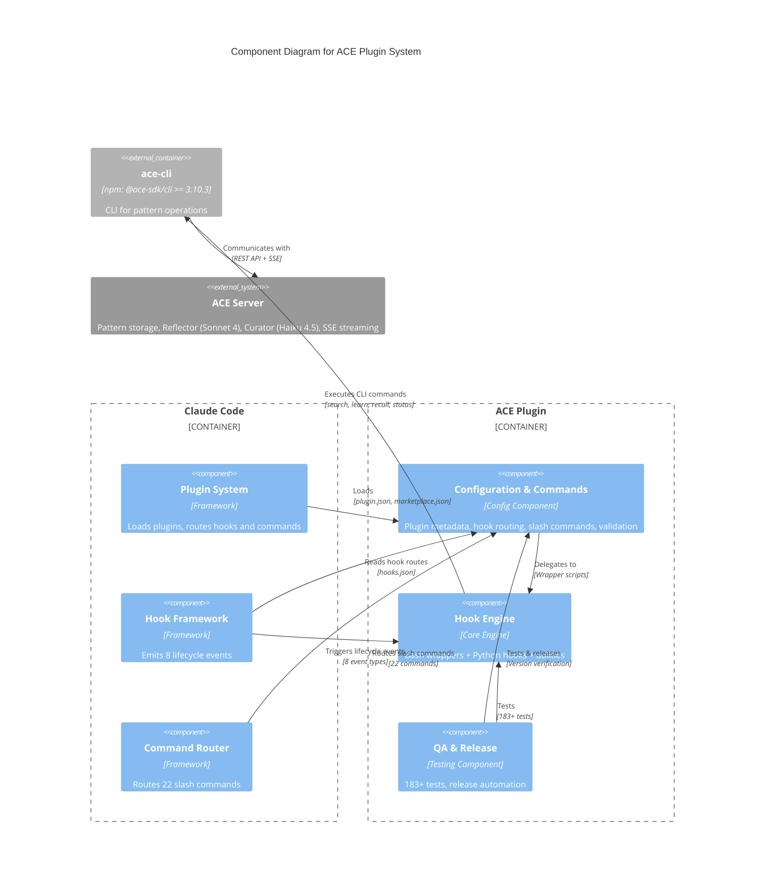
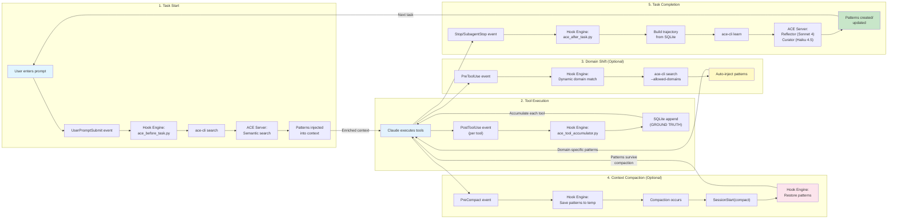

# C4 Component Level: ACE Plugin System Overview

## System Components

### 1. ACE Hook Engine
- **Name**: ACE Hook Engine
- **Description**: Core hook processing engine that orchestrates pattern learning lifecycle through bash wrappers, Python hooks, and utility modules. Implements the complete ACE learning pipeline: pattern injection before tasks (semantic search → context injection), learning capture after tasks (tool accumulation → trajectory → server), and pattern survival through context compaction via PreCompact → SessionStart(compact) handoff.
- **Type**: Core Engine Component
- **Technology**: Bash (wrapper scripts), Python 3.11+ (hook implementations), SQLite (tool accumulation), ace-cli (external dependency)
- **Key Features**:
  - **Pattern Injection**: BeforeTask hook retrieves relevant patterns via semantic search and injects into Claude Code context
  - **Tool Accumulation**: PostToolUse hook captures GROUND TRUTH tool execution data to SQLite (no lossy transcript parsing)
  - **Learning Capture**: Stop/SubagentStop hooks build trajectory from accumulated tools and send to ACE Server via ace-cli learn
  - **Context Compaction Survival**: PreCompact saves patterns to temp file → SessionStart(compact) re-injects after compaction (Issue #17 fix)
  - **Session Pinning**: Session ID coordination across hooks for pattern persistence (v1.0.11+ ace-cli)
  - **Version Checking**: SessionStart validates ace-cli >= 3.10.3 and checks token expiration
  - **CLAUDE.md Auto-Cleanup**: Removes deprecated ACE sections with HTML markers (v3, v4, v5)
  - **Dynamic Domain Matching**: PreToolUse detects domain shifts and auto-searches patterns (no hardcoded lists)
  - **Event Logging**: Optional JSONL logging with 5MB rotation (ACE_EVENT_LOGGING=1)
- **Documentation**: [c4-component-hook-engine.md](./c4-component-hook-engine.md)

### 2. ACE Plugin Configuration & Commands
- **Name**: ACE Plugin Configuration & Commands
- **Description**: Plugin registration, metadata management, hook routing configuration, and 22 user-facing slash commands that enable ACE pattern learning integration with Claude Code. Provides the integration layer between Claude Code's plugin system and the ACE hook engine.
- **Type**: Configuration & Interface Component
- **Technology**: JSON (plugin.json, marketplace.json, hooks.json), Markdown (command definitions with YAML frontmatter), Python (validation utilities), Bash (utility scripts)
- **Key Features**:
  - **Hook Routing**: hooks.json maps 8 Claude Code lifecycle events to wrapper scripts (PreToolUse, PreCompact, SessionStart, UserPromptSubmit, PostToolUse, PermissionRequest, Stop, SubagentStop)
  - **Slash Commands**: 22 commands for pattern management (/ace:learn, /ace:search, /ace:bootstrap, /ace:status, /ace:configure, etc.)
  - **Plugin Metadata**: plugin.json defines marketplace registration (v5.4.28, keywords, author, license)
  - **Validation Utilities**: Pattern ID validation ("ctx-" prefix + lowercase alphanumeric), score formatting ("+N/-M")
  - **Configuration Storage**: .claude/settings.json stores ACE_ORG_ID, ACE_PROJECT_ID, ACE_VERBOSITY
  - **Command Categories**:
    - Learning: /ace:learn, /ace:bootstrap, /ace:export-patterns, /ace:import-patterns
    - Retrieval: /ace:patterns, /ace:search, /ace:top
    - Configuration: /ace:configure, /ace:login, /ace:domains, /ace:tune
    - Diagnostics: /ace:status, /ace:doctor, /ace:test, /ace:delta, /ace:relevance-report
    - Maintenance: /ace:install-cli, /ace:enable-auto-update, /ace:cleanup, /ace:clear
- **Documentation**: [c4-component-plugin-config.md](./c4-component-plugin-config.md)

### 3. ACE Quality Assurance & Release
- **Name**: ACE Quality Assurance & Release
- **Description**: Comprehensive test suite (183+ tests across Python/Bash) and release automation agent that ensures ACE plugin quality through TDD, regression guards, and automated version management. Prevents release mistakes through multi-file version verification and two-commit strategy.
- **Type**: Testing & Release Automation Component
- **Technology**: Python (pytest, unittest), Bash (bats, subprocess harness pattern), Markdown (release-manager agent definition)
- **Key Features**:
  - **Test Coverage**:
    - 48 tests: CLAUDE.md cleanup (v3/v4/v5 marker removal)
    - 51 tests: Version check logic (sort -V semantics, MIN_VERSION=3.10.3)
    - 68 tests: PreCompact → SessionStart handoff (Issue #17 fix)
    - 8 tests: Session ID mismatch fix (Issue #16)
    - 8 tests: playbook_used population integration tests
    - Additional tests: quality filters, per-task delta, hook verification
  - **Regression Guards**:
    - Issue #15: Edge case handling for CLI integration
    - Issue #16: before_task uuid4 vs after_task event.session_id mismatch (16,042 traces fixed)
    - Issue #17: PreCompact hookEventName JSON validation failure (two-script handoff fix)
  - **Test Harness Pattern**: Subprocess isolation with fake /bin, PATH manipulation, stub binaries
  - **Release Manager Agent**: Automated version verification across plugin.json, plugin.template.json, marketplace.json
  - **Release Safety**:
    - Pre-release: Version number verification in ALL files
    - Post-commit: git show HEAD verification for required files
    - Double-commit: If critical files missing, create second commit
    - Tag verification: Ensure all files in tagged commit
    - GitHub release: Automated creation with proper notes
- **Documentation**: [c4-component-quality-assurance.md](./c4-component-quality-assurance.md)

## Component Relationships

## Data Flow: Complete ACE Learning Pipeline

## External Systems

### ACE Server (Remote)
- **Description**: Pattern storage and management service with ML-powered pattern generation
- **Technology**:
  - Reflector: Sonnet 4 (pattern extraction and reasoning)
  - Curator: Haiku 4.5 (pattern ranking and filtering)
  - Storage: Vector database for semantic search
  - Communication: REST API + Server-Sent Events (SSE) for streaming
- **Operations**:
  - `search`: Semantic pattern search with similarity scoring
  - `learn`: Pattern creation/updating from ExecutionTrace
  - `recall`: Session-pinned pattern retrieval (v1.0.11+)
  - `status`: Playbook statistics
  - `bootstrap`: Initial pattern extraction from code/git/docs
- **Authentication**: Token-based with expiration checking (2-hour warning threshold)

### Claude Code (Host Application)
- **Version**: >= 2.1.2
- **Provides**:
  - Plugin system with hook infrastructure
  - 8 lifecycle events: PreToolUse, PreCompact, SessionStart, UserPromptSubmit, PostToolUse, PermissionRequest, Stop, SubagentStop
  - Slash command routing and execution
  - AskUserQuestion UI for interactive commands
  - Subprocess execution with timeout constraints (5s-130s)
- **Integration Points**:
  - `.claude-plugin/plugin.json`: Plugin registration
  - `.claude-plugin/hooks.json`: Hook routing configuration
  - `commands/*.md`: Slash command definitions
  - `.claude/settings.json`: Project-specific configuration storage

### ace-cli (npm: @ace-sdk/cli)
- **Version**: >= 3.10.3
- **Description**: Command-line interface bridge between hooks and ACE Server
- **Installation**: Auto-installed by SessionStart hook if missing
- **Commands**:
  - `search`: Semantic pattern search with --allowed-domains, --blocked-domains
  - `learn --stdin`: Learning capture from ExecutionTrace JSON
  - `recall --session`: Session-pinned pattern retrieval
  - `status --json`: Playbook statistics
  - `bootstrap`: Initial pattern extraction (--mode hybrid|git-history|local-files|docs-only)
  - `whoami --json`: Authentication status and token expiration
  - `configure`: Interactive organization/project selection
- **Communication**: REST API client with JSON output

## System Architecture Highlights

### 1. Hook Execution Flow (8 Lifecycle Events)

**Pattern Retrieval Flow**:
1. UserPromptSubmit → ace_before_task.py → ace-cli search → patterns injected via hookSpecificOutput.additionalContext

**Tool Accumulation Flow**:
2. PostToolUse (per tool) → ace_posttooluse_wrapper.sh → ace_tool_accumulator.py → SQLite append (GROUND TRUTH)

**Dynamic Domain Shift Flow**:
3. PreToolUse → ace_pretooluse_wrapper.sh → domain match → ace-cli search --allowed-domains → auto-inject patterns

**Learning Capture Flow**:
4. Stop/SubagentStop → ace_after_task.py → build trajectory from SQLite → ace-cli learn → ACE Server

**Context Compaction Survival Flow** (Issue #17 fix):
5. PreCompact → save patterns to /tmp/ace-patterns-precompact-${SESSION_ID}.json → SessionStart(compact) → restore patterns via hookSpecificOutput

### 2. Component Coordination Patterns

**Flag File Coordination**:
- SessionStart creates `/tmp/ace-disabled-${SESSION_ID}.flag` if CLI issues detected
- All other hooks check flag and exit silently if present
- Prevents cascading failures without blocking Claude Code

**Temp File Handoff**:
- PreCompact → SessionStart(compact) uses temp file for pattern survival (PreCompact hooks can't output hookSpecificOutput)
- Session ID → pattern ID mapping via `/tmp/ace-session-${PROJECT_ID}.txt`
- Domain tracking via `/tmp/ace-domain-${PROJECT_ID}.txt`

**SQLite Ground Truth**:
- PostToolUse accumulates to SQLite (no transcript parsing)
- Stop hook queries SQLite for trajectory building
- Cleared after learning capture

**Session Pinning**:
- BeforeTask pins session with ace-cli >= 1.0.11
- PreCompact recalls pinned patterns for compaction survival
- <100ms recall performance requirement

### 3. Quality Assurance Strategy

**TDD Approach**:
- 183+ tests written before/during bug fixes
- Subprocess harness pattern isolates bash logic
- Production code path testing (import actual modules)
- Static source code analysis (grep for patterns)

**Regression Guards**:
- Issue #15: Edge cases for CLI integration
- Issue #16: Session ID mismatch (before_task uuid4 → event.get fix)
- Issue #17: PreCompact JSON validation (hookEventName: "PreCompact" invalid → two-script handoff)

**Release Safety**:
- release-manager.md agent prevents common mistakes
- Three-file version sync: plugin.json, plugin.template.json, marketplace.json
- Post-commit verification: `git show HEAD --name-only | grep -E "marketplace.json|plugin"`
- Double-commit strategy if critical files missing

### 4. Performance Characteristics

**Hook Timeouts**:
- PreToolUse: 5s (fast pattern injection)
- PreCompact: 10s (temp file save)
- SessionStart: 30s (CLI installation) / 10s (compaction)
- UserPromptSubmit: 15s (pattern search)
- PostToolUse: 130s (ML processing for learning)
- Stop/SubagentStop: 130s (trajectory building + learning)

**Async Learning**:
- ACE_ASYNC_LEARNING=1 (default): Stop hook returns immediately, learning runs in background
- Background errors logged to `~/.claude/logs/ace-background-*.log`

**Context Reduction**:
- Semantic search reduces context by 50-92% vs full playbook retrieval
- Client-side filtering: confidence >= 0.5 OR helpful >= 2
- Top-k server-side ranking (default: 10 patterns)

## Version History

- **v5.4.28**: PreCompact → SessionStart(compact) handoff (Issue #17 fix)
- **v5.4.27**: CLAUDE.md auto-cleanup with marker detection
- **v5.4.23**: Deprecated config detection for apiToken format
- **v5.4.18**: Token expiration check with 2-hour warning threshold
- **v5.4.13**: Token expiration validation on SessionStart
- **v5.4.11**: Agent type capture from Claude Code 2.1.2+, session pinning support
- **v5.4.7**: Flag-based hook disable + daily update check
- **v5.3.5**: Unicode sanitization (UTF-16 surrogates removal)
- **v5.3.0**: SQLite-based tool accumulation (PostToolUse ground truth)
- **v5.0.0**: CLI-based architecture (MCP → ace-cli migration)

## Key Design Principles

1. **Non-Fatal Error Handling**: All hooks exit 0 (never block Claude Code workflow)
2. **Ground Truth Data**: SQLite tool accumulation (no lossy transcript parsing)
3. **Atomic Operations**: mktemp + mv for temp files, umask 077 for security
4. **Dynamic Domain Matching**: No hardcoded lists, semantic word matching with 4+ char prefix
5. **Session Pinning**: Pattern persistence through context compaction (v1.0.11+ ace-cli)
6. **Two-Script Handoff**: PreCompact side-effect → SessionStart injection (Issue #17 fix)
7. **Version Comparison**: sort -V for semantic version ordering (3.10.3 > 3.9.0)
8. **UTF-8 Sanitization**: iconv removes invalid surrogates before JSON parsing
9. **TDD with Regression Guards**: 183+ tests prevent Issue #15, #16, #17 regressions
10. **Release Automation**: release-manager.md prevents version mismatch and forgotten files

## Notes

- **Current Version**: v5.4.28 (Released: Fix PreCompact JSON validation - Issue #17)
- **Minimum Requirements**: Claude Code >= 2.1.2, ace-cli >= 3.10.3, Python 3.11+, Bash 3.2+
- **Pattern ID Format**: "ctx-" prefix + lowercase alphanumeric (validated by validation.py)
- **Playbook Structure**: 4 sections (strategies_and_hard_rules, useful_code_snippets, troubleshooting_and_pitfalls, apis_to_use)
- **Learning Model**: Pre-task pattern retrieval + post-task learning capture + manual /ace:learn
- **Auth Model**: Token-based with 48h standby detection, 2h expiration warning
- **Marketplace**: ce-dot-net-marketplace, category "productivity", 10 searchable keywords
