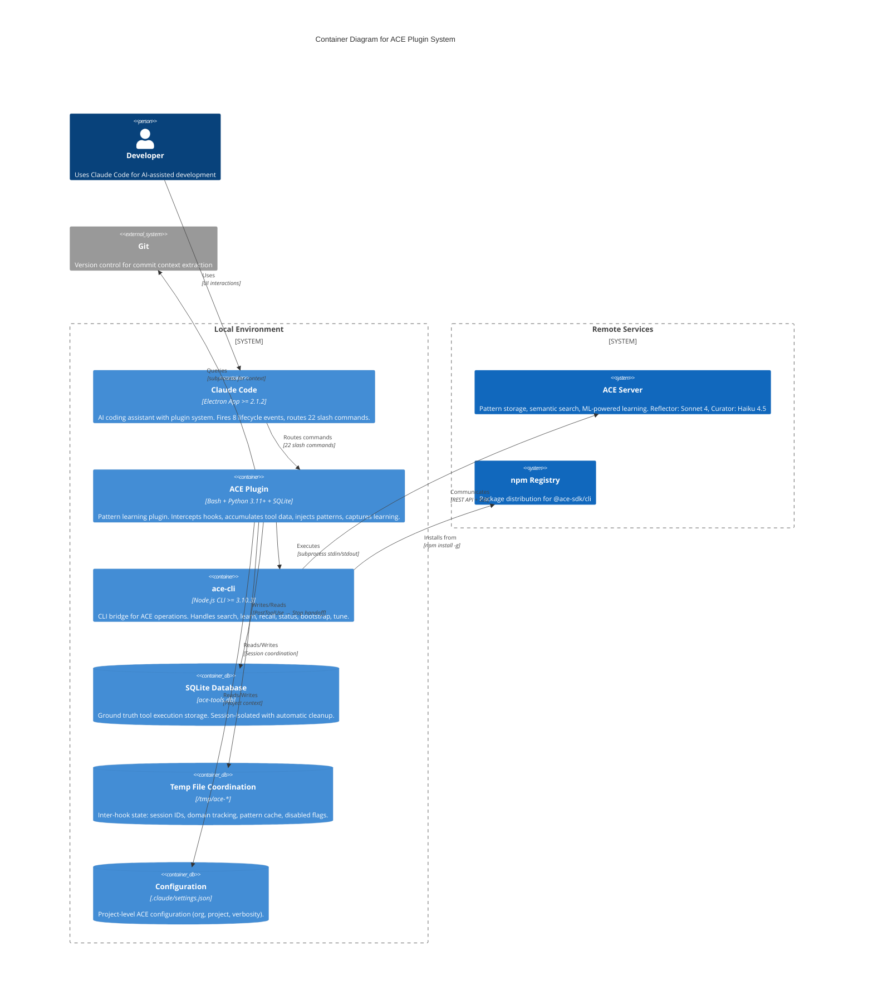
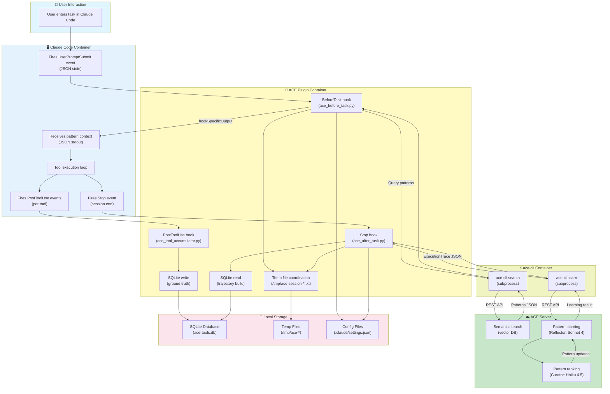

# C4 Container Level: ACE Plugin System Deployment

## Containers

### 1. ACE Plugin Container

- **Name**: ACE Plugin Container
- **Description**: Local Claude Code plugin installation containing all three ACE components: Hook Engine, Plugin Config, and QA/Release. Orchestrates pattern learning lifecycle through bash wrappers, Python hooks, and utility modules.
- **Type**: Claude Code Plugin
- **Technology**: Bash (wrapper scripts), Python 3.11+ (hook implementations), SQLite (tool accumulation), JSON (configuration)
- **Deployment**: Installed locally at `~/.claude/plugins/ace/` or via Claude Code marketplace
- **Version**: v5.4.28

## Purpose

The ACE Plugin Container is the primary deployment unit that integrates pattern learning capabilities into Claude Code. It intercepts 8 lifecycle events, maintains ground truth tool execution data, and coordinates with external services to provide context-aware AI assistance.

## Components

This container deploys the following components:

- **Hook Engine**: Core hook processing engine with bash wrappers + Python implementations
  - Documentation: [c4-component-hook-engine.md](./c4-component-hook-engine.md)

- **Plugin Configuration & Commands**: Plugin metadata, hook routing, 22 slash commands
  - Documentation: [c4-component-plugin-config.md](./c4-component-plugin-config.md)

- **Quality Assurance & Release**: 183+ tests, release automation agent
  - Documentation: [c4-component-quality-assurance.md](./c4-component-quality-assurance.md)

## Interfaces

### 1. Claude Code Plugin Protocol (stdin/stdout JSON)

**Protocol**: JSON over stdin/stdout
**Description**: Bidirectional communication with Claude Code host application for lifecycle events
**Specification**: Claude Code Plugin API v2.1.2+

**Input Event Schema** (stdin):
```json
{
  "session_id": "uuid-string",
  "cwd": "/path/to/project",
  "working_directory": "/path/to/project",
  "transcript_path": "/path/to/transcript.jsonl",
  "tool_name": "Bash",
  "tool_input": {...},
  "tool_response": {...},
  "agent_type": "main"
}
```

**Output Response Schema** (stdout):
```json
{
  "systemMessage": "User-facing message",
  "hookSpecificOutput": {
    "hookEventName": "BeforeTask",
    "additionalContext": "<ace-patterns-recalled>\n...\n</ace-patterns-recalled>"
  }
}
```

**Supported Events**:
- `SessionStart` - CLI validation, token expiration (30s timeout)
- `SessionStart(compact)` - Pattern restoration after compaction (10s timeout)
- `UserPromptSubmit` / `BeforeTask` - Pattern injection (15s timeout)
- `PreToolUse` - Domain shift detection (5s timeout)
- `PostToolUse` - Silent tool accumulation (130s timeout)
- `PreCompact` - Pattern save before compaction (10s timeout)
- `Stop` - Learning capture from main agent (130s timeout)
- `SubagentStop` - Learning capture from Task agents (130s timeout)
- `PermissionRequest` - Auto-approval/denial (5s timeout)

### 2. SQLite Database Interface (Ground Truth Storage)

**Protocol**: SQLite 3 API
**Description**: Local database for tool execution accumulation (PostToolUse → Stop handoff)
**Location**: `.claude/data/logs/ace-tools.db`

**Schema**:
```sql
CREATE TABLE tool_uses (
  id INTEGER PRIMARY KEY AUTOINCREMENT,
  session_id TEXT NOT NULL,
  tool_name TEXT NOT NULL,
  tool_input TEXT NOT NULL,
  tool_response TEXT NOT NULL,
  tool_use_id TEXT UNIQUE NOT NULL,
  timestamp TEXT NOT NULL
);
CREATE INDEX idx_session ON tool_uses(session_id);
```

**Operations**:
- `INSERT INTO tool_uses` - Append tool call (PostToolUse hook)
- `SELECT * FROM tool_uses WHERE session_id = ?` - Retrieve session tools (Stop hook)
- `DELETE FROM tool_uses WHERE session_id = ?` - Cleanup after learning

**Performance**: Sub-10ms writes, O(log n) session queries

### 3. File System Coordination (Temp Files)

**Protocol**: POSIX file I/O
**Description**: Temp files for inter-hook coordination and session state
**Location**: `/tmp/` directory

**Flag Files** (disable mechanism):
- `/tmp/ace-disabled-${SESSION_ID}.flag` - Created by SessionStart if CLI issues detected

**Context Files** (session metadata):
- `/tmp/ace-session-${PROJECT_ID}.txt` - Session ID (written by BeforeTask, read by PreCompact)
- `/tmp/ace-agent-type-${SESSION_ID}.txt` - Agent type from Claude Code 2.1.2+
- `/tmp/ace-domain-${PROJECT_ID}.txt` - Current domain context (PreToolUse)
- `/tmp/ace-domains-${PROJECT_ID}.json` - Stored domain names (BeforeTask)

**Pattern Files** (compaction handling):
- `/tmp/ace-patterns-precompact-${SESSION_ID}.json` - Patterns saved before compaction (PreCompact → SessionStart handoff)

**Cache Files** (update checks):
- `/tmp/ace-update-check-$(date +%Y%m%d).txt` - Latest CLI version (daily cache)

**Permissions**: `umask 077` (owner-only read/write, 0600)

### 4. Configuration Files (JSON)

**Protocol**: JSON file I/O
**Description**: Project and plugin configuration storage

**Read-only**:
- `.claude-plugin/plugin.json` - Plugin metadata (v5.4.28, keywords, author)
- `.claude-plugin/hooks.json` - Hook routing (8 event mappings)
- `commands/*.md` - Slash command definitions (22 commands)

**Read-write**:
- `.claude/settings.json` - Project configuration (ACE_ORG_ID, ACE_PROJECT_ID, ACE_VERBOSITY)

**Write-only**:
- `.claude/data/logs/ace-tools.db` - SQLite accumulation
- `.claude/data/logs/ace-*.jsonl` - Event logs (5MB rotation)
- `.claude/data/logs/ace-relevance.jsonl` - Pattern relevance (10MB rotation)

## Dependencies

### Containers Used

- **ace-cli Container**: CLI bridge between hooks and ACE Server
  - Communication: Subprocess execution (stdin/stdout)
  - Commands: `search`, `learn`, `recall`, `status`, `whoami`, `bootstrap`, `tune`
  - Version requirement: >= 3.10.3

- **Claude Code Container**: Plugin host application
  - Communication: Hook event firing (JSON stdin/stdout)
  - Version requirement: >= 2.1.2
  - Provides: Hook infrastructure, slash command routing, AskUserQuestion UI

### External Systems

- **ACE Server**: Pattern storage and ML processing (via ace-cli)
  - Protocol: REST API + Server-Sent Events (SSE)
  - ML Models: Reflector (Sonnet 4), Curator (Haiku 4.5)
  - Authentication: Token-based with expiration checking

- **npm Registry**: Package management for ace-cli
  - Protocol: HTTPS
  - Package: `@ace-sdk/cli >= 3.10.3`
  - Used for: CLI installation, version checking

- **Git**: Version control integration
  - Protocol: CLI subprocess
  - Used for: Commit context extraction, change tracking

## Infrastructure

- **Deployment Config**:
  - Plugin: Marketplace installation or manual copy to `~/.claude/plugins/ace/`
  - CLI: `npm install -g @ace-sdk/cli@latest` (auto-installed by SessionStart hook)

- **Scaling**: Single-instance per user (local installation)

- **Resources**:
  - Disk: ~50MB plugin code + ~10MB logs (rotating)
  - Memory: <100MB (Python processes)
  - CPU: Minimal (hook execution 10ms-60s depending on operation)

- **Dependencies**:
  - Python 3.11+ (via `uv` package manager)
  - Bash 3.2+
  - Node.js (for ace-cli)
  - SQLite 3
  - System utilities: `jq`, `iconv`, `grep`, `sed`, `mktemp`

## Container Diagram



## Data Flow Diagram

### Complete Learning Pipeline (Container-to-Container Communication)



### Domain Shift Auto-Search Flow (PreToolUse Container Communication)

```mermaid
flowchart LR
    subgraph ClaudeCode["Claude Code"]
        A["Tool invocation:<br/>/src/ace/scripts/foo.ts"]
        B["Fires PreToolUse event"]
    end

    subgraph ACEPlugin["ACE Plugin"]
        C["ace_pretooluse_wrapper.sh"]
        D["Extract file path:<br/>ace, scripts, foo, ts"]
        E["Read stored domains:<br/>/tmp/ace-domains-*.json"]
        F["Domain matching:<br/>exact OR 4+ char prefix"]
        G["Shift detected?<br/>Last: auth<br/>New: ace-platform"]
    end

    subgraph ACECLI["ace-cli"]
        H["ace-cli search<br/>--allowed-domains<br/>ace-platform"]
    end

    subgraph ACEServer["ACE Server"]
        I["Domain-filtered search"]
        J["Return patterns"]
    end

    subgraph ACEPlugin2["ACE Plugin"]
        K["Inject patterns<br/>hookSpecificOutput"]
        L["Log shift metrics<br/>ace-relevance.jsonl"]
    end

    subgraph ClaudeCode2["Claude Code"]
        M["Enriched context<br/>for tool execution"]
    end

    A --> B
    B --> C
    C --> D
    D --> E
    E --> F
    F --> G
    G -->|Yes| H
    G -->|No| M
    H --> I
    I --> J
    J --> K
    K --> L
    L --> M

    style G fill:#fff9c4
    style K fill:#c8e6c9
```



### Context Compaction Survival (PreCompact → SessionStart Handoff)



```mermaid
flowchart TB
    subgraph ClaudeCode1["Claude Code (Before Compaction)"]
        A["Context size exceeds limit"]
        B["Fires PreCompact event"]
    end

    subgraph ACEPlugin1["ACE Plugin"]
        C["ace_precompact_wrapper.sh"]
        D["Read session ID:<br/>/tmp/ace-session-*.txt"]
        E["ace-cli cache recall<br/>--session SESSION_ID"]
    end

    subgraph ACECLI1["ace-cli"]
        F["Retrieve pinned patterns<br/>(local cache, <100ms)"]
    end

    subgraph ACEPlugin2["ACE Plugin"]
        G["Write atomic temp file:<br/>/tmp/ace-patterns-precompact-*.json<br/>(umask 077, mktemp + mv)"]
        H["Return systemMessage<br/>(NO hookSpecificOutput)"]
    end

    subgraph ClaudeCode2["Claude Code"]
        I["Perform context compaction"]
        J["Fires SessionStart(compact) event"]
    end

    subgraph ACEPlugin3["ACE Plugin"]
        K["ace_sessionstart_compact.sh"]
        L["Read temp file:<br/>/tmp/ace-patterns-precompact-*.json"]
        M["Parse pattern JSON"]
        N["Delete temp file (cleanup)"]
        O["Return hookSpecificOutput:<br/>hookEventName: SessionStart<br/>additionalContext: patterns"]
    end

    subgraph ClaudeCode3["Claude Code"]
        P["Inject patterns into<br/>compacted context"]
    end

    A --> B
    B --> C
    C --> D
    D --> E
    E --> F
    F --> G
    G --> H
    H --> I
    I --> J
    J --> K
    K --> L
    L --> M
    M --> N
    N --> O
    O --> P

    style G fill:#ffcccc
    style L fill:#c8e6c9
    style O fill:#c8e6c9
```

## Deployment Considerations

### Installation

**Plugin Installation**:
1. **Marketplace** (recommended): Install via Claude Code marketplace
2. **Manual**: Copy plugin to `~/.claude/plugins/ace/`
3. **Permissions**: Ensure executable permissions on bash scripts (`chmod +x scripts/*.sh`)

**CLI Installation**:
- Auto-installed by SessionStart hook on first run
- Manual: `npm install -g @ace-sdk/cli@latest`
- Verification: `ace-cli --version` (must be >= 3.10.3)

**Configuration**:
1. Run `/ace:configure` command in Claude Code
2. Select organization and project
3. Settings stored in `.claude/settings.json`:
```json
{
  "env": {
    "ACE_ORG_ID": "uuid",
    "ACE_PROJECT_ID": "uuid",
    "ACE_VERBOSITY": "detailed"
  }
}
```

### Scaling & Performance

**Single-Instance Architecture**:
- One plugin instance per Claude Code installation
- Session-isolated data (SQLite indexed by session_id)
- Concurrent sessions supported via unique session IDs

**Performance Characteristics**:
- SessionStart: ~2-3s (CLI validation, token check, CLAUDE.md cleanup)
- BeforeTask: ~100-500ms (pattern search, domain tracking)
- PreToolUse: ~50-200ms (domain shift detection)
- PostToolUse: ~10-50ms (SQLite append, silent)
- PreCompact: ~10-100ms (pattern recall, temp file write)
- SessionStart(compact): ~5-10ms (temp file read, cleanup)
- Stop (async): ~1-30s (background learning)
- Stop (sync): ~10-60s (blocking learning)

**Resource Management**:
- Log rotation: 5MB (event logs), 10MB (relevance logs)
- Backup files: 2-3 per log type
- SQLite cleanup: After each Stop event
- Temp file cleanup: Atomic operations, automatic deletion

### Monitoring & Diagnostics

**Event Logging** (optional, disabled by default):
```bash
export ACE_EVENT_LOGGING=1  # Enables full event logging
export ACE_DEBUG_HOOKS=1    # Enables debug trace logging
```

**Log Locations**:
- `.claude/data/logs/ace-*.jsonl` - Hook event logs (JSONL format)
- `.claude/data/logs/ace-relevance.jsonl` - Pattern relevance metrics
- `.claude/data/logs/ace-errors.jsonl` - Error aggregation
- `/tmp/ace_hook_debug.log` - Debug trace (if ACE_DEBUG_HOOKS=1)
- `~/.claude/logs/ace-background-*.log` - Async learning errors

**Diagnostic Commands**:
- `/ace:status` - Playbook statistics
- `/ace:doctor` - Configuration health check
- `/ace:test` - Test ACE configuration
- `/ace:delta` - Playbook changes over time
- `/ace:relevance-report` - Pattern relevance analysis

**Log Analysis**:
```bash
# Using ace_log_analyzer.py
uv run ace_log_analyzer.py --event-type Stop --stats
uv run ace_log_analyzer.py --errors --hours 24
uv run ace_log_analyzer.py --event-type Stop --export stop_hooks.csv
```

### Security Considerations

**Credential Management**:
- No hardcoded credentials
- Token-based authentication (stored by ace-cli)
- Token expiration checking (2-hour warning threshold)
- 48-hour standby detection

**File Permissions**:
- Temp files: `umask 077` (owner-only 0600)
- SQLite database: `.claude/data/logs/` (user-protected)
- Configuration: `.claude/settings.json` (user-protected)

**Input Validation**:
- UTF-8 sanitization via `iconv` (removes invalid surrogates)
- JSON parsing with error handling
- Pattern ID validation: "ctx-" prefix + lowercase alphanumeric

**Permission Request Hook**:
- Auto-approves safe commands: `search`, `status`, `patterns`, `top`, `doctor`, `tune`
- Auto-denies dangerous commands: `clear`
- User decision required for others

**Fail-Safe Design**:
- Disabled flag pattern: `/tmp/ace-disabled-${SESSION_ID}.flag`
- Non-fatal error handling: All hooks exit 0
- Graceful degradation on CLI issues

### Version Compatibility

**Minimum Requirements**:
- Claude Code: >= 2.1.2 (for agent_type support)
- ace-cli: >= 3.10.3 (for session pinning)
- Python: 3.11+ (via uv)
- Bash: 3.2+
- Node.js: 16+ (for ace-cli)
- SQLite: 3.x

**Backward Compatibility**:
- Fallback CLI detection: `ace-cli` → `ce-ace`
- Graceful feature degradation: Session pinning checks CLI version
- Deprecated config detection: Warns about old apiToken format

**Version Checking**:
- SessionStart hook validates ace-cli version
- Daily npm registry check (cached)
- Semantic version comparison: `sort -V`

## API Specifications

### ACE Plugin Hook API (stdin/stdout JSON)

**SessionStart Hook**:
```json
// Input (stdin)
{
  "session_id": "uuid",
  "agent_type": "main",
  "cwd": "/path/to/project"
}

// Output (stdout)
{
  "systemMessage": "ACE v5.4.28 ready | ace-cli v3.10.3 | Token expires in 47h",
  "continue": true
}
```

**BeforeTask Hook**:
```json
// Input (stdin)
{
  "session_id": "uuid",
  "cwd": "/path/to/project",
  "transcript_path": "/path/to/transcript.jsonl"
}

// Output (stdout)
{
  "systemMessage": "3 patterns injected from ace-platform domain",
  "hookSpecificOutput": {
    "hookEventName": "BeforeTask",
    "additionalContext": "<ace-patterns-recalled>\n[Pattern content]\n</ace-patterns-recalled>"
  }
}
```

**PostToolUse Hook**:
```json
// Input (stdin)
{
  "session_id": "uuid",
  "tool_name": "Edit",
  "tool_input": {"file_path": "foo.py", "old_string": "...", "new_string": "..."},
  "tool_response": {"success": true},
  "tool_use_id": "uuid",
  "cwd": "/path/to/project"
}

// Output (stdout)
{
  "systemMessage": ""  // Silent operation
}
```

**Stop Hook**:
```json
// Input (stdin)
{
  "session_id": "uuid",
  "cwd": "/path/to/project",
  "transcript_path": "/path/to/transcript.jsonl"
}

// Output (stdout)
{
  "systemMessage": "✅ Learning captured: 2 patterns created, 3 updated, 1 pruned",
  "continue": true
}
```

### ace-cli Subprocess API

**Search Operation**:
```bash
# Command
echo '{"query": "authentication patterns"}' | ace-cli search --stdin --json --pin-session SESSION_ID

# Response (stdout)
{
  "similar_patterns": [
    {
      "id": "ctx-abc123",
      "content": "Pattern content...",
      "confidence": 0.85,
      "helpful": 10,
      "harmful": 2,
      "domain": "authentication",
      "section": "strategies_and_hard_rules"
    }
  ],
  "domains_summary": {
    "authentication:local": {"count": 3, "total_helpful": 15}
  },
  "count": 3,
  "threshold": 0.45
}
```

**Learn Operation**:
```bash
# Command
echo '{
  "task": "Implement login flow",
  "trajectory": [
    {"step": 1, "tool": "Edit", "action": "Added auth middleware", "result": "Success"}
  ],
  "result": {"success": true},
  "playbook_used": ["ctx-abc123"],
  "git": {
    "commit_hash": "abc123",
    "files_changed": ["auth.py"],
    "insertions": 45,
    "deletions": 12
  }
}' | ace-cli learn --stdin --json

# Response (stdout)
{
  "success": true,
  "learning_statistics": {
    "patterns_created": 2,
    "patterns_updated": 3,
    "patterns_pruned": 1,
    "average_confidence": 0.78,
    "by_section": {
      "strategies_and_hard_rules": 2,
      "useful_code_snippets": 3
    }
  }
}
```

**Recall Operation**:
```bash
# Command
ace-cli cache recall --session SESSION_ID --json

# Response (stdout)
{
  "similar_patterns": [...],
  "session_id": "uuid",
  "pinned_at": "2026-02-11T10:00:00Z",
  "expires_at": "2026-02-12T10:00:00Z",
  "count": 3
}
```

**Status Operation**:
```bash
# Command
ace-cli status --json

# Response (stdout)
{
  "total_patterns": 142,
  "by_section": {
    "strategies_and_hard_rules": 45,
    "useful_code_snippets": 52,
    "troubleshooting_and_pitfalls": 28,
    "apis_to_use": 17
  },
  "top_helpful": [
    {"id": "ctx-abc123", "helpful": 25, "harmful": 3}
  ]
}
```

### SQLite Database API

**Schema**:
```sql
-- Table definition
CREATE TABLE tool_uses (
  id INTEGER PRIMARY KEY AUTOINCREMENT,
  session_id TEXT NOT NULL,
  tool_name TEXT NOT NULL,
  tool_input TEXT NOT NULL,      -- JSON string
  tool_response TEXT NOT NULL,   -- JSON string
  tool_use_id TEXT UNIQUE NOT NULL,
  timestamp TEXT NOT NULL        -- ISO 8601 format
);

-- Index for fast session queries
CREATE INDEX idx_session ON tool_uses(session_id);
```

**Python API** (ace_tool_accumulator.py):
```python
# Append tool
append_tool(
    session_id="uuid",
    tool_name="Edit",
    tool_input={"file_path": "foo.py", ...},
    tool_response={"success": True},
    tool_use_id="uuid",
    working_dir="/path/to/project"
) -> bool

# Get session tools
get_session_tools(
    session_id="uuid",
    working_dir="/path/to/project"
) -> List[Tuple[str, str, str, str]]  # (tool_name, tool_input_json, tool_response_json, tool_use_id)

# Clear session
clear_session(
    session_id="uuid",
    working_dir="/path/to/project"
) -> bool

# Get statistics
get_session_stats(
    session_id="uuid",
    working_dir="/path/to/project"
) -> Dict[str, Any]  # {total_tools, state_changing_tools, tool_names}
```

## Notes

- **Current Version**: v5.4.28 (Released: Fix PreCompact JSON validation - Issue #17)
- **Architecture**: CLI-based (v5.0.0 migration from MCP)
- **Learning Model**: Pre-task pattern retrieval + post-task learning capture + manual /ace:learn
- **Ground Truth**: SQLite tool accumulation (no transcript parsing for tools)
- **Session Pinning**: Pattern persistence through context compaction (v5.4.11+, requires ace-cli v1.0.11+)
- **Context Reduction**: Semantic search reduces context by 50-92% vs full playbook retrieval
- **Quality Gates**: Trivial task filter + substantial work requirement
- **Async Learning**: Default ACE_ASYNC_LEARNING=1 (Stop hook returns immediately)
- **Auth Model**: Token-based with 48h standby detection, 2h expiration warning
- **Marketplace**: ce-dot-net-marketplace, category "productivity", 10 searchable keywords
- **Pattern ID Format**: "ctx-" prefix + lowercase alphanumeric
- **Playbook Structure**: 4 sections (strategies_and_hard_rules, useful_code_snippets, troubleshooting_and_pitfalls, apis_to_use)
