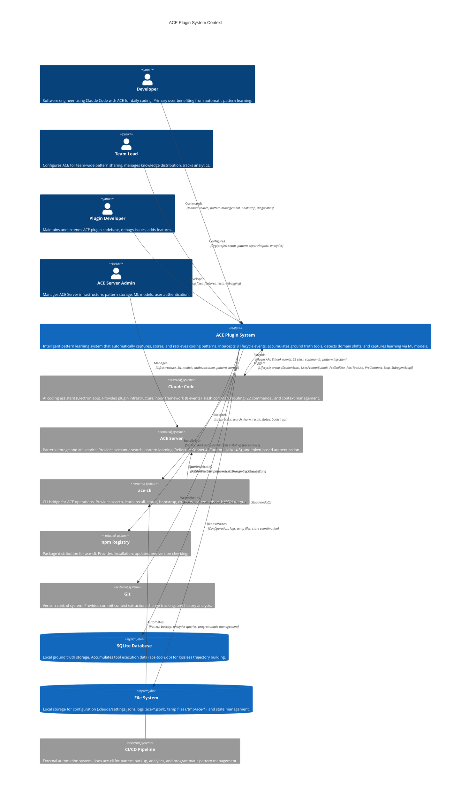
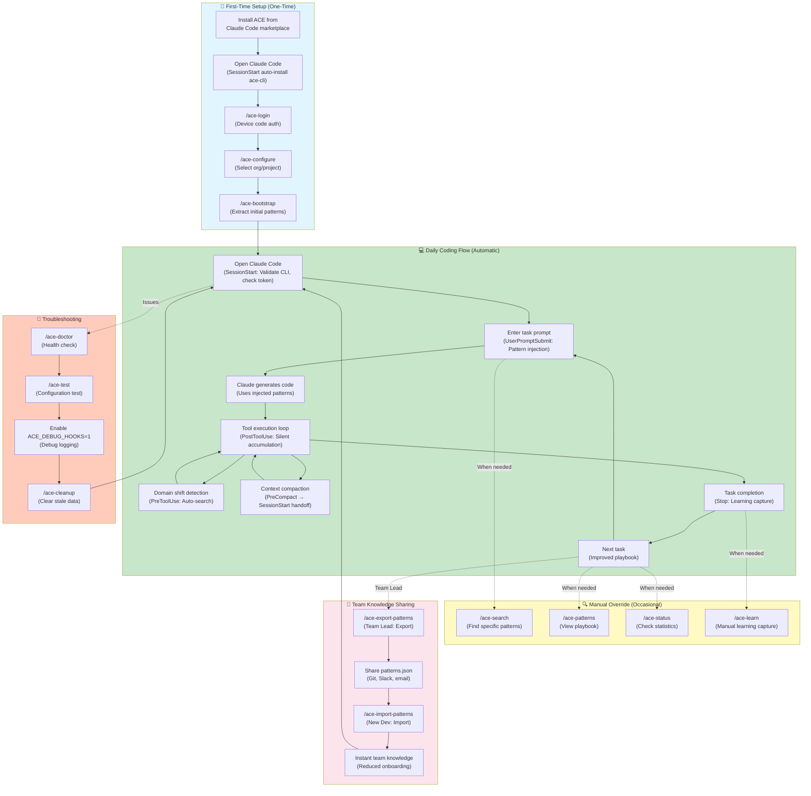
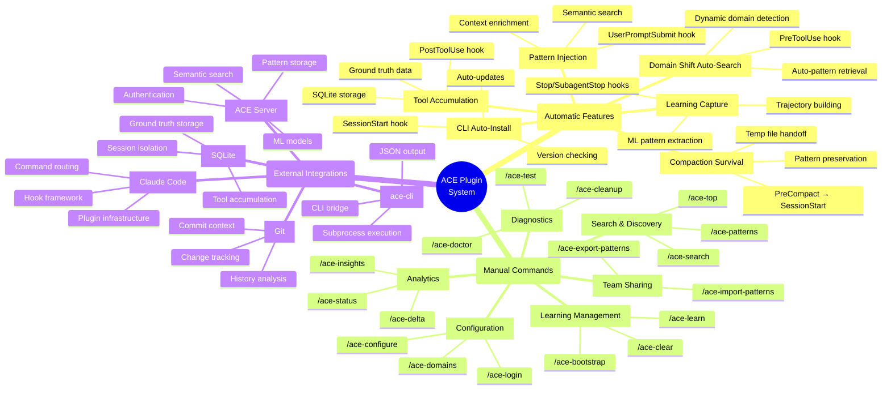

# C4 Context Level: ACE Plugin System Context

## System Overview

### Short Description

ACE (Automatic Context Engineering) is an intelligent pattern learning system that makes AI coding assistants improve over time by automatically capturing, storing, and retrieving development patterns from real coding sessions.

### Long Description

The ACE Plugin transforms Claude Code into a self-improving AI coding assistant through automatic pattern learning. It operates transparently in the background, intercepting 8 lifecycle events to inject relevant patterns before tasks, accumulate ground truth tool execution data during tasks, detect domain shifts to auto-search context-specific patterns, and capture learning after task completion. Unlike traditional static AI assistants, ACE creates a feedback loop where patterns are extracted from successful coding sessions, stored with semantic embeddings for intelligent retrieval, and automatically injected in future relevant contexts. The system uses ML-powered pattern generation (Reflector: Sonnet 4, Curator: Haiku 4.5) to create high-quality, project-specific coding knowledge that accumulates over time. This enables developers to build a personalized "coding playbook" that captures architectural decisions, code patterns, troubleshooting solutions, and API usage patterns specific to their codebase, dramatically reducing context setup time and improving AI assistance quality through continuous learning.

**Key Business Value:**
- **Automatic Learning**: Zero manual effort - patterns are learned from actual coding work
- **Context-Aware Retrieval**: Semantic search finds relevant patterns based on task description and domain
- **Continuous Improvement**: AI assistance quality improves with every coding session
- **Team Knowledge Sharing**: Patterns can be shared across team members and projects
- **Domain Shift Detection**: Automatically searches for new patterns when switching between code domains
- **Compaction Survival**: Patterns persist through Claude Code's context compaction events

## Personas

### Developer (Primary User)

- **Type**: Human User
- **Description**: Software engineer using Claude Code with ACE for daily coding work. Interacts with the system primarily through automatic hooks, with occasional manual command overrides.
- **Goals**:
  - Get relevant coding patterns automatically injected into AI context
  - Build a personal coding playbook without manual effort
  - Improve AI assistance quality over time through accumulated learning
  - Quickly access project-specific patterns and solutions
- **Pain Points Solved**:
  - Repetitive context setup for similar tasks
  - AI forgetting project-specific patterns and conventions
  - Manual documentation maintenance
  - Context loss during long coding sessions (compaction)
- **Key Features Used**:
  - Automatic pattern injection (UserPromptSubmit hook)
  - Automatic learning capture (Stop/SubagentStop hooks)
  - Domain shift auto-search (PreToolUse hook)
  - Manual pattern search (`/ace-search`)
  - Pattern management (`/ace-patterns`, `/ace-status`, `/ace-top`)
  - Bootstrap from existing codebase (`/ace-bootstrap`)
- **Typical Interaction Pattern**: Passive (95% automatic) + Active (5% manual commands for exploration)

### Team Lead / Engineering Manager

- **Type**: Human User
- **Description**: Technical leader responsible for team-wide development standards, knowledge sharing, and onboarding efficiency.
- **Goals**:
  - Configure ACE for team-wide pattern sharing
  - Ensure consistent coding patterns across team members
  - Reduce onboarding time for new developers
  - Track pattern effectiveness and usage
- **Pain Points Solved**:
  - Knowledge silos within teams
  - Inconsistent coding practices
  - Long onboarding cycles for new team members
  - Difficulty maintaining living documentation
- **Key Features Used**:
  - Organization/project configuration (`/ace-configure`)
  - Pattern export/import (`/ace-export-patterns`, `/ace-import-patterns`)
  - Pattern analytics (`/ace-status`, `/ace-delta`, `/ace-insights`)
  - Bootstrap for new team members (`/ace-bootstrap`)
- **Typical Interaction Pattern**: Administrative (setup, monitoring, analytics)

### Plugin Developer / Maintainer

- **Type**: Technical User
- **Description**: Developer maintaining or extending the ACE plugin codebase. Deep understanding of hook architecture, CLI integration, and pattern learning pipeline.
- **Goals**:
  - Debug hook execution issues
  - Improve pattern learning quality
  - Add new features to ACE plugin
  - Fix bugs and performance issues
- **Pain Points Solved**:
  - Complex async hook coordination
  - CLI integration edge cases
  - Version compatibility issues
  - Pattern persistence through compaction
- **Key Features Used**:
  - Diagnostic commands (`/ace-doctor`, `/ace-test`)
  - Log analysis (event logs, relevance logs)
  - Hook debugging (`ACE_DEBUG_HOOKS=1`)
  - Test suite (183+ tests)
- **Typical Interaction Pattern**: Development and debugging

### ACE Server Administrator

- **Type**: Technical User / System Administrator
- **Description**: Manages the ACE Server infrastructure, pattern storage, ML model operations, and user authentication.
- **Goals**:
  - Ensure server availability and performance
  - Manage user authentication and tokens
  - Monitor pattern storage and ML processing
  - Optimize semantic search performance
- **Pain Points Solved**:
  - Server scalability challenges
  - Token expiration management
  - Pattern quality control
  - ML model performance
- **Key Features Used**:
  - Token management (expiration warnings, device code auth)
  - Server status monitoring
  - Pattern storage backend
  - ML model orchestration (Reflector, Curator)
- **Typical Interaction Pattern**: Infrastructure management and monitoring

### External System / API Consumer (Programmatic User)

- **Type**: Programmatic User
- **Description**: External tools, CI/CD pipelines, or automation scripts that interact with ACE through the ace-cli or plugin APIs.
- **Goals**:
  - Automate pattern export for backups
  - Integrate ACE learning into build pipelines
  - Programmatically query pattern effectiveness
  - Automate configuration across multiple projects
- **Key Features Used**:
  - ace-cli JSON output (`--json` flag)
  - Pattern export/import APIs
  - Status and analytics APIs
- **Typical Interaction Pattern**: Automated scripting and integration

## System Features

### 1. Automatic Pattern Injection (Pre-Task)

- **Description**: Before every coding task, automatically searches the pattern playbook using semantic search and injects relevant patterns into Claude Code's context.
- **Users**: Developer (primary), Team Lead
- **Implementation**: UserPromptSubmit hook → ace_before_task.py → ace-cli search → ACE Server semantic search → Pattern injection via hookSpecificOutput
- **User Journey**: [Developer Daily Coding Journey](#developer-daily-coding-journey)
- **Business Value**: Eliminates manual context setup, ensures AI has relevant project knowledge from the start

### 2. Continuous Domain Shift Auto-Search

- **Description**: Monitors tool usage for domain shifts (e.g., switching from `auth/` to `cache/` code) and automatically searches for domain-specific patterns without user intervention.
- **Users**: Developer (primary)
- **Implementation**: PreToolUse hook → Dynamic domain matching → ace-cli search --allowed-domains → Auto-injection
- **User Journey**: [Domain Shift Auto-Search Journey](#domain-shift-auto-search-journey)
- **Business Value**: Provides just-in-time context for new code areas, no manual search needed

### 3. Ground Truth Tool Accumulation

- **Description**: Silently captures every tool call (Edit, Bash, Read, etc.) during task execution to SQLite database for accurate trajectory building.
- **Users**: Developer (transparent), Plugin Developer
- **Implementation**: PostToolUse hook → ace_tool_accumulator.py → SQLite append → Stop hook retrieval
- **User Journey**: [Automatic Learning Capture Journey](#automatic-learning-capture-journey)
- **Business Value**: Zero-loss ground truth data (no transcript parsing), accurate pattern extraction

### 4. Automatic Learning Capture (Post-Task)

- **Description**: After task completion, builds execution trajectory from accumulated tools, extracts patterns using ML models, and updates the playbook automatically.
- **Users**: Developer (transparent), Team Lead (for metrics)
- **Implementation**: Stop/SubagentStop hooks → Build trajectory from SQLite → ace-cli learn → Reflector (Sonnet 4) → Curator (Haiku 4.5) → Pattern storage
- **User Journey**: [Automatic Learning Capture Journey](#automatic-learning-capture-journey)
- **Business Value**: Continuous improvement without manual documentation, accumulates team knowledge over time

### 5. Context Compaction Survival

- **Description**: Preserves critical patterns through Claude Code's context compaction events by saving patterns to temp file before compaction and restoring after.
- **Users**: Developer (transparent)
- **Implementation**: PreCompact hook → Save patterns to temp file → SessionStart(compact) hook → Restore patterns via hookSpecificOutput
- **User Journey**: [Context Compaction Survival Journey](#context-compaction-survival-journey)
- **Business Value**: Maintains AI effectiveness during long coding sessions, no context loss

### 6. Manual Pattern Search

- **Description**: On-demand semantic search of pattern playbook with support for domain filtering and natural language queries.
- **Users**: Developer, Team Lead, Plugin Developer
- **Implementation**: `/ace-search <query>` command → ace-cli search → ACE Server → Display results
- **User Journey**: [Manual Pattern Exploration Journey](#manual-pattern-exploration-journey)
- **Business Value**: Quick access to accumulated knowledge, ad-hoc pattern discovery

### 7. Playbook Management

- **Description**: View, analyze, and manage the complete pattern playbook with statistics, top patterns, and pattern effectiveness metrics.
- **Users**: Developer, Team Lead
- **Commands**: `/ace-patterns`, `/ace-status`, `/ace-top`, `/ace-delta`, `/ace-insights`
- **User Journey**: [Pattern Analytics Journey](#pattern-analytics-journey)
- **Business Value**: Understand pattern effectiveness, track learning progress, identify useful patterns

### 8. Initial Playbook Bootstrap

- **Description**: Extract initial patterns from existing codebase, git history, and documentation to seed the playbook for new projects.
- **Users**: Developer (new project setup), Team Lead (onboarding)
- **Implementation**: `/ace-bootstrap` → ace-cli bootstrap → Multiple extraction modes (hybrid, git-history, local-files, docs-only)
- **User Journey**: [First-Time Setup Journey](#first-time-setup-journey)
- **Business Value**: Instant playbook from existing code, accelerates new project onboarding

### 9. Organization & Project Configuration

- **Description**: Setup and manage ACE organization, project selection, and authentication for pattern storage.
- **Users**: Developer, Team Lead
- **Commands**: `/ace-login` (device code auth), `/ace-configure` (org/project selection)
- **User Journey**: [First-Time Setup Journey](#first-time-setup-journey)
- **Business Value**: Secure team-wide pattern sharing, multi-project support

### 10. Pattern Export/Import

- **Description**: Export patterns for backup or sharing, import patterns from other projects or team members.
- **Users**: Developer, Team Lead, External System
- **Commands**: `/ace-export-patterns`, `/ace-import-patterns`
- **User Journey**: [Team Knowledge Sharing Journey](#team-knowledge-sharing-journey)
- **Business Value**: Pattern portability, team knowledge distribution, backup/restore

### 11. Diagnostic Tools

- **Description**: Health checks, configuration validation, and troubleshooting tools for ACE plugin.
- **Users**: Developer, Plugin Developer
- **Commands**: `/ace-doctor`, `/ace-test`, `/ace-cleanup`
- **User Journey**: [Troubleshooting Journey](#troubleshooting-journey)
- **Business Value**: Self-service debugging, clear error diagnostics, automated fixes

### 12. CLI Auto-Installation & Version Management

- **Description**: Automatically detects, installs, and updates the ace-cli tool to ensure compatibility.
- **Users**: Developer (transparent), Plugin Developer
- **Implementation**: SessionStart hook → CLI version check → Auto-install if missing → Daily update notifications
- **User Journey**: [First-Time Setup Journey](#first-time-setup-journey)
- **Business Value**: Zero-configuration setup, automatic dependency management

## User Journeys

### Developer Daily Coding Journey

**Persona**: Developer
**Feature**: Automatic pattern injection + learning capture
**Frequency**: Multiple times per day

1. **Open Claude Code**: Developer starts a new coding session
2. **SessionStart Hook (Transparent)**:
   - ACE validates ace-cli installation and version
   - Checks authentication token expiration
   - Shows status: "ACE v5.4.28 ready | ace-cli v3.10.3 | Token expires in 47h"
3. **Enter Task Prompt**: Developer types "Implement user authentication with JWT tokens"
4. **UserPromptSubmit Hook (Transparent)**:
   - Extracts query from prompt
   - Calls `ace-cli search` with semantic search
   - Finds 5 relevant authentication patterns
   - Injects patterns into context: "✓ [ACE] 5 patterns from auth domain"
5. **Claude Generates Code**: Claude uses injected patterns to generate authentication code with project-specific conventions
6. **Tool Execution Loop**:
   - Claude calls Edit tool to create auth.py
   - PostToolUse hook silently accumulates tool to SQLite
   - Claude calls Bash tool to run tests
   - PostToolUse hook accumulates test tool
   - Pattern repeats for all tools (Read, Write, Edit, Bash, etc.)
7. **Task Completion**: Developer reviews and approves the implementation
8. **Stop Hook (Transparent, Async)**:
   - Retrieves all accumulated tools from SQLite
   - Builds execution trajectory (task + tools + results)
   - Calls `ace-cli learn --stdin` to send trajectory to server
   - Reflector (Sonnet 4) extracts new patterns
   - Curator (Haiku 4.5) ranks and filters patterns
   - Shows: "✅ Learning captured: 2 patterns created, 3 updated"
9. **Next Task**: Developer continues with next task, now with updated playbook

**Key Touchpoints**: Claude Code UI, Pattern injection notification, Learning capture notification
**Duration**: 5-30 minutes per task
**Success Metric**: Patterns automatically injected and learned without manual intervention

### Domain Shift Auto-Search Journey

**Persona**: Developer
**Feature**: Continuous domain shift detection and auto-search
**Frequency**: Several times per coding session

1. **Start Task in One Domain**: Developer working on authentication code (`auth/login.py`)
2. **UserPromptSubmit Hook**: Injects auth domain patterns
3. **Switch to Different Domain**: Claude reads a file from different domain (`cache/redis.ts`)
4. **PreToolUse Hook Detects Shift**:
   - Extracts domain from file path: "cache"
   - Compares to last domain: "auth"
   - Detects shift: auth → cache
5. **Automatic Pattern Search**:
   - Calls `ace-cli search --allowed-domains cache`
   - Retrieves 5 cache-specific patterns
   - Injects via hookSpecificOutput
   - Shows: "🔄 [ACE] Domain shift: auth → cache. Auto-loaded 5 patterns."
6. **Claude Uses Both Contexts**: Now has BOTH auth patterns (from start) AND cache patterns (from shift)
7. **Continue Coding**: Developer continues without manual search
8. **Multiple Shifts**: Pattern repeats as Claude reads files from other domains (logging, database, api)

**Key Touchpoints**: Domain shift notification, Pattern auto-injection
**Duration**: Milliseconds (transparent)
**Success Metric**: Relevant patterns available when switching code domains

### Automatic Learning Capture Journey

**Persona**: Developer (transparent background process)
**Feature**: Ground truth tool accumulation + ML-powered pattern extraction
**Frequency**: After every completed task

1. **Task Execution**: Developer completes a coding task through Claude Code
2. **During Execution (PostToolUse Hook, Silent)**:
   - Every tool call (Edit, Bash, Read, Write, etc.) is captured
   - Tool name, input, response, and tool_use_id stored to SQLite
   - No user-facing messages (silent accumulation)
   - Database indexed by session_id for fast retrieval
3. **Task Completion**: Developer finishes the task
4. **Stop Hook Triggered**:
   - Queries SQLite for all tools in this session
   - Builds ExecutionTrace JSON:
     ```json
     {
       "task": "Implement JWT authentication",
       "trajectory": [
         {"step": 1, "tool": "Edit", "action": "Created auth.py", "result": "Success"},
         {"step": 2, "tool": "Bash", "action": "Ran pytest auth_test.py", "result": "All tests passed"}
       ],
       "result": {"success": true},
       "playbook_used": ["ctx-abc123", "ctx-def456"],
       "git": {"commit_hash": "abc123", "files_changed": ["auth.py"], ...}
     }
     ```
   - Sends trajectory to server via `ace-cli learn --stdin`
5. **Server-Side ML Processing**:
   - Reflector (Sonnet 4) analyzes trajectory
   - Extracts patterns from successful actions
   - Identifies code snippets, strategies, API usage
   - Curator (Haiku 4.5) ranks patterns by quality
   - Filters low-quality patterns
   - Updates playbook in pattern storage
6. **Learning Result**:
   - Shows: "✅ Learning captured: 2 patterns created, 3 updated, 1 pruned"
   - SQLite session data cleared (cleanup)
   - Patterns available for next task
7. **Async Operation (Default)**:
   - If `ACE_ASYNC_LEARNING=1`: Stop hook returns immediately, learning runs in background
   - Developer can continue working while learning processes
   - Background errors logged to `~/.claude/logs/ace-background-*.log`

**Key Touchpoints**: Learning notification (only at end), Background logs (for errors)
**Duration**: 0-60 seconds (async by default)
**Success Metric**: New patterns extracted and available for future tasks

### Context Compaction Survival Journey

**Persona**: Developer (transparent background process)
**Feature**: Pattern persistence through context compaction
**Frequency**: During long coding sessions when context limit is reached

1. **Long Coding Session**: Developer working on complex multi-step task
2. **Context Grows Large**: Claude Code context approaches token limit
3. **Compaction Triggered**: Claude Code decides to compact context
4. **PreCompact Hook Triggered**:
   - Reads current session ID from `/tmp/ace-session-*.txt`
   - Calls `ace-cli cache recall --session SESSION_ID`
   - Retrieves pinned patterns (from BeforeTask hook)
   - Writes patterns to temp file: `/tmp/ace-patterns-precompact-${SESSION_ID}.json`
   - Uses atomic write (mktemp + mv) with umask 077 for security
   - Returns systemMessage only (NO hookSpecificOutput, per Claude Code API)
5. **Claude Code Performs Compaction**:
   - Removes older messages from context
   - Keeps recent messages and pinned content
   - Context size reduced
6. **SessionStart(compact) Hook Triggered**:
   - Reads temp file: `/tmp/ace-patterns-precompact-${SESSION_ID}.json`
   - Parses pattern JSON
   - Deletes temp file (cleanup)
   - Returns hookSpecificOutput with `hookEventName: "SessionStart"` (valid schema)
   - Injects patterns via additionalContext
7. **Patterns Restored**: Claude Code re-injects patterns into compacted context
8. **Coding Continues**: Developer continues with patterns still available
9. **No User Disruption**: Entire process transparent to developer

**Key Touchpoints**: None (completely transparent)
**Duration**: 10-100ms
**Success Metric**: Patterns survive compaction, no user intervention needed

### First-Time Setup Journey

**Persona**: Developer (new to ACE)
**Feature**: Installation, authentication, configuration, bootstrap
**Frequency**: Once per developer per project

1. **Install Plugin**: Developer installs ACE from Claude Code marketplace
2. **First Session Start**: Developer opens Claude Code
3. **SessionStart Hook (Auto-Install)**:
   - Detects ace-cli is missing
   - Auto-installs: `npm install -g @ace-sdk/cli@latest`
   - Shows: "Installing ace-cli... Done! Version 3.10.3 installed"
4. **Run `/ace-login`**:
   - ACE generates device code
   - Shows: "Visit https://auth.example.com/device and enter code: ABCD-1234"
   - Opens browser automatically
   - Developer authenticates in browser
   - ACE receives token
   - Shows: "✅ Login successful!"
   - Smart login: If only 1 org/project, auto-configures
5. **Run `/ace-configure`** (if multiple orgs/projects):
   - Fetches organizations: `ace-cli orgs --json`
   - Shows: "Select organization: [1] Acme Corp [2] Beta Inc"
   - Developer selects: "1"
   - Fetches projects: `ace-cli projects --org acme-corp --json`
   - Shows: "Select project: [1] Web App [2] Mobile App"
   - Developer selects: "1"
   - Saves to `.claude/settings.json`:
     ```json
     {
       "env": {
         "ACE_ORG_ID": "org-uuid",
         "ACE_PROJECT_ID": "proj-uuid",
         "ACE_VERBOSITY": "detailed"
       }
     }
     ```
   - Shows: "✅ Configuration saved"
6. **Run `/ace-bootstrap`**:
   - Shows: "Select bootstrap mode: [1] Hybrid [2] Git history [3] Local files [4] Docs only"
   - Developer selects: "1" (Hybrid)
   - ACE scans codebase, git history, and docs
   - Extracts initial patterns
   - Shows: "✅ Bootstrap complete: 47 patterns extracted"
7. **Ready to Use**: Developer starts coding with pre-populated playbook
8. **Subsequent Sessions**: SessionStart hook validates CLI, checks token, shows status

**Key Touchpoints**: CLI installation, Browser authentication, Organization/project selection, Bootstrap progress
**Duration**: 5-10 minutes (one-time)
**Success Metric**: Developer can start coding with patterns immediately

### Manual Pattern Exploration Journey

**Persona**: Developer
**Feature**: Manual pattern search and exploration
**Frequency**: Occasional (when automatic search misses something)

1. **Need Specific Pattern**: Developer wants to find patterns about "Redis caching strategies"
2. **Run `/ace-search Redis caching strategies`**:
   - ACE calls `ace-cli search "Redis caching strategies" --json`
   - Server performs semantic search
   - Returns ranked patterns with confidence scores
3. **View Results**:
   - Shows 5 most relevant patterns
   - Each with: ID, content, confidence, helpful score, domain, section
   - Example:
     ```
     1. ctx-abc123 (confidence: 0.87, +15/-2)
        Domain: cache
        Section: strategies_and_hard_rules
        Content: "Use Redis with TTL for session caching. Always set expiration..."
     ```
4. **Pattern Details**: Developer reviews pattern content
5. **Pattern Injected**: ACE automatically injects searched patterns into current context
6. **Use Pattern**: Developer applies pattern to current task
7. **Pattern Feedback**: After task completion, Stop hook tracks that pattern was used
8. **Effectiveness Scoring**: Server updates pattern's helpful/harmful scores based on usage

**Key Touchpoints**: `/ace-search` command, Pattern results display
**Duration**: 30 seconds - 2 minutes
**Success Metric**: Developer finds relevant pattern and applies it successfully

### Pattern Analytics Journey

**Persona**: Team Lead
**Feature**: Pattern effectiveness tracking and analytics
**Frequency**: Weekly or monthly

1. **Run `/ace-status`**:
   - Shows playbook statistics:
     ```
     Total patterns: 142
     By section:
       - Strategies and hard rules: 45
       - Useful code snippets: 52
       - Troubleshooting and pitfalls: 28
       - APIs to use: 17
     ```
2. **Run `/ace-top`**:
   - Shows top 10 most helpful patterns
   - Each with: ID, helpful count, harmful count, last used date
   - Identifies most valuable patterns for team
3. **Run `/ace-delta --days 7`**:
   - Shows playbook changes in last 7 days
   - Patterns created: 23
   - Patterns updated: 45
   - Patterns pruned: 8
   - Shows learning velocity
4. **Run `/ace-insights`**:
   - Analyzes pattern relevance metrics
   - Shows patterns with high retrieval but low usage
   - Identifies patterns that need improvement
5. **Export Top Patterns**: Team Lead runs `/ace-export-patterns --top 20`
   - Exports top 20 patterns to JSON
   - Shares with new team members for import
6. **Share with Team**: New developers run `/ace-import-patterns patterns.json`
   - Import top patterns
   - Accelerate onboarding

**Key Touchpoints**: Analytics commands, Pattern export/import
**Duration**: 5-15 minutes
**Success Metric**: Identify high-value patterns, track learning progress, share knowledge

### Team Knowledge Sharing Journey

**Persona**: Team Lead + New Developer
**Feature**: Pattern export/import for team knowledge distribution
**Frequency**: During onboarding or periodic knowledge sync

1. **Team Lead: Export Patterns**:
   - Run `/ace-export-patterns --output team-patterns.json`
   - Optionally filter: `--top 50` or `--domain auth`
   - Patterns exported to JSON file
2. **Share File**: Team Lead shares file via git, Slack, or email
3. **New Developer: Import Patterns**:
   - Run `/ace-import-patterns team-patterns.json`
   - ACE validates pattern format
   - Imports patterns to local playbook
   - Shows: "✅ Imported 50 patterns"
4. **Merge Strategy**: ACE handles conflicts:
   - If pattern ID exists: Updates if imported pattern has higher helpful score
   - If pattern ID new: Adds to playbook
5. **Immediate Use**: New developer has team knowledge without manual learning
6. **Continue Learning**: New developer's playbook continues to grow with their own patterns

**Key Touchpoints**: Export/import commands, Pattern sharing mechanism
**Duration**: 2-5 minutes
**Success Metric**: New developers start with team knowledge, reduced onboarding time

### Troubleshooting Journey

**Persona**: Developer or Plugin Developer
**Feature**: Diagnostic tools for debugging ACE issues
**Frequency**: When issues occur

1. **Issue Detected**: Developer notices patterns not being injected
2. **Run `/ace-doctor`**:
   - Checks ace-cli installation and version
   - Validates authentication token
   - Checks organization/project configuration
   - Tests ACE Server connectivity
   - Shows diagnostic report with ✓/✗ for each check
3. **Run `/ace-test`**:
   - Tests pattern search
   - Tests pattern learning
   - Tests configuration
   - Shows: "All tests passed" or specific failures
4. **Check Status**: Run `/ace-status` to verify playbook is populated
5. **Enable Debug Logging**:
   - Set `ACE_DEBUG_HOOKS=1` in environment
   - Reproduce issue
   - Check `/tmp/ace_hook_debug.log` for detailed traces
6. **Run `/ace-cleanup`** (if needed):
   - Cleans orphaned temp files
   - Clears stale session data
   - Rotates oversized logs
   - Shows: "✅ Cleanup complete"
7. **Issue Resolved**: Developer identifies and fixes issue (or reports bug)

**Key Touchpoints**: Diagnostic commands, Debug logs
**Duration**: 5-15 minutes
**Success Metric**: Issue identified and resolved, clear error messages

### External System Integration Journey (Programmatic User)

**Persona**: External System / CI/CD Pipeline
**Feature**: Programmatic pattern management via ace-cli
**Frequency**: Automated/scheduled

1. **Backup Script**: CI/CD pipeline runs nightly backup
   ```bash
   ace-cli export --output backup-$(date +%Y%m%d).json --json
   ```
2. **Parse JSON Output**: Script parses JSON response
   ```json
   {
     "exported": 142,
     "filename": "backup-20260211.json",
     "success": true
   }
   ```
3. **Upload to S3**: Script uploads backup to cloud storage
4. **Query Analytics**: Monitoring script checks pattern effectiveness
   ```bash
   ace-cli status --json | jq '.total_patterns'
   ```
5. **Alert on Changes**: Alert if pattern count drops significantly
6. **Restore on Failure**: If needed, restore from backup
   ```bash
   ace-cli import backup-20260211.json --json
   ```

**Key Touchpoints**: ace-cli JSON API, Automation scripts
**Duration**: Seconds to minutes (automated)
**Success Metric**: Reliable pattern backup/restore, programmatic access

## External Systems and Dependencies

### Claude Code (Host Application)

- **Type**: Desktop Application (Electron)
- **Description**: AI-powered coding assistant that hosts the ACE plugin. Provides plugin infrastructure, hook framework, and slash command routing.
- **Integration Type**: Plugin API (JSON stdin/stdout), Hook events, Slash commands
- **Purpose**: ACE extends Claude Code's capabilities with automatic pattern learning. Claude Code fires lifecycle events that ACE intercepts to inject patterns and capture learning.
- **Key Dependencies**:
  - Hook framework: 8 lifecycle events (SessionStart, UserPromptSubmit, PreToolUse, PostToolUse, PreCompact, Stop, SubagentStop, PermissionRequest)
  - Plugin system: Loads plugin.json, marketplace.json, hooks.json
  - Command routing: Routes 22 `/ace:*` slash commands
  - Context management: hookSpecificOutput.additionalContext for pattern injection
- **Version Requirement**: >= 2.1.2 (for agent_type support and session pinning)
- **Communication Protocol**: JSON over stdin/stdout

### ACE Server (Remote Service)

- **Type**: Cloud Service (REST API + SSE)
- **Description**: Remote pattern storage and management service with ML-powered pattern generation and semantic search capabilities.
- **Integration Type**: REST API + Server-Sent Events (SSE streaming)
- **Purpose**: Stores patterns with semantic embeddings, performs vector similarity search, extracts patterns from trajectories using ML models, ranks patterns by quality.
- **Key Capabilities**:
  - **Semantic Search**: Vector similarity search for pattern retrieval (0.45 threshold)
  - **Pattern Learning**: ML-powered pattern extraction from execution traces
  - **Pattern Storage**: Multi-tenant pattern database (organization + project isolation)
  - **Pattern Ranking**: Quality-based ranking using helpful/harmful scores
  - **Session Pinning**: Pattern caching for compaction survival (v1.0.11+)
- **ML Models**:
  - **Reflector**: Claude Sonnet 4 - Pattern extraction and reasoning from trajectories
  - **Curator**: Claude Haiku 4.5 - Pattern ranking, filtering, and quality control
- **Authentication**: Token-based authentication with device code flow
  - Sliding window TTL: +48h extension on every API call
  - Hard cap: 7-day continuous use limit
  - Token expiration warnings: 2-hour threshold
  - 48-hour standby detection
- **API Endpoints**:
  - `POST /search` - Semantic pattern search
  - `POST /learn` - Pattern learning from trajectory
  - `GET /recall` - Session-pinned pattern retrieval
  - `GET /status` - Playbook statistics
  - `POST /bootstrap` - Initial pattern extraction
  - `GET /whoami` - Authentication status

### ace-cli (npm Package)

- **Type**: Node.js CLI Tool
- **Description**: Command-line interface bridge between ACE hooks and ACE Server. Provides CLI commands for all ACE operations.
- **Integration Type**: Subprocess execution (stdin/stdout)
- **Purpose**: Abstracts ACE Server communication, provides CLI for manual operations, enables JSON output for scripting.
- **Package**: `@ace-sdk/cli` (npm)
- **Version Requirement**: >= 3.10.3
- **Installation**: Auto-installed by SessionStart hook if missing
- **Key Commands**:
  - `ace-cli search` - Semantic pattern search
  - `ace-cli learn --stdin` - Pattern learning from JSON trajectory
  - `ace-cli cache recall --session` - Session-pinned pattern retrieval
  - `ace-cli status --json` - Playbook statistics
  - `ace-cli bootstrap` - Initial pattern extraction
  - `ace-cli whoami --json` - Authentication status
  - `ace-cli configure` - Interactive org/project selection
  - `ace-cli orgs --json` - List organizations
  - `ace-cli projects --org` - List projects for organization
- **Communication**: REST API client for ACE Server

### npm Registry (Package Distribution)

- **Type**: Public Package Registry
- **Description**: Node.js package distribution service for ace-cli installation and updates.
- **Integration Type**: HTTPS (npm install)
- **Purpose**: Distribute ace-cli updates, enable version checking, provide global CLI installation.
- **Used For**:
  - CLI installation: `npm install -g @ace-sdk/cli@latest`
  - Version checking: Daily update notifications
  - Package metadata: Version comparison for compatibility
- **Version Checking**: SessionStart hook queries npm registry daily (cached)

### Git (Version Control)

- **Type**: Version Control System
- **Description**: Git version control integration for commit context extraction and change tracking.
- **Integration Type**: CLI subprocess execution
- **Purpose**: Extract commit metadata for pattern learning, track code changes, provide historical context.
- **Used For**:
  - Commit context: After learning capture, includes git commit hash, files changed, insertions, deletions
  - Bootstrap: Git history analysis for pattern extraction
  - Change tracking: Identifies modified files for pattern relevance
- **Operations**:
  - `git log -1 --format=%H` - Get current commit hash
  - `git diff --stat HEAD~1` - Get commit statistics
  - `git log --all --format=...` - Extract history for bootstrap

### SQLite (Local Database)

- **Type**: Embedded Database
- **Description**: Local SQLite database for ground truth tool execution accumulation.
- **Integration Type**: SQLite 3 API (Python sqlite3 module)
- **Purpose**: Provides lossless tool accumulation during task execution, enables accurate trajectory building without transcript parsing.
- **Database**: `.claude/data/logs/ace-tools.db`
- **Schema**:
  ```sql
  CREATE TABLE tool_uses (
    id INTEGER PRIMARY KEY AUTOINCREMENT,
    session_id TEXT NOT NULL,
    tool_name TEXT NOT NULL,
    tool_input TEXT NOT NULL,
    tool_response TEXT NOT NULL,
    tool_use_id TEXT UNIQUE NOT NULL,
    timestamp TEXT NOT NULL
  );
  CREATE INDEX idx_session ON tool_uses(session_id);
  ```
- **Operations**:
  - PostToolUse: Append tool call (INSERT)
  - Stop hook: Retrieve session tools (SELECT WHERE session_id)
  - Stop hook: Cleanup after learning (DELETE WHERE session_id)
- **Performance**: Sub-10ms writes, O(log n) session queries

### Python Runtime (Execution Environment)

- **Type**: Programming Language Runtime
- **Description**: Python 3.11+ interpreter for hook implementation execution.
- **Integration Type**: Python script execution
- **Purpose**: Execute hook logic, SQLite operations, JSON processing, CLI subprocess management.
- **Version Requirement**: Python 3.11+
- **Package Manager**: `uv` (fast Python package manager)
- **Used For**:
  - Hook implementations (ace_before_task.py, ace_after_task.py, etc.)
  - SQLite database operations
  - JSON parsing and validation
  - CLI subprocess orchestration

### Bash Shell (Script Execution)

- **Type**: Shell Interpreter
- **Description**: Bash shell for wrapper script execution and hook coordination.
- **Integration Type**: Shell script execution
- **Purpose**: Wrap Python hooks with shell logic, coordinate temp files, manage hook lifecycle.
- **Version Requirement**: Bash 3.2+
- **Used For**:
  - Hook wrapper scripts (ace_*_wrapper.sh)
  - Temp file management
  - Flag file coordination
  - Environment variable handling
  - CLI subprocess execution

### File System (Local Storage)

- **Type**: POSIX File System
- **Description**: Local file system for configuration, logs, temp files, and state management.
- **Integration Type**: POSIX file I/O
- **Purpose**: Store configuration, coordinate hook state, persist logs, cache data.
- **Key Locations**:
  - `.claude/settings.json` - ACE configuration (org, project, verbosity)
  - `.claude/data/logs/ace-*.jsonl` - Event logs (5MB rotation)
  - `.claude/data/logs/ace-relevance.jsonl` - Pattern relevance metrics (10MB rotation)
  - `/tmp/ace-*` - Temp files for hook coordination (session IDs, domains, patterns, flags)
  - `~/.claude/logs/ace-background-*.log` - Async learning error logs

## System Context Diagram



## User Journey Map



## Feature Map



## System Boundaries

### Inside ACE Plugin System

**Core Components:**
- Hook Engine (8 lifecycle hooks with bash wrappers + Python implementations)
- Plugin Configuration (plugin.json, marketplace.json, hooks.json)
- Quality Assurance (183+ tests, release automation)
- 22 slash commands for manual operations
- SQLite tool accumulation database
- Temp file coordination mechanism
- Event logging and diagnostics

**Responsibilities:**
- Intercept Claude Code lifecycle events
- Accumulate ground truth tool execution data
- Coordinate pattern retrieval and injection
- Build execution trajectories
- Manage local configuration and state
- Provide user-facing commands
- Ensure pattern survival through compaction

### Outside ACE Plugin System

**External Dependencies:**
- Claude Code: Plugin host application, provides hook infrastructure
- ACE Server: Pattern storage, semantic search, ML processing
- ace-cli: CLI bridge for server communication
- npm Registry: Package distribution for ace-cli
- Git: Version control for commit context
- SQLite: Database engine (system library)
- Python Runtime: Script execution environment
- Bash Shell: Wrapper script execution
- File System: Configuration and log storage

**User Personas:**
- Developer: Primary user of automatic pattern learning
- Team Lead: Configuration and team knowledge management
- Plugin Developer: Maintenance and feature development
- ACE Server Admin: Infrastructure and authentication management
- External Systems: CI/CD pipelines for automation

## Related Documentation

- **Container Documentation**: [c4-container.md](./c4-container.md) - ACE Plugin deployment architecture, container interfaces, data flows
- **Component Documentation**: [c4-component.md](./c4-component.md) - Component master index
  - [c4-component-hook-engine.md](./c4-component-hook-engine.md) - Hook engine internal architecture
  - [c4-component-plugin-config.md](./c4-component-plugin-config.md) - Plugin configuration and commands
  - [c4-component-quality-assurance.md](./c4-component-quality-assurance.md) - Test suite and release automation
- **Source Code**: `/Users/ptsafaridis/repos/github_com/ce-dot-net/ce-claude-marketplace/plugins/ace/`
- **Plugin Metadata**:
  - `plugins/ace/.claude-plugin/plugin.json` - Plugin registration
  - `.claude-plugin/marketplace.json` - Marketplace metadata
- **CHANGELOG**: `plugins/ace/CHANGELOG.md` - Version history and release notes

## Notes

- **Current Version**: v5.4.28 (Released: Fix PreCompact JSON validation - Issue #17)
- **Minimum Requirements**:
  - Claude Code >= 2.1.2 (for agent_type support)
  - ace-cli >= 3.10.3 (for session pinning)
  - Python 3.11+
  - Bash 3.2+
  - Node.js 16+ (for ace-cli)
- **Architecture Model**: CLI-based (v5.0.0 migration from MCP)
- **Learning Pipeline**: Pre-task retrieval → Tool accumulation → Domain shift detection → Post-task learning
- **Ground Truth**: SQLite tool accumulation (no transcript parsing)
- **Context Reduction**: Semantic search reduces context by 50-92% vs full playbook retrieval
- **ML Models**: Reflector (Sonnet 4) for pattern extraction, Curator (Haiku 4.5) for ranking
- **Authentication**: Token-based with sliding window TTL (+48h on every API call), 7-day hard cap
- **Async Learning**: Default `ACE_ASYNC_LEARNING=1` (Stop hook returns immediately)
- **Session Pinning**: Pattern persistence through context compaction (v5.4.11+)
- **Pattern ID Format**: "ctx-" prefix + lowercase alphanumeric
- **Playbook Structure**: 4 sections (strategies_and_hard_rules, useful_code_snippets, troubleshooting_and_pitfalls, apis_to_use)
- **Marketplace**: ce-dot-net-marketplace, category "productivity"
- **Quality Gates**: Trivial task filter + substantial work requirement
- **Release Safety**: release-manager.md agent prevents version mismatch and forgotten files
